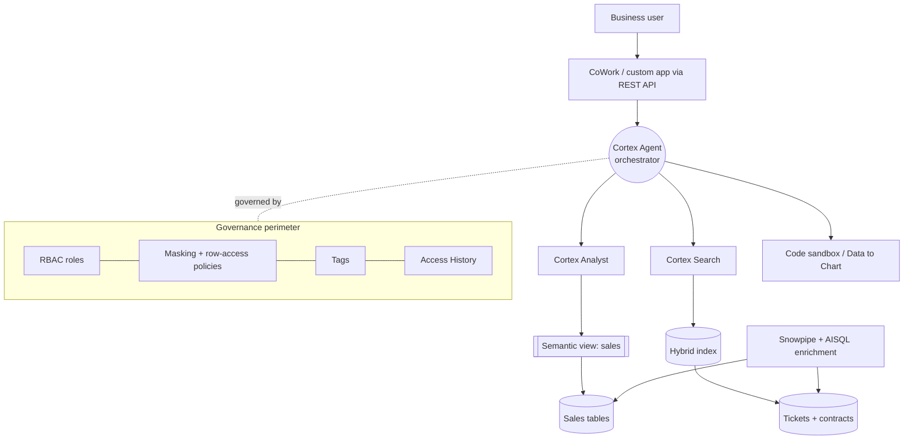

# System Design + Mock Interview

Bring it together: a full Cortex system-design walkthrough you can narrate on a
whiteboard, then a timed mock interview with model answers. Pairs with the
vendor-neutral [Master Interview Simulator](../Personal-SourceCode/Interview_Master_Simulator.md).

---

## System design: a governed "ask your enterprise data" assistant

**Prompt:** *"Design a Snowflake-native assistant that lets business users ask
natural-language questions spanning sales metrics (structured) and support
tickets + contracts (unstructured), with enterprise governance and controlled
cost."*

### 1. Clarify (always start here)

- **Users & scale?** Internal analysts + support leads; hundreds of users,
  bursty interactive traffic.
- **Data?** Sales in structured tables; tickets/contracts as text.
- **Governance?** RBAC by team; PII in tickets must stay masked; full audit.
- **Latency/cost?** Interactive (seconds); predictable monthly credit budget.
- **Freshness?** Sales near-real-time; documents hourly is fine.

### 2. High-level architecture

### 3. Component decisions (and the "why")

| Decision | Choice | Why |
|----------|--------|-----|
| Structured Q&A | **Cortex Analyst** over a curated **semantic view** | Governed SQL; definitions/metrics encoded once |
| Unstructured Q&A | **Cortex Search** (hybrid, managed) | Native RAG; no separate vector store to secure |
| Orchestration | **Cortex Agent** with both as tools | Handles cross-domain, multi-step questions; managed loop |
| Ingestion/enrichment | **Snowpipe** + **AISQL** (`AI_FILTER`, `SENTIMENT`) via **Streams/Tasks** | Turn text into structured signals for cheap SQL later |
| PII | **Object tags + tag-based masking**, row-access policies | Protection follows classification into AI results |
| Cost | Per-workload warehouses, **resource monitors**, model routing, pre-inference filters | Predictable credits; runaway loops trip alerts |
| UX | **CoWork** for internal, **REST API** for a custom app | Meet users where they are; thin client, Threads hold state |
| Quality | **Eval set** + LLM-judge + user feedback in CI | Catch regressions on model/semantic-view changes |

### 4. Data flow for one hard question

*"Total at-risk revenue this quarter for accounts whose contracts have an
auto-renewal clause."*

1. **Agent plans:** split into (a) find contracts with auto-renewal clause →
   Search; (b) sum this-quarter revenue for those accounts → Analyst.
2. **Search** returns matching account IDs from the contract corpus.
3. **Analyst** generates governed SQL over the sales semantic view for those IDs,
   respecting masking/row-access for the caller's role.
4. **Agent reflects,** combines, cites both sources, optionally charts it.
5. Output **validated** before display; the whole exchange is **audited**.

### 5. Failure modes to raise unprompted

- **Indirect prompt injection** via a malicious contract → retrieved content is
  data, not instructions; write tools gated.
- **Wrong numbers** after a schema change → semantic view versioned, eval set in
  CI.
- **Cost spike** → resource monitors + pre-inference filters + model routing.
- **Over-broad access** → least-privilege roles; tools run under caller context.

!!! tip "Scoring signal"
    Strong answers (a) clarify first, (b) map each requirement to a specific
    Cortex component with a reason, (c) **volunteer** governance + cost + failure
    modes without being asked, and (d) name trade-offs (Cortex vs. DIY agent).

---

## Timed mock interview (45 min)

Give yourself the time budget; answer aloud, then check.

### Warm-up (5 min)

??? question "In two sentences, what is Snowflake Cortex and why does it matter?"
    Cortex runs LLM inference, semantic search, and agentic workflows on governed
    data inside Snowflake's perimeter. It matters because you inherit RBAC,
    masking, and audit and avoid data egress — the security/compliance boundary
    already exists around the data.

??? question "Name the Cortex layers and when you use each."
    AISQL/LLM functions for set-based enrichment; Cortex Search for unstructured
    retrieval (native RAG); Cortex Analyst for text-to-SQL over a semantic view;
    Cortex Agents to orchestrate tools for multi-step, cross-domain questions.

### Core (20 min)

??? question "Design text-to-SQL over our sales data that non-analysts can trust. Walk me through it."
    Cortex Analyst over a curated **semantic view**: define logical tables,
    metrics (with formulas), relationships/join keys, synonyms, and verified
    queries. Return the generated SQL for transparency. Iterate from real failing
    questions by adding verified queries. Emphasize the semantic model is the
    product; the LLM is the easy part.

??? question "How would you add document Q&A without standing up a vector database?"
    Create a **Cortex Search service** over the text column — it handles
    embedding, hybrid (vector + keyword) retrieval, and freshness via target lag,
    inside the perimeter with attribute filtering. No separate store to secure or
    sync. Trade-off: less low-level index control than DIY.

??? question "A single question needs both the tickets and the revenue table. How?"
    A Cortex **Agent** with Search and Analyst as tools. It plans the split,
    calls Search to find relevant accounts and Analyst to compute the metric,
    reflects over both, and answers with citations. Threads keep state so
    follow-ups work.

??? question "How do you keep this within a monthly credit budget?"
    Token volume × model tier is the driver. Filter with cheap SQL before
    inference, route easy questions to small models, batch enrichment with
    Streams/Tasks, tune Search target lag to real needs, and put resource
    monitors with alerts on the Cortex warehouses.

### Curveballs (15 min)

??? question "Users report the assistant gives a colleague more data than them. Debug it."
    Governance, not the model: tools run under the caller's role; compare granted
    roles, row-access policies, and masking. Inaccessible-tool handling means a
    run continues with only the tools a role can use. Fix grants/policies, verify
    tools don't run under an elevated service role.

??? question "Where can this system be attacked, and what's your top control?"
    The unstructured path (Search/web/MCP) carries indirect prompt injection. Top
    control: treat all retrieved content as **data, not instructions**, and keep
    write-capable tools least-privileged and human-gated. Add output validation
    and ingestion vetting.

??? question "The demo works; what would you fix before production?"
    Add an **eval set** in CI (guarding the semantic view and model choice),
    resource monitors + cost-per-question dashboard, masking/row-access on every
    sensitive column, audit review, output validation before serving, and
    monitoring of tool latency/failure. Then a rollback plan for model/semantic
    changes.

---

## Self-scoring rubric

- [ ] Clarified requirements before designing
- [ ] Mapped each need to a Cortex component **with a reason**
- [ ] Volunteered governance (RBAC, masking, audit) unprompted
- [ ] Volunteered a cost-control strategy
- [ ] Named at least two failure modes + mitigations
- [ ] Stated a trade-off (Cortex vs. DIY, model tier, freshness vs. cost)
- [ ] Distinguished agent vs. AISQL-batch appropriately
- [ ] Mentioned eval/observability for production readiness

---

**Next:** [Cheat Sheet + 30-Day Cortex Ramp](cheat-sheet-30-day.md)
