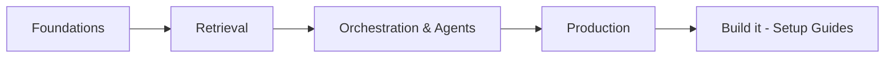

# Start Here — Learning Path

New to the knowledge base? Follow a track below in order. Every link goes to a
page with diagrams, concepts, and an **Interview deep dive** (talking points,
scenario questions, pitfalls, rapid-fire).

!!! tip "View over HTTP so diagrams render"
    Double-click **`start.bat`** in the project folder (or run `.\start.ps1`) and
    open **http://localhost:8080**. Opening files directly with `file://` shows
    diagrams as raw text.

## The big picture



## Track 1 — GenAI from scratch

Best if you're learning the stack end to end.

1. [LLM Fundamentals](../GenAI-Topics/llm-fundamentals/index.md) — tokens, sampling, RAG vs fine-tune
2. [Prompt Engineering](../GenAI-Topics/prompt-engineering/index.md) — reliable prompting
3. [Context Engineering](../GenAI-Topics/context-engineering/index.md) — managing the context window
4. [RAG](../GenAI-Topics/rag/index.md) → [Vector DB](../GenAI-Topics/vector-db/index.md) → [Retrieval Tuning](../GenAI-Topics/retrieval-tuning/index.md)
5. [LangChain](../GenAI-Topics/langchain/index.md) → [LangGraph](../GenAI-Topics/langgraph/index.md) → [Agent Engineering](../GenAI-Topics/agent-engineering/index.md)
6. [Observability & Eval](../GenAI-Topics/observability/index.md) → [LLMOps](../GenAI-Topics/llmops/index.md) → [Cost Optimization](../GenAI-Topics/cost-optimization/index.md)

## Track 2 — Build something now

Best if you learn by doing. Follow the [Setup Guides](../Setup-Guides/index.md):

1. [Local Environment](../Setup-Guides/local-environment/index.md)
2. [LLM Access](../Setup-Guides/llm-access/index.md)
3. [Vector DB Setup](../Setup-Guides/vector-db-setup/index.md)
4. [First RAG App](../Setup-Guides/first-rag/index.md)
5. [First Agent](../Setup-Guides/first-agent/index.md)

Then study the real [GenAI POC scripts](../Projects/genai-poc/index.md).

## Track 3 — Interview prep

Best if you have an interview coming up.

1. Skim the **Interview deep dive** on each [GenAI Topic](../GenAI-Topics/index.md)
2. [GenAI Interview Q&A](../Personal-SourceCode/GenAI_Interview_QA.md) ·
   [FDE Q&A](../Personal-SourceCode/Forward_Deployed_Engineer_Interview_QA.md) ·
   [Coding Prep](../Personal-SourceCode/FDE_Coding_Interview_Prep.md)
3. Data platforms: [Snowflake](../Technologies/snowflake/index.md) ·
   [Databricks](../Technologies/databricks/index.md) · [dbt](../Technologies/dbt/index.md)
4. Quiz yourself with the **agent**: `python ask.py --area rag "how do I evaluate RAG"`

## Track 4 — Data & cloud engineering

Best if your focus is the platform side.

1. [Snowflake](../Technologies/snowflake/index.md) (Cortex, CDC, governance)
2. [Databricks](../Technologies/databricks/index.md) (Lakehouse, Spark, Unity Catalog)
3. [dbt](../Technologies/dbt/index.md) · [FastAPI](../Technologies/fastapi/index.md) · [AWS Interview Q&A](../Personal-SourceCode/AWS_Interview_QA.md)
4. Applied: [Data Migration case study](../Personal-SourceCode/genai-procurement-architecture.md) and the [Oracle→Snowflake migration](../Projects/data-migration/index.md)

## How to use the retrieval agent

Ask questions answered from *this* knowledge base, with citations:

```bash
cd agent
python ask.py "What is Cortex Analyst?"
python ask.py --area agent-engineering "how do I make an agent production-safe"
python ask.py                 # interactive; /area rag to filter, /quit to exit
```

## Reference

- [Architecture Overview](../Documentation/architecture-overview/index.md) — how it all fits
- [FAQ](../Documentation/faq/index.md) · [Troubleshooting](../Documentation/troubleshooting/index.md)
- [Enterprise](../Enterprise/index.md) — security, RBAC, compliance, reference architectures
