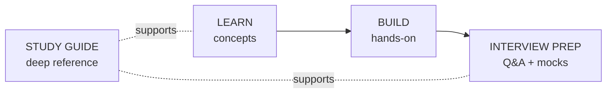

# Start Here — Your Study Path

This is the one front door. The site is organized into four tabs across the top,
each answering a different question:

| Tab | Use it when you want to… |
|-----|--------------------------|
| **Learn** | Understand concepts — GenAI foundations, data/cloud tech, Snowflake Cortex, reference docs, security |
| **Build** | Do the work — setup guides, projects, case studies, hands-on practice labs |
| **Interview Prep** | Get ready for interviews — Q&A banks, mock simulators, cheat sheets, the 30-day plan |
| **Study Guide** | Read the long-form study book and course modules |

Every Learn page ends with an **Interview deep dive** (talking points, scenario
questions, pitfalls, rapid-fire), so learning and prep reinforce each other.

!!! tip "View over HTTP so diagrams render"
    Double-click **`start.bat`** in the project folder (or run `.\start.ps1`) and
    open **http://localhost:8080**. Opening files directly with `file://` shows
    diagrams as raw text.

## The journey



A good default: **Learn → Build → Interview Prep**, dipping into the **Study
Guide** for depth whenever a topic needs it. Pick the track below that matches
where you are.

---

## Track 1 — GenAI from scratch (Learn tab)

Best if you're learning the stack end to end. All under **Learn → Foundations**.

1. [LLM Fundamentals](../GenAI-Topics/llm-fundamentals/index.md) — tokens, sampling, RAG vs fine-tune
2. [Prompt Engineering](../GenAI-Topics/prompt-engineering/index.md) — reliable prompting
3. [Context Engineering](../GenAI-Topics/context-engineering/index.md) — managing the context window
4. [RAG](../GenAI-Topics/rag/index.md) → [Vector DB](../GenAI-Topics/vector-db/index.md) → [Retrieval Tuning](../GenAI-Topics/retrieval-tuning/index.md)
5. [LangChain](../GenAI-Topics/langchain/index.md) → [LangGraph](../GenAI-Topics/langgraph/index.md) → [Agent Engineering](../GenAI-Topics/agent-engineering/index.md)
6. [Observability & Eval](../GenAI-Topics/observability/index.md) → [LLMOps](../GenAI-Topics/llmops/index.md) → [Cost Optimization](../GenAI-Topics/cost-optimization/index.md)

## Track 2 — Data & cloud engineering (Learn tab)

Best if your focus is the platform side. Under **Learn → Data & Cloud Tech** and
**Learn → Snowflake Cortex**.

1. [Snowflake](../Technologies/snowflake/index.md) (warehousing, CDC, governance)
2. [Snowflake Cortex](../Snowflake-Cortex/index.md) — Cortex AI, Agents, Analyst, Search (deep dive)
3. [Databricks](../Technologies/databricks/index.md) (Lakehouse, Spark, Unity Catalog)
4. [dbt](../Technologies/dbt/index.md) · [FastAPI](../Technologies/fastapi/index.md)
5. Governance: [Enterprise & Security](../Enterprise/index.md) · [AI Security](../AI-Security/index.md)

## Track 3 — Build something now (Build tab)

Best if you learn by doing. Follow the [Setup Guides](../Setup-Guides/index.md):

1. [Local Environment](../Setup-Guides/local-environment/index.md)
2. [LLM Access](../Setup-Guides/llm-access/index.md)
3. [Vector DB Setup](../Setup-Guides/vector-db-setup/index.md)
4. [First RAG App](../Setup-Guides/first-rag/index.md)
5. [First Agent](../Setup-Guides/first-agent/index.md)

Then study the real [GenAI POC scripts](../Projects/genai-poc/index.md), the
[Data Migration case study](../Projects/data-migration/index.md), and drill with
the [Practice Labs](../Personal-SourceCode/Lab_Scenario_Drills.md).

## Track 4 — Interview prep (Interview Prep tab)

Best if you have an interview coming up. Start at the
[Interview Guide overview](../Personal-SourceCode/Interview_Guide_Overview.md).

1. Skim the **Interview deep dive** on each [GenAI Topic](../GenAI-Topics/index.md) and tech page
2. Q&A banks: [GenAI](../Personal-SourceCode/GenAI_Interview_QA.md) ·
   [FDE](../Personal-SourceCode/Forward_Deployed_Engineer_Interview_QA.md) ·
   [Snowflake](../Personal-SourceCode/Snowflake_Interview_QA.md) ·
   [SQL](../Personal-SourceCode/SQL_Interview_QA.md) ·
   [Behavioral/STAR](../Personal-SourceCode/Behavioral_STAR_Interview_QA.md)
3. Practice under pressure: [Master Interview Simulator](../Personal-SourceCode/Interview_Master_Simulator.md) ·
   [Production Incident Interviews](../Personal-SourceCode/Interview_Production_Incidents.md) ·
   [Snowflake Cortex mock](../Snowflake-Cortex/system-design-mock.md)
4. Last mile: [Master Cheat Sheets](../Personal-SourceCode/Interview_Cheat_Sheets.md) ·
   [30-Day Prep Plan](../Personal-SourceCode/Interview_30_Day_Plan.md)
5. Quiz yourself with the **agent**: `python ask.py --area rag "how do I evaluate RAG"`

---

## A 4-week plan (if you want one)

- **Week 1 — Learn foundations:** Track 1 (GenAI) + Track 2 (data/cloud) pages.
- **Week 2 — Build:** Track 3 — stand up a RAG app and an agent; read a case study.
- **Week 3 — Deepen:** Snowflake Cortex + Enterprise & Security; skim the Study Guide book for gaps.
- **Week 4 — Prep:** Track 4 — Q&A banks, mock simulators, cheat sheets, the 30-day plan.

## How to use the retrieval agent

Ask questions answered from *this* knowledge base, with citations:

```bash
cd agent
python ask.py "What is Cortex Analyst?"
python ask.py --area agent-engineering "how do I make an agent production-safe"
python ask.py                 # interactive; /area rag to filter, /quit to exit
```

## Reference

- [Architecture Overview](../Documentation/architecture-overview/index.md) — how it all fits
- [FAQ](../Documentation/faq/index.md) · [Troubleshooting](../Documentation/troubleshooting/index.md)
- [Enterprise](../Enterprise/index.md) — security, RBAC, compliance, reference architectures
