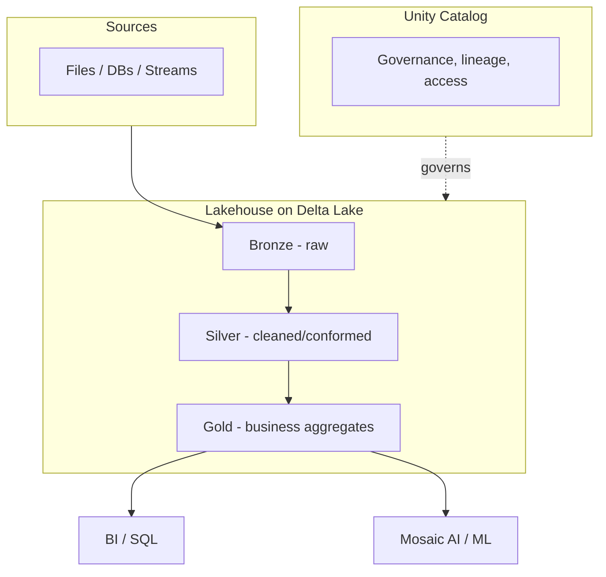
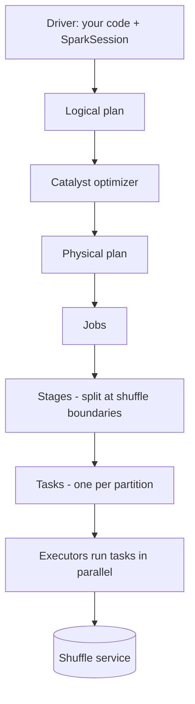

# Databricks

Databricks is a unified **Lakehouse** platform built on Apache Spark and Delta
Lake — combining the low-cost, open storage of a data lake with the reliability
and performance of a warehouse, plus native ML/GenAI (Mosaic AI).

## Lakehouse architecture



The **medallion architecture** (Bronze → Silver → Gold) is the standard pattern:
raw ingestion, then cleaning/conforming, then business-level aggregates.

## Delta Lake

The storage layer that makes the lakehouse work:

- **ACID transactions** on object storage (no more partial writes).
- **Time Travel** — query/restore previous versions (`VERSION AS OF`).
- **Schema enforcement & evolution**.
- **`MERGE`** for upserts/CDC; **`OPTIMIZE`** + **Z-ordering** for file compaction
  and data skipping; **`VACUUM`** to clean old files.

```sql
-- Upsert with Delta MERGE
MERGE INTO gold.customers t
USING staging.customers s ON t.id = s.id
WHEN MATCHED THEN UPDATE SET *
WHEN NOT MATCHED THEN INSERT *;

-- Optimize + data skipping
OPTIMIZE gold.customers ZORDER BY (region, signup_date);
```

## Spark essentials

- **Lazy evaluation**: transformations build a DAG; actions trigger execution.
- **Narrow vs wide transformations**: wide ops (joins, groupBy) cause shuffles —
  the main perf cost.
- **Partitioning & caching**: repartition to balance work; cache reused DataFrames.
- **PySpark / SQL / Scala** interchangeable on the same engine.

```python
from pyspark.sql import functions as F
gold = (silver
        .filter(F.col("status") == "active")
        .groupBy("region")
        .agg(F.sum("amount").alias("total")))
gold.write.mode("overwrite").saveAsTable("gold.region_totals")
```

## Unity Catalog (governance)

Centralized governance across workspaces: a three-level namespace
`catalog.schema.table`, fine-grained access control, **column/row masking**,
**data lineage**, and a discovery search. One place to secure all data & AI assets.

## Mosaic AI & Genie (GenAI)

| Capability | What it does |
|------------|--------------|
| **Mosaic AI Model Serving** | Deploy/serve ML & LLM endpoints |
| **Vector Search** | Managed vector index for RAG |
| **AI Functions (`ai_query`)** | Call LLMs from SQL, like Snowflake Cortex |
| **Genie** | Natural-language analytics over your data (text-to-insight) |
| **MLflow** | Experiment tracking, model registry, deployment |

```sql
-- Call an LLM from Databricks SQL
SELECT ai_query('databricks-meta-llama-3-70b-instruct',
                'Summarize: ' || review) AS summary
FROM feedback;
```

## Snowflake vs Databricks (quick take)

| Dimension | Snowflake | Databricks |
|-----------|-----------|------------|
| Origin | Cloud data warehouse | Spark/lakehouse |
| Sweet spot | SQL analytics, sharing, ease of use | Data engineering, ML/AI, big data |
| Storage | Managed micro-partitions | Open Delta Lake on your storage |
| GenAI | Cortex | Mosaic AI / Genie |
| Governance | RBAC, tags, masking | Unity Catalog |

They overlap more each year; choice often comes down to existing skills, workload
mix (heavy ML → Databricks; SQL-first + sharing → Snowflake), and openness needs.

## Interview questions

??? question "What is the Lakehouse and how is it different from a warehouse or lake?"
    A lakehouse combines the open, cheap storage of a data lake with the ACID
    transactions, schema, and performance of a warehouse — on one copy of data via
    Delta Lake. Avoids the two-system (lake + warehouse) copy/sync problem.

??? question "Explain the medallion architecture."
    Bronze (raw ingested), Silver (cleaned/conformed/deduped), Gold
    (business-level aggregates for BI/ML). Progressive refinement with clear
    quality contracts at each layer.

??? question "Narrow vs wide transformations in Spark?"
    Narrow (map, filter) need no data movement; wide (join, groupBy, distinct)
    trigger shuffles across the network — the main performance cost. Minimize/
    optimize shuffles.

??? question "What does Delta Lake add on top of Parquet?"
    ACID transactions, a transaction log, Time Travel, schema enforcement/
    evolution, MERGE/upserts, and OPTIMIZE/Z-order for performance.

## Related course modules

- **[MODULE2-AWS-CLOUD](../../Course-Modules/module2-aws-cloud.md)** — cloud data
  fundamentals that transfer to Databricks.
- **[MODULE3-PYTHON](../../Course-Modules/module3-python.md)** — PySpark and
  Python data engineering.

---

## Interview deep dive

### 60-second talking points

- **"Lakehouse = one copy, both worlds."** Delta Lake adds ACID, schema, and
  performance to cheap open object storage, so you avoid the lake-plus-warehouse
  copy/sync problem.
- **"The cost is the shuffle."** Spark's speed comes from parallelism; wide
  transformations (join, groupBy) shuffle data across the network — that's what
  you tune.
- **"Unity Catalog governs data *and* AI."** One place for access, lineage, and
  masking across workspaces.

### Spark internals worth knowing

- **Lazy DAG**: transformations build a plan; an **action** (`count`, `write`)
  triggers execution. The Catalyst optimizer + Tungsten engine plan it.
- **Jobs → stages → tasks**: a shuffle boundary splits stages; tasks run per
  partition.
- **Skew & spill**: uneven partitions overload one executor; salting or AQE
  (Adaptive Query Execution) helps. Spill = not enough memory → disk.
- **Broadcast join**: small table sent to every executor to avoid a shuffle.

### Scenario & system-design questions

??? question "A Spark job is slow and one task takes 10x longer than the rest. Diagnose it."
    Classic **data skew** — one partition/key has far more rows. Fixes: enable
    **AQE** (skew join handling), **salt** the hot key, repartition on a better
    key, or broadcast the small side if it's a join. Check the Spark UI stage view
    for the long task and its input size.

??? question "Design an ingestion pipeline for streaming + batch into the lakehouse."
    **Medallion**: Auto Loader / Structured Streaming into **Bronze** (raw, append)
    → cleanse/dedupe/conform into **Silver** (`MERGE` for CDC) → aggregate into
    **Gold**. Delta gives ACID + Time Travel; `OPTIMIZE`/Z-order Gold for reads;
    Unity Catalog governs it.

??? question "How do you handle GDPR 'delete my data' on an append-only lake?"
    Delta **`DELETE`** rewrites affected files transactionally; run **`VACUUM`** to
    purge old file versions past the retention window (so time-travel copies are
    also removed). Track with Unity Catalog lineage.

??? question "When would you pick Databricks over Snowflake and vice versa?"
    Databricks for heavy **data engineering / ML / unstructured / big-data** work
    and open Delta storage; Snowflake for **SQL-first analytics, ease of use, and
    data sharing**. They overlap increasingly; decide on workload mix, team
    skills, and openness/lock-in preferences.

### Pitfalls interviewers probe

- Confusing **narrow vs wide** transformations (only wide ones shuffle).
- Calling `collect()` on big data (pulls everything to the driver → OOM).
- Not running `OPTIMIZE`/`VACUUM` → tiny-file problem, slow reads.
- Assuming Delta = Parquet (Delta adds the transaction log, ACID, Time Travel).
- Ignoring partitioning strategy → skew and shuffle blowups.

### Rapid-fire

| Q | A |
|---|---|
| Transformation vs action? | Transformation is lazy; action triggers the DAG |
| What triggers a shuffle? | Wide transformations: join, groupBy, distinct, repartition |
| Delta over Parquet adds? | ACID, transaction log, Time Travel, schema evolution, MERGE |
| Medallion layers? | Bronze (raw) → Silver (clean) → Gold (aggregates) |
| Broadcast join is for? | Joining a small table without shuffling the large one |

---

## Deep dive: Spark execution model

The internals interviewers escalate into once you've said "lazy DAG."



- **Driver vs executors** — the driver plans and schedules; executors do the
  work on partitions. `collect()` pulls all data to the driver → OOM risk.
- **Job → stage → task** — an **action** launches a job; a **shuffle** splits it
  into stages; each stage runs one **task per partition**.
- **Catalyst + Tungsten** — Catalyst optimizes the query plan (predicate
  pushdown, join reordering); Tungsten does code-gen and off-heap memory
  management.
- **Adaptive Query Execution (AQE)** — re-optimizes at runtime using actual
  stats: coalesces shuffle partitions, switches join strategies, and splits skew
  automatically. Know it by name — it's the answer to half of "my job is slow."

### Join strategies (and when Spark picks each)

| Strategy | When | Cost |
|----------|------|------|
| **Broadcast hash join** | One side is small (fits in memory) | No shuffle — cheapest |
| **Shuffle hash join** | Medium tables, one side hashable | One shuffle |
| **Sort-merge join** | Two large tables | Shuffle + sort — default for big joins |

Forcing a broadcast (`broadcast(df)`) on a small dimension is the single most
common Spark speedup.

---

## Performance & cost tuning

Databricks bills **DBUs** (compute) on top of cloud VM cost, so tuning is both a
speed and a money conversation.

- **Kill the shuffle** — broadcast small sides, filter early (predicate
  pushdown), and pick partition keys that match your joins/filters.
- **Fix the tiny-file problem** — many small files murder read performance. Run
  `OPTIMIZE` (+ Z-order) to compact; use Auto Optimize / Optimized Writes on
  streaming tables.
- **Partition sensibly** — partition on low-cardinality, frequently-filtered
  columns (date), not high-cardinality ones (user_id → millions of dirs).
- **Right-size clusters** — autoscaling for bursty jobs; **job clusters** (spun
  up per job, torn down after) over always-on all-purpose clusters for
  scheduled work; **spot/preemptible** instances for fault-tolerant batch.
- **Photon** — the vectorized C++ engine; enable it for SQL/DataFrame workloads
  for a large speedup on scans and aggregations.
- **Cache deliberately** — `cache()`/`persist()` a DataFrame reused many times;
  don't cache one-shot reads (wastes memory).

!!! tip "Cost soundbite"
    *"Databricks cost is DBUs times time. I cut both by killing shuffles
    (broadcast + partition strategy), compacting small files with OPTIMIZE, using
    ephemeral job clusters with autoscaling, and turning on Photon for SQL
    workloads."*

---

## Governance & security (Unity Catalog depth)

- **Three-level namespace** `catalog.schema.table` unifies governance across all
  workspaces from one metastore.
- **Fine-grained access** — grants on catalogs/schemas/tables; **row filters**
  and **column masks** enforce row/column security centrally.
- **Lineage** — table- and column-level lineage captured automatically; answers
  "what feeds this Gold table and who consumes it."
- **Data discovery + tags** — search and classify assets; tag PII for policy.
- **Governed AI** — models, features, and volumes (unstructured files) are
  first-class securable objects, so ML/GenAI assets inherit the same controls as
  tables. Compare to [Snowflake governance](../snowflake/index.md) and
  [Cortex governance](../../Snowflake-Cortex/governance-cost-observability.md).

---

## Observability

- **Spark UI / query profile** — the primary tool: stage timeline, task skew,
  spill, shuffle read/write, and the physical plan.
- **Job runs + alerts** — monitor scheduled jobs, retries, and SLAs; alert on
  failure and runtime drift.
- **Lakehouse Monitoring / expectations** — track data quality and drift on
  tables over time.
- **System tables / billing** — query usage and DBU spend for cost attribution.

---

## More system-design & production incidents

Each drill: **diagnose → mitigate → prevent.**

??? question "A streaming job's latency keeps climbing until it falls behind. What's happening?"
    Likely **small-file accumulation** (each micro-batch writes tiny files, so
    reads and compaction slow down) or **state growth** in a stateful stream.
    **Diagnose:** check batch duration trend and input rate vs processing rate in
    the Structured Streaming dashboard. **Mitigate:** enable Optimized Writes /
    Auto Compaction, tune trigger interval and `maxFilesPerTrigger`, add
    watermarks to bound state. **Prevent:** schedule `OPTIMIZE`, set retention,
    and monitor batch duration with alerts.

??? question "A join that used to work now OOMs after data grew. Fix it."
    **Diagnose:** the small side stopped fitting for a broadcast, or skew put a
    hot key on one executor. **Mitigate:** let **AQE** handle skew and partition
    coalescing, salt the hot key, or switch to sort-merge and size executors up.
    **Prevent:** don't hardcode broadcast on a growing table; keep AQE on;
    monitor partition sizes.

??? question "Two teams' jobs interfere and costs spiked. Design the fix."
    **Diagnose:** shared all-purpose clusters cause contention and idle burn.
    **Mitigate + prevent:** isolate workloads with **job clusters** per pipeline,
    autoscaling with sane min/max, spot for batch, and **budget/usage alerts** via
    system tables. Tag jobs for cost attribution.

??? question "GDPR erasure on an append-only Delta table — walk me through it."
    `DELETE` rewrites affected files transactionally, then `VACUUM` past the
    retention window purges old file versions (so **Time Travel** copies are also
    removed). Track scope via Unity Catalog **lineage**; confirm no downstream
    Gold table re-materializes the deleted rows.

??? question "Design a lakehouse serving both BI and a RAG app over the same data."
    Medallion to **Gold**; expose Gold to BI via SQL warehouses (Photon). For
    RAG, embed the relevant text with **Mosaic AI Vector Search** and serve
    retrieval + an LLM endpoint via **Model Serving** / `ai_query`. Govern
    everything (tables, model, vector index) with **Unity Catalog**. This mirrors
    the [Snowflake Cortex](../../Snowflake-Cortex/index.md) native-RAG story on
    the Databricks side.

---

## 60-second ramp checklist

- [ ] Explain lakehouse = one copy + ACID/schema/perf via Delta.
- [ ] Draw job → stage → task and name what causes a shuffle.
- [ ] Name the three join strategies and when Spark picks each.
- [ ] Know AQE, Photon, and OPTIMIZE/Z-order/VACUUM by name.
- [ ] Tie cost to DBUs × time and list three levers.
- [ ] Describe Unity Catalog's three-level namespace + lineage + masking.
- [ ] Handle a skew incident and a GDPR-erasure incident out loud.

## Related in this site

- [Snowflake](../snowflake/index.md) · [Snowflake Cortex](../../Snowflake-Cortex/index.md) — the warehouse-native counterpart.
- [dbt](../dbt/index.md) — the transformation layer that runs on top.
- [Databricks Interview Q&A](../../Personal-SourceCode/Databricks_Interview_QA.md) — the full question bank.
- [Data Migration case study](../../Projects/data-migration/index.md).
