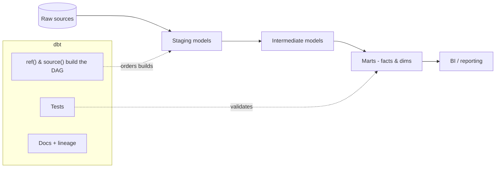
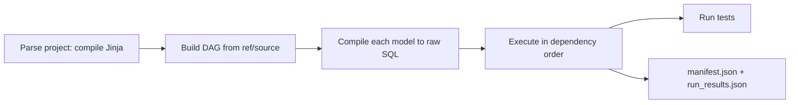

# dbt (data build tool)

dbt is the **T in ELT** — analytics engineering with software best practices:
you write `SELECT` statements as **models**, dbt handles dependencies, builds
them in the right order, tests them, and documents them. It runs *inside* your
warehouse (Snowflake, Databricks, BigQuery, etc.).

## How dbt works



- You reference other models with **`{{ ref('model_name') }}`** and raw tables
  with **`{{ source('schema','table') }}`**. dbt reads those to build a **DAG**
  and runs models in dependency order.
- `dbt run` builds models, `dbt test` runs data tests, `dbt docs generate`
  builds a lineage-aware docs site.

## Models & materializations

A model is a `.sql` file containing one `SELECT`. How it's persisted is the
**materialization**:

| Materialization | Persisted as | Use when |
|-----------------|--------------|----------|
| `view` | View | Lightweight, always fresh |
| `table` | Table (rebuilt) | Faster reads, small/medium data |
| `incremental` | Table (append/merge new rows) | Large, append-mostly data |
| `ephemeral` | Inlined CTE | Reusable logic, no object |

```sql
-- models/marts/fct_orders.sql
{{ config(materialized='incremental', unique_key='order_id') }}

SELECT
    o.order_id,
    o.customer_id,
    o.order_date,
    o.amount
FROM {{ ref('stg_orders') }} o

WHERE o.order_date > (SELECT MAX(order_date) FROM {{ this }})

```

## Tests

Catch data-quality issues in CI. Built-in generic tests + custom ones:

```yaml
# models/marts/schema.yml
models:
  - name: fct_orders
    columns:
      - name: order_id
        tests: [unique, not_null]
      - name: customer_id
        tests:
          - relationships:
              to: ref('dim_customers')
              field: customer_id
```

## Sources, seeds, macros, snapshots

- **Sources** — declare raw tables, add **freshness** checks.
- **Seeds** — small CSVs versioned in the repo (lookups).
- **Macros** — reusable Jinja SQL (DRY); packages like `dbt_utils`.
- **Snapshots** — dbt's built-in **SCD Type 2** to track history over time.

```sql
-- A simple macro

    ({{ col }} / 100.0)::numeric(16,2)

```

## Why teams adopt dbt

Version control, modular SQL, automated testing, auto-generated docs with
lineage, and environment promotion (dev → prod) — bringing software engineering
discipline to the transformation layer.

## Interview questions

??? question "What problem does dbt solve?"
    It brings engineering rigor to SQL transformations: dependency management via
    `ref()`, testing, documentation/lineage, and reproducible builds — the
    governed **T** in ELT, run inside the warehouse.

??? question "ref() vs source()?"
    `source()` points at raw external tables (and enables freshness checks);
    `ref()` points at other dbt models and is what builds the DAG and build order.

??? question "When would you use an incremental model?"
    For large, append-mostly tables where rebuilding fully is expensive — process
    only new/changed rows using `is_incremental()` and a `unique_key` for merges.

??? question "How does dbt handle slowly changing dimensions?"
    **Snapshots** implement SCD Type 2 — dbt detects changes and maintains
    valid-from/valid-to history automatically.

---

## Interview deep dive

### 60-second talking points

- **"dbt is the governed T in ELT."** SQL `SELECT`s become versioned, tested,
  documented models; dbt manages dependencies and build order via `ref()`.
- **"`ref()` builds the DAG."** That single function gives you lineage,
  ordering, and environment-safe table names for free.
- **"Tests + docs make transformations trustworthy."** Data quality is enforced
  in CI, and lineage docs are auto-generated.

### Scenario & system-design questions

??? question "A nightly full rebuild of a 2-billion-row fact table takes hours. Fix it."
    Switch to an **incremental** model with a `unique_key` and an
    `is_incremental()` filter on a load/updated timestamp so only new/changed rows
    are processed and merged. Consider partition/cluster hints for the warehouse
    and periodic `--full-refresh` to correct drift.

??? question "How do you promote changes from dev to prod safely with dbt?"
    Separate **targets/profiles** per environment; develop in a dev schema, run
    **`dbt build`** (models + tests) in CI on a PR, and only merge/deploy to prod
    on green. Use **slim CI** (`state:modified`) to build just what changed.

??? question "How would you track history of a dimension that changes over time?"
    A dbt **snapshot** implements **SCD Type 2** — dbt detects changes on a key and
    maintains `dbt_valid_from`/`dbt_valid_to`, so you can query the dimension as of
    any point in time.

??? question "A model passed but downstream numbers are wrong. How do tests help?"
    Add **generic tests** (`unique`, `not_null`, `relationships`,
    `accepted_values`) and **singular tests** (custom SQL that returns failing
    rows). Test at the **grain** — e.g. assert one row per key — to catch fan-out
    from a bad join early.

### Pitfalls interviewers probe

- Hardcoding table names instead of `ref()`/`source()` → breaks lineage and envs.
- Overusing `table` materialization where `view`/`incremental` fits (cost/time).
- Incremental models without a `unique_key` → duplicates.
- No tests → silent data-quality regressions.
- Business logic duplicated across models instead of macros/intermediate models.

### Rapid-fire

| Q | A |
|---|---|
| `ref()` vs `source()`? | `ref()` = other models (builds DAG); `source()` = raw tables (+ freshness) |
| Materializations? | view, table, incremental, ephemeral |
| SCD Type 2 in dbt? | Snapshots |
| Generic vs singular test? | Generic = reusable (unique/not_null); singular = custom SQL |
| What does `dbt build` do? | Runs models + tests + snapshots + seeds in DAG order |

---

## Deep dive: how dbt actually builds

The mental model behind `ref()` that senior interviews probe.



- **Compile then run** — dbt renders Jinja into plain SQL (`target/compiled/…`)
  *before* executing. When debugging, read the compiled SQL, not the template.
- **`ref()` does three jobs** — builds the DAG (order), resolves the correct
  schema/database per **target** (dev vs prod), and enables lineage. Never
  hardcode a table name.
- **Artifacts** — `manifest.json` (the full graph + metadata) and
  `run_results.json` (what ran, timings, pass/fail) power docs, **slim CI**, and
  observability tooling.

### Materialization decision tree

| If the model is… | Use | Why |
|------------------|-----|-----|
| Small, cheap, must be fresh | `view` | No storage, always current |
| Reused a lot, moderate size | `table` | Fast reads, rebuilt each run |
| Large, append-mostly | `incremental` | Process only new/changed rows |
| Just reusable logic | `ephemeral` | Inlined as a CTE, no object |

Incremental **strategies** matter: `append` (facts, no updates), `merge`
(upsert on `unique_key`), `delete+insert`, and `insert_overwrite` (partition
swap). Wrong strategy = duplicates or full rewrites.

---

## Testing, contracts & data quality

Beyond `unique`/`not_null`:

- **Generic tests** — `unique`, `not_null`, `relationships`, `accepted_values`,
  plus `dbt_utils`/`dbt_expectations` (row counts, ranges, freshness, expression
  checks).
- **Singular tests** — a `.sql` file that returns failing rows; use for
  business rules ("revenue is never negative").
- **Unit tests** — assert a model's SQL logic against mock inputs, so you catch
  transformation bugs without full data.
- **Model contracts** — enforce column names, types, and `not_null`/`unique`
  constraints at build time; a downstream consumer's schema can't silently break.
- **Test at the grain** — the highest-value test is "one row per key"; it catches
  fan-out from a bad join, the #1 silent data bug.

```yaml
models:
  - name: fct_orders
    config:
      contract: {enforced: true}
    columns:
      - name: order_id
        data_type: number
        constraints: [{type: not_null}, {type: unique}]
```

---

## Environments, CI/CD & performance

- **Targets/profiles** isolate dev vs prod (separate schemas/databases); the
  same `ref()` resolves correctly per environment.
- **Slim CI** — `dbt build --select state:modified+` builds only changed models
  and their children against a deferred prod manifest, so PR checks are fast.
- **Deploy on green** — run `dbt build` (models + tests + snapshots + seeds) in
  CI; merge/deploy only when tests pass. This is [DevOps for AI/data](../../GenAI-Topics/devops-ai/index.md)
  discipline applied to the transformation layer — Kiro-assisted authoring,
  Jenkins/GitHub Actions running the build.
- **Performance** — prefer `incremental` for big facts; push heavy logic into
  the warehouse (dbt is just SQL); avoid unnecessary `table` rebuilds; use
  warehouse-native clustering/partitioning; keep models single-responsibility so
  the DAG parallelizes.

!!! tip "Analytics-engineering soundbite"
    *"dbt turns SQL into software: version-controlled, tested, documented models
    with a DAG from `ref()`. In CI I run slim builds on just what changed, and
    contracts stop a schema change from silently breaking a downstream mart."*

---

## Governance & observability

- **Docs + lineage** — `dbt docs generate` builds a searchable, column-lineage
  site from the manifest; it's the "what feeds this and who uses it" answer.
- **Source freshness** — `dbt source freshness` warns/errors when raw data is
  stale, catching upstream pipeline failures early.
- **Exposures** — declare downstream dashboards/apps so lineage extends past dbt
  and you know the blast radius of a change.
- **Ownership + meta** — tag models with owner/domain for accountability.

---

## More system-design & production incidents

Each: **diagnose → mitigate → prevent.**

??? question "An incremental model is producing duplicate rows. Root cause?"
    Almost always a **missing or wrong `unique_key`**, or an `is_incremental()`
    filter that lets overlapping rows in. **Mitigate:** set the correct
    `unique_key` with a `merge` strategy and `--full-refresh` once to clean up.
    **Prevent:** a `unique` test on the grain so CI catches recurrence.

??? question "A dashboard number silently went wrong after a PR. How should this have been caught?"
    A **fan-out from a many-to-many join** inflated the grain. **Prevent:** a
    grain test (`unique` on the key), `relationships` tests, and **model
    contracts** so column/type/constraint changes fail the build. Read the
    **compiled SQL** to confirm the join.

??? question "Upstream data was late and the whole run built on stale data. Fix the process."
    **Diagnose:** no freshness gate. **Mitigate/prevent:** add
    **`dbt source freshness`** as a pre-run check that errors on stale sources,
    and gate the build on it so you don't publish stale marts.

??? question "The nightly run is taking too long and blocking morning dashboards. Speed it up."
    Convert big full-rebuild `table` models to **incremental**; split monolithic
    models so the DAG parallelizes; use **slim CI** so only changed models rebuild
    on PRs; move the schedule earlier or add warehouse concurrency. Profile with
    `run_results.json` to find the slowest models.

??? question "How do you safely refactor a heavily-used model without breaking consumers?"
    Add a **model contract** to lock the interface, use **exposures** to see who
    depends on it, ship behind tests, and deploy via CI on green. If the shape
    must change, version the model and deprecate the old one.

---

## 60-second ramp checklist

- [ ] Explain `ref()`'s three jobs (DAG, env resolution, lineage).
- [ ] Pick a materialization and incremental strategy for a given case.
- [ ] Name generic vs singular vs unit tests and what a grain test catches.
- [ ] Describe model contracts and why they matter.
- [ ] Explain slim CI (`state:modified+`) and deploy-on-green.
- [ ] Use source freshness + exposures for governance.
- [ ] Debug a duplicate-rows and a silent-fan-out incident out loud.

## Related in this site

- [Snowflake](../snowflake/index.md) · [Databricks](../databricks/index.md) — the warehouses dbt runs inside.
- [Data Engineering Interview Q&A](../../Personal-SourceCode/DataEngineering_Interview_QA.md) · [dbt Interview Q&A](../../Personal-SourceCode/dbt_Interview_QA.md).
- [DevOps for AI](../../GenAI-Topics/devops-ai/index.md) — CI/CD patterns that apply to dbt.
