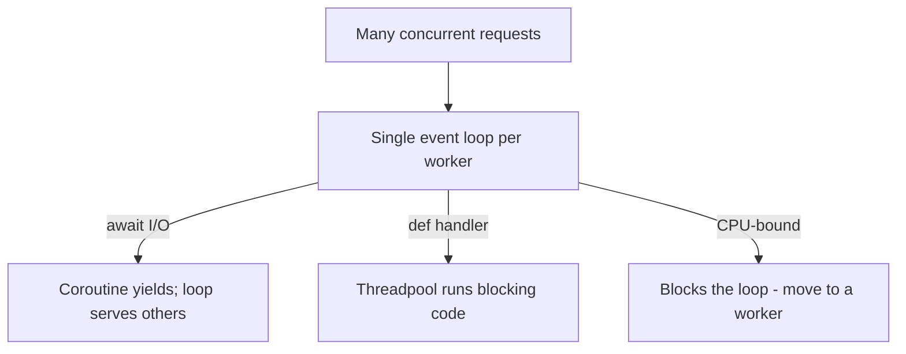

# FastAPI

FastAPI is a modern, high-performance Python web framework for building APIs. It
uses **type hints** for automatic validation and docs, is **async-first** (built
on Starlette + Pydantic), and is a common choice for **serving GenAI/LLM
endpoints**.

## Why FastAPI

- **Fast** — on par with Node/Go for I/O-bound work, thanks to ASGI/async.
- **Type-driven** — Pydantic models validate requests/responses automatically.
- **Auto docs** — interactive Swagger UI at `/docs` and ReDoc at `/redoc`, free.
- **Editor support** — type hints give autocomplete and catch errors early.

## A minimal API

```python
from fastapi import FastAPI
from pydantic import BaseModel

app = FastAPI(title="Demo")

class AskRequest(BaseModel):
    question: str
    area: str = "all"

class AskResponse(BaseModel):
    answer: str
    citations: list[str] = []

@app.get("/health")
def health():
    return {"status": "ok"}

@app.post("/ask", response_model=AskResponse)
def ask(req: AskRequest):
    # ... call your logic ...
    return AskResponse(answer=f"You asked about {req.area}: {req.question}")
```

Run it: `uvicorn main:app --reload` → open `http://127.0.0.1:8000/docs`.

## Request lifecycle


## Core concepts

| Concept | What it does |
|---------|--------------|
| **Path operations** | `@app.get/post/...` decorators map routes to functions |
| **Pydantic models** | Typed request/response schemas + validation |
| **Path & query params** | Declared as function args with type hints |
| **Dependencies (`Depends`)** | Reusable injected logic: auth, DB sessions, config |
| **`async def`** | Non-blocking handlers for I/O (DB, HTTP, LLM calls) |
| **Background tasks** | Fire-and-forget work after responding |
| **Routers** | Split endpoints across modules (`APIRouter`) |

## async vs sync

Use `async def` when the handler does **I/O** (calling an LLM, DB, or HTTP
service) with an async client — it frees the event loop to serve other requests.
Use plain `def` for CPU-bound or blocking-library code (FastAPI runs it in a
threadpool so it won't block the loop).

## Serving an LLM / RAG endpoint

FastAPI is a natural front door for a GenAI service — the same role Lambda +
Chainlit play in the course's SQL Assistant project:

```python
@app.post("/chat")
async def chat(req: AskRequest):
    # 1. retrieve context from a vector store (RAG)
    # 2. build the prompt
    # 3. await the LLM call (async client)
    # 4. return the grounded answer + citations
    ...
```

Good practices: stream responses (`StreamingResponse`) for token-by-token UX,
set timeouts on model calls, validate/limit input size, and add rate limiting.

## Validation, errors, docs

- **Validation** — invalid bodies auto-return `422` with details; no manual checks.
- **Errors** — raise `HTTPException(status_code=..., detail=...)`.
- **Docs** — `/docs` (Swagger) and `/redoc` are generated from your models.
- **Settings** — use `pydantic-settings` / env vars for config and secrets.

## Deployment

- **Uvicorn** (ASGI server), often behind **Gunicorn** with uvicorn workers.
- Containerize; put **Nginx**/ALB in front for TLS and load balancing.
- On AWS: run on ECS/Fargate, or wrap with **Mangum** to run on Lambda + API
  Gateway.

## Interview questions

??? question "Why FastAPI over Flask?"
    Async-first (ASGI) for high I/O concurrency, automatic request/response
    validation via Pydantic type hints, and auto-generated interactive docs.
    Flask is sync-first (WSGI) and needs extensions for much of that.

??? question "When do you use async def vs def in a path operation?"
    `async def` for non-blocking I/O with async clients (DB, HTTP, LLM). Plain
    `def` for blocking/CPU-bound code — FastAPI runs it in a threadpool so it
    doesn't block the event loop.

??? question "What are dependencies (Depends) used for?"
    Reusable injected logic — auth, DB sessions, shared config, pagination —
    declared once and injected into any endpoint, improving testability and reuse.

??? question "How does FastAPI validate input?"
    You declare Pydantic models / typed params; FastAPI validates automatically
    and returns a structured 422 on failure — no manual parsing.

??? question "How would you serve an LLM/RAG app with FastAPI?"
    A `/chat` endpoint that retrieves context from a vector store, builds a
    grounded prompt, awaits an async LLM call, and returns the answer with
    citations — optionally streaming tokens via StreamingResponse.

---

## Interview deep dive

### 60-second talking points

- **"Type hints do the work."** Pydantic validates requests/responses and
  generates OpenAPI docs automatically — less boilerplate, fewer bugs.
- **"Async-first for I/O concurrency."** Built on ASGI, so one process serves
  many concurrent I/O-bound requests (DB, HTTP, LLM calls).
- **"Dependencies = clean, testable wiring."** Auth, DB sessions, config injected
  via `Depends`.

### Scenario & system-design questions

??? question "Design a streaming chat endpoint for an LLM app."
    `POST /chat` → retrieve context (RAG) → build prompt → `await` the model with
    an **async client** → return a **`StreamingResponse`** yielding tokens.
    Add input-size limits, per-user rate limiting, timeouts, and a fallback if the
    model call fails.

??? question "Your API blocks under load even though it's async. Why?"
    A **blocking call inside an `async def`** (e.g. a sync DB driver or `requests`)
    stalls the event loop. Fix: use async clients, or move blocking work to a
    threadpool (`def` handler / `run_in_executor`). CPU-bound work belongs in a
    worker, not the loop.

??? question "How do you deploy FastAPI to production?"
    **Uvicorn** workers under **Gunicorn**, behind Nginx/ALB for TLS + load
    balancing; containerized on ECS/Fargate/K8s, or **Mangum** to run on Lambda +
    API Gateway. Health checks, structured logging, and config via env/secrets.

??? question "How do you keep request/response contracts safe as the API evolves?"
    Pydantic **response_model** enforces the output shape; version the API
    (`/v1`); validate inputs strictly; and rely on the auto OpenAPI schema as the
    contract for clients.

### Pitfalls interviewers probe

- Blocking I/O inside `async def` (kills concurrency).
- No `response_model` → leaking internal fields.
- Doing heavy CPU work in the event loop.
- Skipping input validation/limits on public endpoints.
- Global mutable state instead of dependency injection.

### Rapid-fire

| Q | A |
|---|---|
| FastAPI vs Flask? | ASGI/async + Pydantic validation + auto docs vs sync WSGI |
| `async def` vs `def`? | Async for non-blocking I/O; def (threadpool) for blocking/CPU |
| What is `Depends` for? | Injecting reusable logic: auth, DB, config |
| Auto docs URLs? | `/docs` (Swagger), `/redoc` |
| Stream tokens with? | `StreamingResponse` |

---

## Deep dive: the ASGI concurrency model

Why FastAPI scales for I/O — and exactly how people break it.



- **One event loop per worker process.** `async def` handlers that `await` I/O
  yield control so the loop serves other requests — that's the concurrency win.
- **The cardinal sin:** a **blocking call inside `async def`** (sync DB driver,
  `requests`, `time.sleep`, heavy CPU) freezes the loop and stalls *every*
  concurrent request. Use async clients, or make the handler `def` (FastAPI runs
  `def` handlers in a threadpool).
- **CPU-bound work** belongs in a background worker (Celery/RQ/Arq) or a separate
  service — not the event loop.
- **Scale out** with multiple Uvicorn workers (processes); scale the loop within
  each for I/O. GIL means CPU parallelism needs processes, not threads.

---

## Dependency injection in depth

`Depends` is FastAPI's backbone for clean, testable wiring.

```python
from fastapi import Depends, HTTPException, Header

async def get_db():
    async with SessionLocal() as session:   # yield-based: setup + teardown
        yield session

async def require_api_key(x_api_key: str = Header(...)):
    if not valid(x_api_key):
        raise HTTPException(401, "bad key")
    return x_api_key

@app.post("/chat")
async def chat(req: AskRequest,
               db=Depends(get_db),
               _=Depends(require_api_key)):
    ...
```

- **Yield dependencies** run setup before and teardown after the request (DB
  sessions, transactions) — like context managers.
- **Sub-dependencies** compose; FastAPI resolves the graph and **caches** each
  dependency per request by default.
- **Testability** — `app.dependency_overrides` swaps real deps for fakes in
  tests. This is why DI beats global state.

---

## Serving GenAI/LLM endpoints (production shape)

FastAPI is the front door for the RAG/agent systems described in
[GenAI Topics](../../GenAI-Topics/index.md) and the
[Snowflake Cortex](../../Snowflake-Cortex/index.md) REST integration.

```python
from fastapi.responses import StreamingResponse

@app.post("/chat")
async def chat(req: AskRequest, _=Depends(require_api_key)):
    ctx = await retrieve(req.question)          # async vector search
    async def gen():
        async for token in llm_stream(req.question, ctx):  # async LLM client
            yield token
    return StreamingResponse(gen(), media_type="text/event-stream")
```

Production checklist for an LLM endpoint:

- **Stream** tokens (`StreamingResponse` / SSE) for responsive UX.
- **Timeouts** on every model/tool call; a hung upstream must not hang your API.
- **Backpressure & concurrency caps** — a semaphore limiting in-flight LLM calls
  so a spike doesn't exhaust tokens/budget (ties to
  [cost optimization](../../GenAI-Topics/cost-optimization/index.md)).
- **Input limits & validation** — cap prompt size; reject oversized bodies.
- **Idempotency** for retriable POSTs (idempotency key) so client retries don't
  double-charge an LLM call.
- **Treat model output as untrusted** — never `eval`/exec it, escape before
  downstream use ([AI Security](../../AI-Security/index.md), insecure output handling).

---

## Security

- **AuthN/AuthZ** — OAuth2/JWT via `Depends`; scope-check per route; never trust
  client-supplied identity fields.
- **Secrets** — `pydantic-settings` + env/secret manager; never hardcode.
- **Input hardening** — Pydantic validation + explicit size/rate limits; strict
  `response_model` so internal fields don't leak.
- **CORS/TLS** — lock CORS to known origins; terminate TLS at the proxy/ALB.
- **Rate limiting** — per-key/IP (e.g. slowapi or gateway-level) to contain abuse
  and cost.

---

## Observability & performance

- **Structured logging** with a request/correlation ID (middleware) so you can
  trace one request end-to-end.
- **Metrics** — latency (p50/p95/p99), error rate, in-flight requests, and for
  LLM apps: tokens and cost per request. Prometheus/OpenTelemetry integrate
  cleanly with ASGI.
- **Tracing** — OpenTelemetry spans across retrieve → prompt → model call to see
  where latency lives.
- **Health/readiness** — `/health` (liveness) and a readiness check (deps
  reachable) for orchestrators.
- **Perf levers** — async clients everywhere on the hot path, connection pooling,
  cache hot reads, `orjson` responses, and right-sizing worker count.

---

## More system-design & production incidents

Each: **diagnose → mitigate → prevent.**

??? question "Latency spikes to seconds under moderate load though the code is async. Why?"
    A **blocking call in an `async def`** (sync DB/HTTP client, CPU work) is
    stalling the event loop. **Diagnose:** profile the handler; look for non-await
    I/O. **Mitigate:** switch to an async client or make the handler `def`
    (threadpool); move CPU work to a worker. **Prevent:** lint for blocking calls,
    load-test, and cap concurrency.

??? question "The LLM provider slowed down and your whole API became unresponsive. Design the fix."
    No **timeout/isolation** on the upstream. **Mitigate/prevent:** per-call
    timeouts, a **circuit breaker** and retries with backoff, a concurrency
    **semaphore** so slow calls don't consume every worker, and a graceful
    fallback/queue. This is the [reliability](../../GenAI-Topics/reliability/index.md)
    playbook applied at the API edge.

??? question "Design a multi-tenant LLM API that stays within a cost budget."
    Per-tenant **API keys** (DI-checked), per-tenant **rate limits** and
    **token/cost budgets**, request size caps, response caching for repeat
    prompts, and model routing (cheap model first). Emit per-tenant cost metrics
    and alert on drift.

??? question "How do you deploy and roll this out safely?"
    Containerize; **Uvicorn workers under Gunicorn** behind ALB/Nginx (TLS, LB);
    run on ECS/Fargate or K8s (or **Mangum** on Lambda + API Gateway). Health +
    readiness probes, **canary/blue-green** rollout, structured logs, and config
    via env/secrets. See [Kubernetes](../../GenAI-Topics/kubernetes/index.md) and
    [DevOps for AI](../../GenAI-Topics/devops-ai/index.md).

??? question "How do you keep the API contract stable as it evolves?"
    Strict `response_model` (no leaked fields), URL versioning (`/v1`), the
    auto-generated OpenAPI schema as the client contract, and additive changes
    over breaking ones. Deprecate old versions on a schedule.

---

## 60-second ramp checklist

- [ ] Explain one event loop per worker and the blocking-call trap.
- [ ] Decide `async def` vs `def` correctly for a given handler.
- [ ] Use `Depends` (incl. yield deps + overrides) for DB/auth/config.
- [ ] Design a streaming LLM endpoint with timeouts, limits, and idempotency.
- [ ] List the security controls (auth, secrets, rate limit, response_model).
- [ ] Describe logging/metrics/tracing + health vs readiness.
- [ ] Handle the "blocking loop" and "slow upstream" incidents out loud.

## Related in this site

- [GenAI Topics](../../GenAI-Topics/index.md) · [Snowflake Cortex](../../Snowflake-Cortex/index.md) — the systems this API fronts.
- [Reliability](../../GenAI-Topics/reliability/index.md) · [Kubernetes](../../GenAI-Topics/kubernetes/index.md) · [DevOps for AI](../../GenAI-Topics/devops-ai/index.md).
- [AI Security](../../AI-Security/index.md) — output handling and input hardening for AI endpoints.
