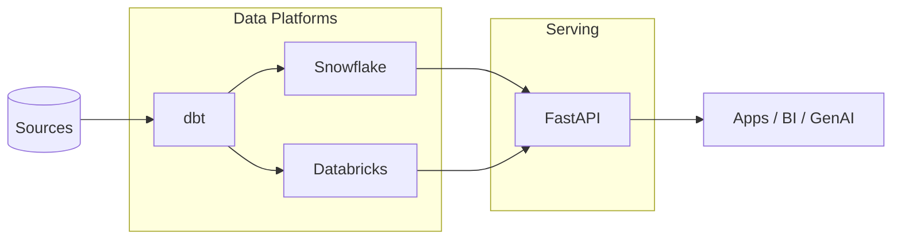

# Technologies

Notes, patterns, and references for the core data & cloud platforms I work with.
Pick an area below and add content freely — each area is a normal Markdown page
you can grow over time.

-   :material-snowflake: __Snowflake__

    Warehousing, SQL, performance, and integrations.

    [Open](snowflake/index.md)

-   :material-database: __Databricks__

    Lakehouse, Spark, Delta, Unity Catalog, Mosaic AI.

    [Open](databricks/index.md)

-   :material-cube-outline: __dbt__

    Models, tests, sources, macros — analytics engineering.

    [Open](dbt/index.md)

-   :material-lightning-bolt: __FastAPI__

    Python APIs: async, Pydantic, serving GenAI endpoints.

    [Open](fastapi/index.md)

