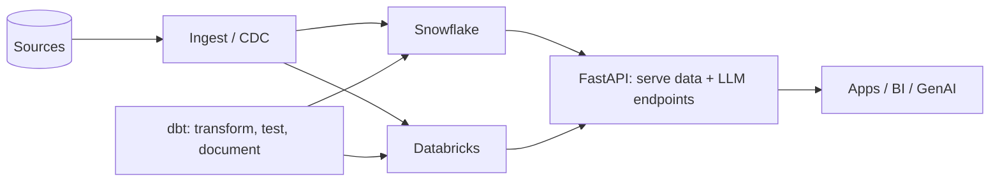

# Technologies

*Last reviewed: October 2026*

Deep-dive pages on the data and serving platforms that come up most in senior
data, platform and AI engineering interviews. Each page covers the architecture,
core patterns, performance and cost tuning, governance and interview
questions. The Databricks, dbt and FastAPI pages also include production
incidents and a 60-second ramp checklist for the night before.

**Who it's for:** engineers who list these tools on their CV and need to defend
design choices at staff or principal depth, and engineers who are moving into a
role built on one of these platforms.

## How the pieces fit

```mermaid
flowchart LR
    SRC[(Sources)] --> ING[Ingest / CDC]
    ING --> SF[Snowflake]
    ING --> DB[Databricks]
    DBT[dbt: transform, test, document] --> SF
    DBT --> DB
    SF --> API[FastAPI: serve data + LLM endpoints]
    DB --> API
    API --> APP[Apps / BI / GenAI]
```

## Suggested learning path

1. **Start with the warehouse you use or are interviewing for**, either
   Snowflake or Databricks. Read the architecture section, then the
   performance and cost section.
2. **Add dbt**, because modelling, testing and CI for analytics come up in
   nearly every data platform loop.
3. **Finish with FastAPI** to cover how data and GenAI features are served to
   applications.
4. **Practise out loud** with the matching interview Q&A pages linked below.

-   :material-snowflake: __Snowflake__

    ---

    Storage and compute separation, CDC with Streams and Tasks, Time Travel,
    Cortex AI, cost and performance tuning, and governance.

    [:octicons-arrow-right-24: Open](snowflake/index.md)

-   :material-database: __Databricks__

    ---

    Lakehouse on Delta Lake, the Spark execution model, Unity Catalog,
    Mosaic AI and Genie, and tuning.

    [:octicons-arrow-right-24: Open](databricks/index.md)

-   :material-cube-outline: __dbt__

    ---

    Models and materializations, tests and contracts, snapshots and macros,
    and CI/CD for analytics engineering.

    [:octicons-arrow-right-24: Open](dbt/index.md)

-   :material-lightning-bolt: __FastAPI__

    ---

    The async ASGI model, Pydantic validation, dependency injection and
    production-shaped LLM/RAG endpoints.

    [:octicons-arrow-right-24: Open](fastapi/index.md)

## Go deeper

- [Snowflake Cortex](../Snowflake-Cortex/index.md): AI SQL functions, Cortex
  Analyst and Search, and agents inside Snowflake.
- Interview Q&A:
  [Snowflake](../Personal-SourceCode/Snowflake_Interview_QA.md) ·
  [Databricks](../Personal-SourceCode/Databricks_Interview_QA.md) ·
  [dbt](../Personal-SourceCode/dbt_Interview_QA.md) ·
  [SQL](../Personal-SourceCode/SQL_Interview_QA.md) ·
  [Python](../Personal-SourceCode/Python_Interview_QA.md) ·
  [Data Engineering](../Personal-SourceCode/DataEngineering_Interview_QA.md)
- Role path: [Data Platform](../Personal-SourceCode/Path_Data_Platform.md).
