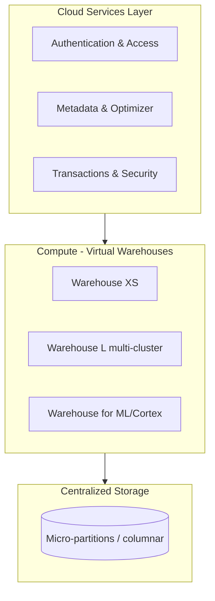
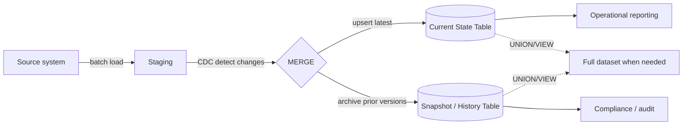
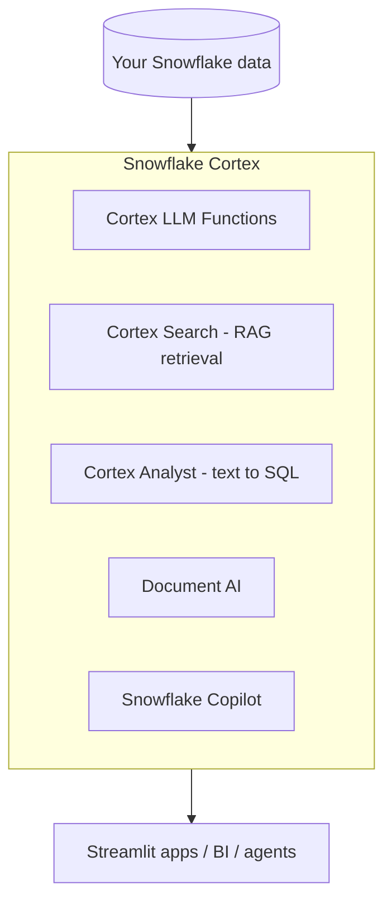

# Snowflake

Snowflake is a cloud data platform with a **multi-cluster, shared-data**
architecture that separates storage, compute, and cloud services so each scales
independently. This page covers the architecture, SQL patterns, the newer
**Cortex AI** features, performance/cost tuning, governance, and interview prep.

## Architecture at a glance



Three independent layers:

| Layer | What it does | Why it matters |
|-------|--------------|----------------|
| **Cloud Services** | Auth, metadata, query optimization, security | The "brain"; you don't size it |
| **Compute (Virtual Warehouses)** | Run queries; T-shirt sized (XS→6XL); multi-cluster for concurrency | Scale up for big queries, out for concurrency; per-second billing |
| **Storage** | Columnar micro-partitions in cloud object storage | Compressed, immutable, auto-managed; enables Time Travel & cloning |

Key differentiators: **separation of storage & compute**, **zero-copy cloning**,
**Time Travel** (query/restore past data), **data sharing** (no copies), and
**automatic micro-partition pruning**.

## Core SQL patterns

=== "Window functions"

    ```sql
    -- Rank employees by salary within each department
    SELECT
        first_name, last_name, department, salary,
        RANK()       OVER (PARTITION BY department ORDER BY salary DESC) AS rnk,
        AVG(salary)  OVER (PARTITION BY department)                     AS dept_avg
    FROM employees;
    ```

=== "CTE + aggregation"

    ```sql
    WITH dept_max AS (
        SELECT department, MAX(salary) AS max_salary
        FROM employees
        GROUP BY department
    )
    SELECT department, max_salary
    FROM dept_max
    WHERE max_salary > 70000;
    ```

=== "MERGE (upsert)"

    ```sql
    MERGE INTO current_state tgt
    USING staged_changes src
      ON tgt.key = src.key
    WHEN MATCHED AND src.op = 'D' THEN DELETE
    WHEN MATCHED THEN UPDATE SET tgt.val = src.val, tgt.updated = src.ts
    WHEN NOT MATCHED THEN INSERT (key, val, updated) VALUES (src.key, src.val, src.ts);
    ```

## Pattern: Snapshot + Current-State tables (CDC/Merge)

A production pattern for keeping a fast "current" table while retaining full
history — splitting a large table into a **Current State** table (recent data)
and a **Snapshot/History** table (older versions with timestamps).



- **Load → Merge → Insert:** batch-load into staging, detect changes via CDC,
  `MERGE` the latest into the Current State table, and move prior versions into
  the Snapshot table at weekly/monthly intervals.
- **Current State** = latest version per key for operational efficiency.
- **Snapshot** = full historical records with timestamps for reporting/compliance.
- Combine with `UNION`/`JOIN`/`VIEW` when a complete dataset is needed.
- Apply **object tags** for governance (e.g. `Confidentiality`, compliance flags)
  directly on the history table so classification travels with the data.

!!! note "From real work"
    This mirrors a metering/measurement history design (e.g. a `*_MSRMT_HIST`
    table tagged for confidentiality and regulatory compliance) — snapshot tables
    keep audit history while the current-state table stays lean for downstream
    processing.

## Cortex — AI built into Snowflake

Snowflake **Cortex** brings LLMs and ML to your data, governed by the same RBAC —
no data movement required.



| Feature | What it does | Example |
|---------|--------------|---------|
| **Cortex LLM Functions** | Call LLMs in SQL: summarize, translate, sentiment, classify, complete | `SELECT SNOWFLAKE.CORTEX.SUMMARIZE(review) FROM feedback;` |
| **Cortex Search** | Managed hybrid (vector + keyword) retrieval — the RAG engine | Powers semantic search & grounding for chatbots |
| **Cortex Analyst** | Natural-language → SQL over a semantic model | "What were Q3 sales by region?" returns governed SQL |
| **Document AI** | Extract structured fields from PDFs/images | Pull totals/dates from invoices into tables |
| **Snowflake Copilot** | In-editor SQL assistant (write/explain/optimize) | "Write a query for top 10 customers by revenue" |

```sql
-- LLM functions run right in SQL, on governed data
SELECT
    id,
    SNOWFLAKE.CORTEX.SENTIMENT(comment)                        AS sentiment,
    SNOWFLAKE.CORTEX.SUMMARIZE(comment)                        AS summary,
    SNOWFLAKE.CORTEX.COMPLETE('mistral-large',
        'Classify this ticket: ' || comment)                  AS category
FROM support_tickets;
```

Why it matters for a Solutions Architect: you can add **GenAI capabilities
without moving data out of the governance boundary** — RBAC, masking policies,
and tags still apply, which is exactly the security/compliance story enterprises
need.

## Performance & cost tuning

- **Right-size warehouses**: scale **up** for heavy single queries, **out**
  (multi-cluster) for concurrency. Set `AUTO_SUSPEND` low and `AUTO_RESUME` on.
- **Pruning**: cluster keys / natural load order so micro-partition pruning skips
  data. Check `SYSTEM$CLUSTERING_INFORMATION`.
- **Result cache**: identical queries return instantly for 24h with no compute.
- **Avoid** `SELECT *`, exploding joins, and tiny frequent warehouses; use
  `QUERY_HISTORY` and the Query Profile to find spillage and scan bottlenecks.
- **Separate warehouses** per workload (ETL vs BI vs ML) so they don't contend.

## Governance & security

- **RBAC** with role hierarchies; grant to roles, not users.
- **Dynamic Data Masking** and **Row Access Policies** for column/row security.
- **Object Tags** for classification (confidentiality, compliance) + **tag-based
  masking**.
- **Data lineage & Access History** for audit; **GDPR/CCPA** support via masking
  and retention.

## Loading data

Snowflake supports batch and continuous ingestion:

| Method | Use for |
|--------|---------|
| **`COPY INTO`** from a **stage** | Bulk batch loads from S3/Azure/GCS or internal stage |
| **Snowpipe** | Continuous, near-real-time file ingestion (auto-triggered) |
| **Snowpipe Streaming** | Low-latency row-level streaming |
| **External tables** | Query files in cloud storage without loading |
| **Connectors** (Kafka, Spark, drivers) | Stream/ETL from apps |

```sql
-- Stage -> table batch load
CREATE OR REPLACE STAGE my_stage
  URL='s3://bucket/path/' STORAGE_INTEGRATION = my_int
  FILE_FORMAT = (TYPE = CSV SKIP_HEADER = 1);

COPY INTO raw.events
  FROM @my_stage
  ON_ERROR = 'CONTINUE';
```

## Time Travel & cloning

- **Time Travel** — query or restore data as of a past time (default 1 day, up to
  90 on Enterprise): `SELECT * FROM t AT (OFFSET => -3600);` or `UNDROP TABLE t;`.
- **Fail-safe** — 7-day non-configurable recovery after Time Travel (disaster only).
- **Zero-copy clone** — instant metadata copy that shares micro-partitions until
  changed: `CREATE TABLE dev_t CLONE prod_t;`. Great for dev/test and backups.

## Streams & Tasks (CDC + scheduling)

The native way to build the CDC/Merge pipeline described above:

- **Stream** — tracks row-level changes (inserts/updates/deletes) on a table (a
  change-data-capture "bookmark").
- **Task** — scheduled SQL (or a DAG of tasks) that can run when a stream has data.

```sql
CREATE OR REPLACE STREAM s_orders ON TABLE staging.orders;

CREATE OR REPLACE TASK t_merge_orders
  WAREHOUSE = etl_wh
  SCHEDULE = '5 MINUTE'
  WHEN SYSTEM$STREAM_HAS_DATA('s_orders')
AS
  MERGE INTO current.orders tgt
  USING s_orders src ON tgt.id = src.id
  WHEN MATCHED THEN UPDATE SET tgt.val = src.val
  WHEN NOT MATCHED THEN INSERT (id, val) VALUES (src.id, src.val);
```

## Data sharing & Marketplace

- **Secure Data Sharing** — share live data with other Snowflake accounts with
  **no copying** (consumers query your micro-partitions, you pay only storage).
- **Marketplace** — publish/consume datasets and native apps.
- **Reader accounts** — share with non-Snowflake customers.

## Key objects reference

| Object | Purpose |
|--------|---------|
| **Database → Schema → Table/View** | Standard containment hierarchy |
| **Virtual Warehouse** | Compute cluster (sizing/scaling) |
| **Stage** | Pointer to files for load/unload |
| **Storage Integration** | Secure cloud-storage credential object |
| **Stream / Task** | CDC tracking / scheduled execution |
| **Materialized View** | Precomputed, auto-maintained results |
| **Dynamic Table** | Declarative, auto-refreshing transformation |
| **Masking / Row Access Policy** | Column/row security |
| **Tag** | Classification metadata (governance) |

## Interview questions

??? question "Explain Snowflake's architecture and why storage/compute separation matters."
    Three layers — cloud services (metadata/optimizer/security), compute (virtual
    warehouses), and centralized storage. Separating storage and compute means you
    can scale them independently, run many warehouses on the same data with no
    contention, pay per-second for compute only when used, and clone data with
    zero copy.

??? question "How do you handle slowly changing / historical data at scale?"
    Snapshot + Current-State pattern: CDC into staging, `MERGE` latest into a lean
    current-state table, archive prior versions into a timestamped snapshot/history
    table on an interval. Query current for operations, snapshot for audit, and
    `UNION`/views for the full picture.

??? question "What is zero-copy cloning and when do you use it?"
    A metadata-only copy of a table/schema/database that shares micro-partitions
    until modified. Great for instant dev/test environments and pre-deployment
    backups with no extra storage cost.

??? question "How would you add GenAI to a Snowflake platform securely?"
    Use **Cortex** (LLM functions, Cortex Search for RAG, Cortex Analyst for
    text-to-SQL) so processing happens inside Snowflake under existing RBAC,
    masking, and tags — no data egress, governance preserved.

??? question "How do you optimize a slow query?"
    Read the Query Profile: look for full scans (add clustering / better filters),
    spillage to disk (size up the warehouse), exploding joins (fix grain/keys), and
    leverage the result cache. Avoid `SELECT *`.

---

## Interview deep dive

### 60-second talking points

Crisp framings to sound fluent, not memorized:

- **"Snowflake decouples storage and compute."** One copy of data, many
  independent warehouses — scale up for a heavy query, out for concurrency, pay
  per second, and clone with zero copy.
- **"Micro-partitions + pruning are the performance story."** Data is stored in
  immutable ~16 MB columnar micro-partitions with min/max metadata, so the
  optimizer skips partitions that can't match — no manual indexes.
- **"Cortex means governed GenAI with no data egress."** LLM functions, Search,
  and Analyst run inside the RBAC/masking/tag boundary.

### Scenario & system-design questions

??? question "Design a near-real-time pipeline that keeps a lean 'current' table plus full history."
    Land files → **Snowpipe** into staging → **Stream** captures row changes → a
    scheduled **Task** runs `MERGE` into the Current-State table and archives prior
    versions into a timestamped Snapshot table. Query current for operations,
    snapshot for audit, and a `UNION`/view for the full set. Tag the history table
    for confidentiality/compliance. (This is the metering-history pattern.)

??? question "A dashboard got slow after data volume grew 10x. Walk me through diagnosis."
    Open the **Query Profile**: check for (1) full table scans → add a **cluster
    key** aligned to filters or fix load order; (2) **spilling to local/remote
    disk** → size the warehouse up; (3) **exploding joins** → verify grain/keys;
    (4) low **partition pruning** → check `SYSTEM$CLUSTERING_INFORMATION`. Confirm
    the **result cache** isn't being defeated by non-deterministic functions.

??? question "How would you control cost on a Snowflake account used by many teams?"
    Separate **warehouses per workload** (ETL/BI/ML) with tight `AUTO_SUSPEND`;
    use **resource monitors** with credit quotas and alerts; right-size (start
    small, scale on evidence); enable **multi-cluster** only where concurrency
    demands it; review `WAREHOUSE_METERING_HISTORY` and the most expensive queries
    in `QUERY_HISTORY`.

??? question "How do you implement column-level security for PII across many tables?"
    **Tag** PII columns once (e.g. `pii = 'email'`), then attach a **tag-based
    masking policy** so masking follows the classification automatically. Combine
    with **row access policies** for tenant/row isolation and role hierarchies so
    only authorized roles see cleartext.

??? question "Explain how you'd share data with an external partner without copying it."
    **Secure Data Sharing**: create a share, grant on the objects, add the
    consumer account (or a **reader account** if they're not on Snowflake). They
    query your micro-partitions live; you pay storage, they pay their own compute.
    No ETL, no stale copies.

### Pitfalls interviewers probe

- Thinking warehouses store data (they don't — storage is separate).
- Over-clustering small/low-cardinality tables (cost > benefit).
- Using one giant warehouse for everything (contention); or too many tiny ones.
- Forgetting `AUTO_SUSPEND`, leaving warehouses running idle.
- Assuming Time Travel = backup (Fail-safe is 7 days, disaster-only, not
  self-serve).

### Rapid-fire

| Q | A |
|---|---|
| Default Time Travel window? | 1 day (up to 90 on Enterprise) |
| What's Fail-safe? | 7-day, non-configurable, Snowflake-managed recovery |
| Scale **up** vs **out**? | Up = bigger warehouse (heavy query); out = more clusters (concurrency) |
| Result cache duration? | 24 hours if underlying data unchanged |
| Micro-partition size? | ~50–500 MB uncompressed (~16 MB compressed), columnar |
