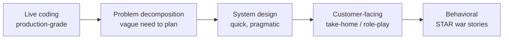

# FDE Live-Coding & Real-Time Scenarios — Prep & Confidence

A focused playbook for the **hard parts** of Forward Deployed Engineer loops:
live coding under a watcher, real-time "the demo just broke" scenarios, and the
LLM fundamentals (models, tokens, sampling) they probe. Plus concrete ways to
walk in **calmer and more confident**.

!!! note "Sources"
    Interview-format details paraphrased from current 2026 FDE guides
    (industry sources: Exponent, Scaler, Itexus).
    Verify your exact loop with your recruiter. Content rephrased for licensing.

## What an FDE loop actually tests

The FDE role is a **hybrid**: you embed with a customer, scope a real problem,
and ship production code fast. So the loop tests a **"dual muscle"** — hard
engineering *and* high-stakes communication (source: Scaler).

Typical rounds you'll see (varies by company — source: Exponent guides):

- **Live coding** — production-quality Python/JavaScript, not just LeetCode tricks.
- **Decomposition** — turn a messy, vague business need into a concrete plan.
- **System design** — pragmatic, "ship it this quarter" architecture.
- **Customer-facing** — a take-home or role-play where you translate a fuzzy
  requirement into working software and *explain it to a non-engineer*.
- **Behavioral** — STAR stories about the "implementation gap" (lab code meets
  messy real infra).

Market note: FDE postings surged (~5x year-over-year into 2026) as AI companies
built customer-facing engineering teams (source: UKy/Lightcast).

## Live coding: a repeatable method

The panic in live coding comes from *not having a routine*. Use one every time:

1. **Restate the problem** in your own words. Confirm inputs, outputs, edge
   cases, and scale **before** typing. (This alone signals seniority.)
2. **Say your plan out loud** — 2-3 sentences. Get a nod before coding.
3. **Write the simplest correct version first.** Working-but-naive beats
   clever-but-broken. You can optimize after.
4. **Narrate as you go** — "I'll use a dict for O(1) lookups here." Interviewers
   score your *thinking*, not just the final code.
5. **Test with a concrete example** you pick early; walk an input through.
6. **Then discuss tradeoffs / optimization** — complexity, failure modes, what
   you'd do with more time.

**Confidence tactics that actually work:**

- **Think out loud even when stuck.** Silence reads as panic; reasoning reads as
  competence. "I'm weighing two approaches..." keeps you in control.
- **Ask clarifying questions.** It's not weakness — FDEs are *paid* to clarify
  vague requirements. It also buys thinking time.
- **Narrate recovery.** If you spot a bug: "Good — my test caught an off-by-one,
  fixing it." Recovering gracefully scores higher than never erroring.
- **Keep a tiny snippet library warm** — file I/O, an API call with retry, a
  quick FastAPI endpoint, a pandas group-by. Muscle memory frees your head.

## Real-time scenarios: the "it broke on stage" test

FDE loops love **live-failure** scenarios — a customer demo where the pipeline
errors, data looks wrong, or the model returns garbage. They're testing
**composure + a debugging method**, not memorized answers.

A framework to say out loud:

1. **Acknowledge + reassure** (customer-facing): "I see the issue, let me trace
   it — give me two minutes."
2. **Isolate the layer** — is it input data, the retrieval/context, the model
   call, or the post-processing? Bisect fast.
3. **Check the cheap things first** — auth/expired token, empty input, a schema
   change, rate limit, wrong env/config.
4. **Form one hypothesis, test it**, don't shotgun. Narrate each step.
5. **Have a fallback** — cached result, a smaller/deterministic path, or a
   graceful "here's what I'd verify next" if you can't fix it live.
6. **Communicate impact + timeline** in plain language to the "customer."

**Common scenario prompts to rehearse:**

- "Your RAG bot suddenly returns irrelevant answers in the client demo. Debug."
  → retrieval layer: check embeddings/index freshness, query, top-k, reranker.
- "Nightly agent job silently produced wrong numbers." → data lineage: trace
  source → transform → output; look for a schema/key change.
- "The LLM call times out under load." → batching, streaming, timeouts, smaller
  model for the hot path, caching.
- "Customer says 'the AI is too slow and too expensive.'" → measure first, then
  routing/caching/right-sizing (see [Cost Optimization](../GenAI-Topics/cost-optimization/index.md)).

## The LLM fundamentals FDEs get quizzed on

You don't need to train models, but you **must** speak fluently about how they
behave. These come up constantly.

### Tokens & tokenization

- An LLM reads/writes in **tokens** (word-pieces), not characters or words. A
  token is roughly ¾ of a word on average.
- **Why it matters:** context limits, latency, and cost are all measured in
  tokens. Long prompts = more cost + latency; you trim/compress context to fit.
- At each step the model outputs a **logit** (raw score) per vocabulary token
  (vocabularies run ~100k tokens), turned into probabilities via softmax
  (source: ML Mastery).

### Context window

- The **max tokens** the model can consider at once (prompt + output). Exceed it
  and you must truncate, summarize, or retrieve (that's *why* RAG exists).
- Bigger isn't free — long contexts cost more and can dilute attention
  ("lost in the middle"). This is the core of **context engineering**.

### Sampling parameters (know these cold)

| Param | What it does | Interview one-liner |
|-------|-------------|---------------------|
| **Temperature** | Scales the probability distribution's sharpness | 0 = deterministic/factual; higher = more creative/varied (source: Google whitepaper summary) |
| **Top-p (nucleus)** | Sample from the smallest set of tokens whose cumulative prob ≥ p | Cuts the low-probability tail that causes rambling (source: Marktechpost) |
| **Top-k** | Sample only from the k most-likely tokens | Simpler cap on the candidate set |
| **Max tokens** | Caps output length | Controls cost/latency + avoids truncation surprises |

**Practical presets to quote** (paraphrased from public guides): factual/SQL/JSON
→ temperature 0; creative copy → higher temperature + top-p ~0.95
(source: Google whitepaper summary).
Newer samplers (min-p, DRY, XTC) exist but temperature/top-p/max-tokens cover most
interview needs (source: localaimaster).

### Choosing a model (workload thinking)

Tie it back to [Trends & Market](../GenAI-Topics/trends/index.md): frontier model
for hard reasoning, cheaper tier for high-volume/latency-sensitive, open-weight
when data must stay private. Interviewers want the **decision logic**, not a
favorite brand.

## A 2-week confidence-building plan

- **Days 1-3:** Re-derive tokens → logits → softmax → sampling on paper until you
  can explain it in 60 seconds. Do 3-4 mixed coding problems *out loud* (record
  yourself).
- **Days 4-7:** Build one tiny end-to-end thing from a vague prompt (e.g. "help
  support triage tickets") — FastAPI + an LLM call + a retrieval step. This is
  literally the FDE take-home shape.
- **Days 8-10:** Rehearse 5 live-failure scenarios above; practice the "isolate
  the layer" narration until it's automatic.
- **Days 11-14:** Mock interviews. Force yourself to clarify, narrate, and
  recover from an intentional bug. Prep 4 STAR stories about shipping under
  ambiguity.

## Rapid-fire self-quiz

| Q | A |
|---|---|
| What's a token, and why care? | Word-piece; context/cost/latency are measured in it |
| Temperature 0 vs 0.9? | Deterministic/factual vs creative/varied |
| What does top-p do? | Samples the nucleus; trims the low-prob tail (less rambling) |
| Demo breaks live — first move? | Reassure, then isolate the layer, check cheap causes first |
| How do you pick a model? | By workload: reasoning vs volume vs privacy |
| Why does RAG exist? | Context windows are finite + models don't know your private/fresh data |

Practice these against the site's [retrieval agent](../Start-Here/index.md), and
pair with [FDE Coding Prep](FDE_Coding_Interview_Prep.md) and
[FDE Interview Q&A](Forward_Deployed_Engineer_Interview_QA.md).
