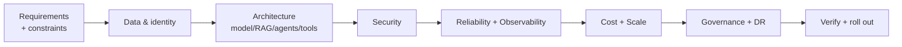
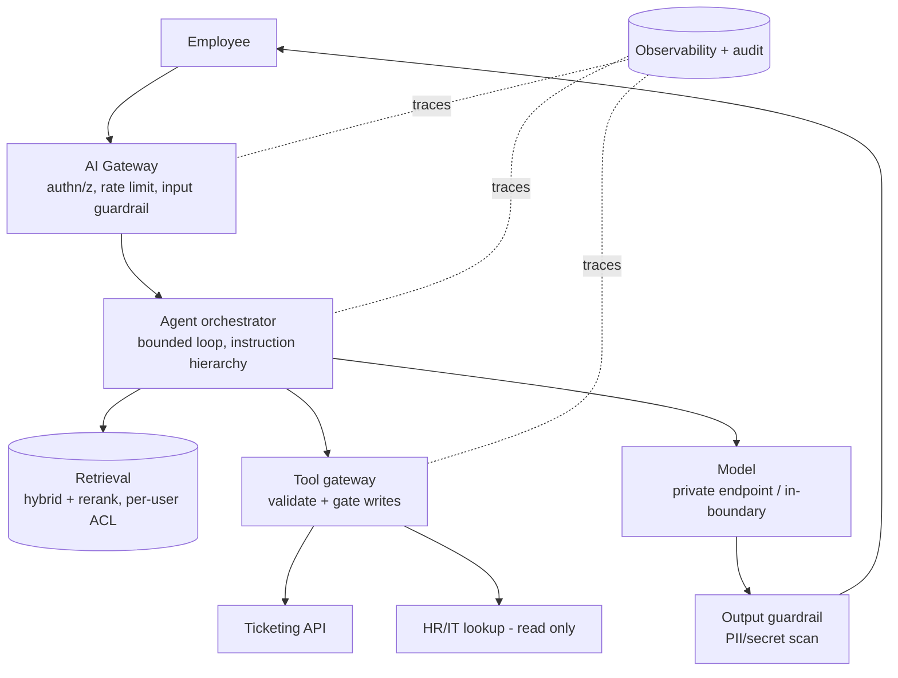

# Requirements → Production (Flagship System Design)

The definitive senior/staff/principal exercise: take a vague business ask and
drive it all the way to a production-ready, secured, operated system, out loud,
defending every decision. This page walks one prompt end-to-end as a model, then
gives you more prompts to run the same way.

!!! tip "How to use this"
    Set 45–60 min. Work the **stages in order**, narrating decisions and
    **trade-offs**. Don't jump to a diagram, clarify first. At the end, expect the
    interviewer follow-ups; practice defending, not just describing. Pair this with
    [The interviewer keeps asking "Why"](Interview_Why_Chains.md).

---

## The method (never skip clarify)

**Anti-pattern:** drawing boxes before you've established scale, latency, data
sensitivity, and who the users are. **Senior signal:** clarifying questions that
change the design.

---

## Worked example — Enterprise AI Assistant for 100,000 employees

> "Build an AI assistant for our 100,000 employees to answer questions from
> internal docs and take a few actions (open a ticket, look up HR/IT info)."

### 1. Requirements & constraints (clarify first)

- **Users/scale:** 100k employees, assume ~5% daily active, peak concurrency in
  business hours; multi-region? languages?
- **Use cases:** doc Q&A (RAG), a few **actions** (create ticket, lookup) → it's
  an **agent with gated tools**, not just a chatbot.
- **Latency:** conversational (stream tokens; first-token < ~1s ideal).
- **Data sensitivity:** internal docs + **HR/PII** → governance, per-user access,
  no data egress likely required.
- **Constraints:** budget, compliance (SOC2/GDPR), on-prem/cloud, existing IdP.

*Clarifying questions that change the design:* Is HR data in scope? (row-level
access) Must data stay in our cloud/region? (private inference) Are the actions
reversible? (approval gating).

### 2. Data & identity

- **Ingestion:** connectors to doc sources → parse → chunk (semantic) → embed →
  index; track **provenance** and **per-doc ACLs**.
- **Identity:** SSO via existing IdP (OIDC); pass user identity through so
  **retrieval enforces per-user access** (you can't retrieve what you can't see).
- **Freshness:** incremental re-index on change (target lag), not full rebuilds.

### 3. Architecture

- **Model strategy:** managed in-boundary model (e.g. Bedrock via private
  endpoint) or self-host if data can't egress; **route** easy→cheap, hard→strong.
- **RAG strategy:** hybrid retrieval + reranker; per-user ACL filter; answer only
  from context with citations.
- **Agent strategy:** single agent with a **narrow tool set**; plan→act→observe
  with a step cap; read tools open, **write (create ticket) validated + gated**.
- **Tools:** typed schemas, least-privilege service creds, sandboxed.

### 4. Security (see [AI Security](../AI-Security/index.md))

- Treat retrieved docs + tool output as **data, not instructions** (indirect
  injection is the top risk).
- **Per-user row/doc access** at retrieval so PII never leaks cross-user.
- Gate the write action; **output guardrail** scans for PII/secrets.
- Secrets in a manager; private networking + **egress allowlist**; audit every
  tool call. Threat-model it (assets→boundaries→threats→controls→detect/respond).

### 5. Reliability & observability

- **Timeouts + retries** with backoff on model/tool calls; **fallback** model or
  cached/degraded answer; **rate limit** per user/tenant.
- **Bounded agent** (step + cost caps, loop detection).
- **Telemetry:** latency (model/retrieval/tool), tokens, cost/request, tool
  failures, retrieval quality, safety hits, task success. Trace end-to-end so you
  can find the slow hop. (See [Observability](../GenAI-Topics/observability/index.md).)

### 6. Cost & scale

- Route to cheaper models; **prompt caching** for the fixed system/context prefix;
  cache frequent Q&A; **token budgets**; stream for perceived latency.
- Scale the stateless gateway/agent horizontally; the model is the throughput
  bottleneck, size/route accordingly. Rough cost model = requests/day × avg
  tokens × per-token price − cache hit rate; put a **resource monitor**/budget alert on it.

### 7. Governance & DR

- Data classification + masking; retention; audit trail for compliance.
- **Eval + CI/CD gate** on prompt/model changes (golden + regression); canary +
  rollback (see [LLMOps](../GenAI-Topics/llmops/index.md)).
- DR: multi-AZ; alternate model provider/region as failover; backups of index +
  config; documented runbook.

### 8. Verify & roll out

- Golden/regression eval passes; injection suite passes; canary to one
  org/region; watch quality/cost/latency/safety; expand; rollback path ready.

### Interviewer follow-ups (defend these)

- *"HR data leaked to the wrong employee, what failed?"* → per-user ACL not
  enforced at retrieval; fix at the retrieval boundary + output DLP.
- *"Cost is 3x forecast in week one."* → routing/caching/token budgets; find the
  offender in cost-per-request telemetry.
- *"Someone put a malicious doc in the corpus."* → indirect injection; provenance
  + review at ingestion, content-as-data, gated actions contain it.
- *"It's slow at 9am."* → concurrency on the model; scale out / route / cache;
  trace to find the bottleneck hop.
- *"Prove a prompt change is safe to ship."* → regression eval vs prod + injection
  suite in CI, canary.

---

## More prompts — run the same 8 stages

??? question "A customer-support agent that can issue refunds and update orders."
    Emphasis: **gated write actions** (refund = propose→validate→approve),
    idempotency, per-customer data access, injection via customer-supplied text,
    audit + reversal path. Latency + deflection-rate as success metrics.

??? question "An AI data analyst over the warehouse (natural language → insights)."
    Emphasis: text-to-SQL vs a semantic model (Cortex Analyst), **read-only**
    least-privilege role, governance/masking, verifying generated SQL, cost of
    scans, and "what if it writes a wrong number" (validation + citations of the
    SQL run).

??? question "A document intelligence platform (extract fields from PDFs at scale)."
    Emphasis: ingestion pipeline, structured-output validation, batch vs real-time,
    eval on extraction accuracy, PII handling, throughput/cost at scale, human
    review for low-confidence.

??? question "An internal AI DevOps assistant that can run safe operations."
    Emphasis: **excessive agency** is the core risk, tool allowlist, read vs
    write, approval gates, blast radius, audit, and a hard kill switch. Kiro
    assists authoring; the assistant's actions are gated and logged.

---

## Self-check

- [ ] Did I clarify scale, latency, and data sensitivity **before** designing?
- [ ] Does retrieval enforce **per-user access**?
- [ ] Are write actions **gated**, reads least-privilege?
- [ ] Did I address **indirect injection** explicitly?
- [ ] Do I have reliability (timeouts/retries/fallback) and **bounded** agents?
- [ ] Can I name the **cost levers** and how I'd monitor spend?
- [ ] Is there an **eval-gated CI/CD** path with canary + rollback?
- [ ] Can I defend every box with a mechanism + trade-off?

!!! note "Related"
    [The interviewer keeps asking "Why"](Interview_Why_Chains.md) ·
    [AI Security](../AI-Security/index.md) ·
    [LLMOps / Production CI-CD](../GenAI-Topics/llmops/index.md) ·
    [Agent Principles](../GenAI-Topics/agent-principles/index.md) ·
    Practice: [Scenario Drills](Lab_Scenario_Drills.md) ·
    [AI Engineer Interview Q&A](AI_Engineer_Interview_QA.md)
