# OfferReady Complete Study Guide

A single, structured path from fundamentals to shipping production GenAI — written
for OfferReady. Every chapter is **original OfferReady content**: our own
explanations, our own diagrams, and fresh code you can run. It pairs with the
deeper topic pages under **Learn** and the practice banks under **Interview Prep**.

!!! abstract "How to use this guide"
    Read top to bottom for a full ramp, or jump to a chapter. Each chapter ends
    with **Key takeaways** and links to the matching deep-dive page and interview
    Q&A so you can go from *learn* → *practice* → *defend*. Diagrams render live
    (Mermaid); code blocks are minimal and runnable.

## Contents

| # | Chapter | Deep dive |
|---|---------|-----------|
| 1 | AI, ML & Generative AI foundations | [LLM Fundamentals](../GenAI-Topics/llm-fundamentals/index.md) |
| 2 | AWS cloud foundations for AI apps | [AWS Q&A](AWS_Interview_QA.md) |
| 3 | Python for AI engineering | [Python Q&A](Python_Interview_QA.md) |
| 4 | Prompt & context engineering | [Prompt Engineering](../GenAI-Topics/prompt-engineering/index.md) |
| 5 | Retrieval-Augmented Generation (RAG) | [RAG](../GenAI-Topics/rag/index.md) |
| 6 | LangChain | [LangChain](../GenAI-Topics/langchain/index.md) |
| 7 | Graph databases for AI | [Graph DB](../GenAI-Topics/graph-db/index.md) |
| 8 | LangGraph — agentic workflows | [LangGraph](../GenAI-Topics/langgraph/index.md) |
| 9 | Model Context Protocol (MCP) | [MCP](../GenAI-Topics/mcp/index.md) |
| 10 | AWS Bedrock & AgentCore | [Bedrock](../GenAI-Topics/bedrock/index.md) · [AgentCore](../GenAI-Topics/agentcore/index.md) |
| 11 | Kubernetes & containers for AI | [Kubernetes](../GenAI-Topics/kubernetes/index.md) |
| 12 | Capstone — ship one production workflow | [Requirements → Production](Interview_Requirements_to_Production.md) |

---

# Chapter 1 — AI, ML & Generative AI foundations

## The hierarchy

Start by placing the terms so nothing is fuzzy later.

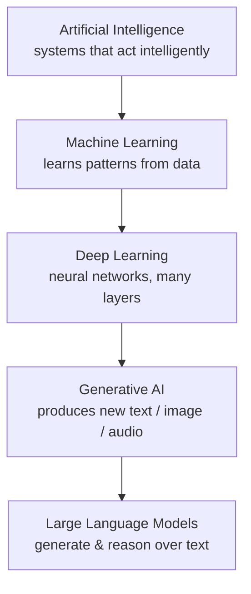

- **AI** — the broad goal: machines doing things that need intelligence.
- **ML** — the dominant method: learn a function from data instead of hand-coding rules.
- **Deep learning** — ML with multi-layer neural networks; powers modern perception and language.
- **Generative AI** — models that *produce* content rather than only classify or predict.
- **LLMs** — the text branch of GenAI; the engine behind most of this guide.

### The three classic ML styles

| Style | Learns from | Everyday example | Where it shows up in GenAI |
|-------|-------------|------------------|-----------------------------|
| Supervised | Labeled pairs (input → known answer) | Spam vs not-spam, price prediction | Fine-tuning on instruction/response pairs |
| Unsupervised | Unlabeled data (find structure) | Customer segments, anomaly detection | Pre-training on raw text; embeddings/clustering |
| Reinforcement | Rewards from acting in an environment | Game agents, robotics | RLHF — aligning an LLM to human preferences |

### How an LLM is actually built (three stages)

Knowing the training pipeline explains a lot of model behavior you'll be asked about.

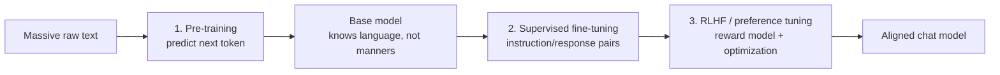

1. **Pre-training** — self-supervised next-token prediction over huge corpora. The
   model learns grammar, facts, and patterns. Output is a *base* model: knowledgeable
   but not helpful or safe by default.
2. **Supervised fine-tuning (SFT)** — train on curated instruction→response examples so
   it follows instructions.
3. **RLHF / preference optimization** — humans rank outputs; a reward model learns those
   preferences; the LLM is optimized to score well. This is what makes it *helpful,
   harmless, honest* — and why models refuse some requests.

!!! tip "Interview-ready line"
    *"A base model predicts text; the chat model you use has been instruction-tuned and
    preference-aligned on top. That alignment layer — not the raw weights — is why it
    follows instructions and refuses unsafe ones."*

## What a large language model actually is

An LLM is a next-token predictor trained on huge text corpora. Given the tokens so
far, it outputs a probability distribution over the next token, samples one, appends
it, and repeats. Everything else — answering, summarizing, "reasoning" — emerges from
doing that extremely well at scale.

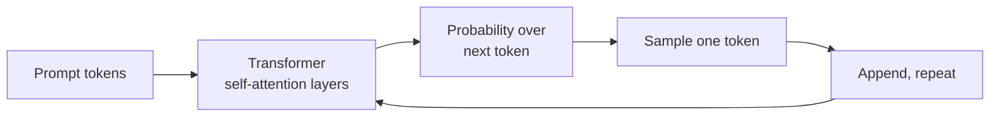

### Why the transformer matters

The transformer replaced sequential recurrence with **self-attention**: every token
can look at every other token in one step, so the model captures long-range
relationships and trains efficiently in parallel. Three shapes to know:

- **Encoder-only** (e.g. BERT-style) — understanding tasks: classification, embeddings.
- **Decoder-only** (e.g. GPT-style) — generation: chat, completion. Most LLMs today.
- **Encoder-decoder** (e.g. T5-style) — translation/summarization where input maps to output.

### Self-attention in one honest paragraph

Each token is turned into three vectors: a **query**, a **key**, and a **value**. To
decide how much token A should "pay attention to" token B, the model compares A's query
with B's key; higher match = higher weight. Each token's new representation is the
weighted blend of all the value vectors. Stack this across many **heads** (each head
learns a different relationship — syntax, coreference, topic) and many **layers**, and
the model builds rich context-aware representations. That's the whole trick: *learned,
content-based weighting of every token against every other token.*

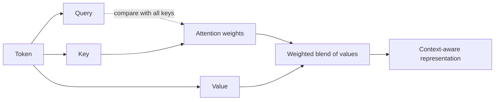

### Decoding: how the next token is actually chosen

The model outputs a probability for every possible next token; **decoding** is how you
pick. This is where `temperature` and friends live — worth knowing precisely because
you tune them constantly.

| Knob | Effect | Use |
|------|--------|-----|
| **temperature** | Scales randomness. 0 = deterministic/greedy; higher = more varied | Low for extraction/code; higher for brainstorming |
| **top-p (nucleus)** | Sample only from the smallest set of tokens whose probability sums to p | Common default (e.g. 0.9) to cut off the long tail |
| **top-k** | Sample only from the k most likely tokens | Alternative cap on randomness |
| **max tokens** | Hard cap on output length | Control cost + prevent truncated JSON |
| **stop sequences** | Halt generation at a marker | End cleanly at a delimiter |

!!! warning "The classic bug"
    Deterministic tasks (extraction, classification, JSON) want **temperature 0**. A
    truncated JSON response is almost always **max_tokens too low**, not a model
    problem — raise the cap or shrink the requested output.

### Embeddings — the other half of GenAI

An **embedding** turns text into a vector so that *similar meaning → nearby vectors*.
This powers semantic search, clustering, and RAG retrieval. Different job from
generation: a generation model writes text; an embedding model measures meaning.

```python
# Cosine similarity: 1.0 = same direction (very similar), 0 = unrelated.
def cosine(a, b):
    dot = sum(x*y for x, y in zip(a, b))
    na = sum(x*x for x in a) ** 0.5
    nb = sum(y*y for y in b) ** 0.5
    return dot / (na * nb)

# "cancel my plan" and "terminate subscription" would score high even with no shared words.
```

### Hallucination — why it happens and what actually helps

An LLM generates the *most plausible continuation*, not the *true* one — it has no
built-in notion of truth. So it can state false things fluently ("hallucinate").
What reduces it, in order of leverage:

1. **Ground it** — give it the facts in-context (RAG, Chapter 5) and instruct
   "answer only from the provided context."
2. **Ask for citations** — make it point to sources so unsupported claims are visible.
3. **Lower temperature** for factual tasks.
4. **Verify downstream** — validate structured output; don't trust free-form claims.

## Tokens, context window, and cost

- **Token** — a chunk of text (~¾ of a word on average). Models read and bill in tokens.
- **Context window** — the maximum tokens the model can consider at once (prompt +
  output). Exceed it and earlier content is dropped or must be summarized.
- **Cost** — you pay per input token and per output token; larger models cost more per
  token. This is the single biggest lever on a GenAI bill.

```python
# A rough token budget check before you call an API.
# Real tokenizers vary; ~4 characters per token is a workable estimate.
def estimate_tokens(text: str) -> int:
    return max(1, len(text) // 4)

def fits_context(prompt: str, expected_output_tokens: int, window: int) -> bool:
    return estimate_tokens(prompt) + expected_output_tokens <= window

assert fits_context("Summarize this ticket...", 300, window=8192)
```

!!! tip "Cost instinct"
    Cost ≈ (input tokens + output tokens) × price-per-token of the chosen model.
    You control it by **choosing a smaller model where it passes**, **trimming
    context**, and **capping output length** — long before you reach for anything
    fancier.

## Prompt engineering vs context engineering

- **Prompt engineering** — crafting the instruction: role, task, constraints,
  examples, output format.
- **Context engineering** — controlling *what information* is in the window:
  retrieval, memory, tool results, trimming. As systems grow, context engineering
  matters more than clever wording.

## Fine-tuning vs RAG vs prompting — pick the cheapest that works

A question you *will* be asked. The instinct interviewers want: reach for the
lightest tool first.

| Approach | What it changes | Best for | Cost / effort |
|----------|-----------------|----------|---------------|
| **Prompting** | Nothing — just the instruction | Most tasks; start here | Lowest |
| **RAG** | Adds *your* knowledge at query time | Facts that change, private/current data, citations | Medium — build retrieval |
| **Fine-tuning** | The model's weights | Consistent *style/format/behavior*, narrow domain tone | Highest — data + training + eval |

- **Need current or private facts?** → RAG (not fine-tuning — fine-tuning teaches
  behavior, not fresh facts, and bakes data in stale).
- **Need a consistent voice/format/skill?** → fine-tuning can help.
- **Everything else?** → prompt engineering + good context first.

!!! tip "The senior answer"
    *"Fine-tuning changes behavior; RAG changes knowledge. If the problem is 'the model
    doesn't know our data,' that's RAG. If it's 'the model won't reliably follow our
    format/tone,' that's fine-tuning — after prompting fails."*

## Evaluating an LLM system

You can't ship what you can't measure. Token-level "looks good" is not evaluation.

- **Build an eval set** — representative inputs with known-good outputs.
- **Score automatically** — exact/structured match where possible; **LLM-as-judge**
  for open-ended quality; human spot-checks.
- **Track the metrics that matter**: task success rate, groundedness (does the answer
  trace to sources?), and regression when you change model/prompt/retrieval.
- **Run it in CI** — re-run the eval set on every change so quality doesn't silently drift.

## Chapter 1 key takeaways

- AI ⊃ ML ⊃ DL ⊃ GenAI ⊃ LLMs — know where each term sits.
- An LLM predicts the next token; capability emerges from scale + the transformer's attention.
- Tokens drive both the context limit and the bill.
- Prompt engineering shapes the instruction; context engineering shapes the information.

**Go deeper:** [LLM Fundamentals](../GenAI-Topics/llm-fundamentals/index.md) ·
[Prompt Engineering](../GenAI-Topics/prompt-engineering/index.md)

---

# Chapter 2 — AWS cloud foundations for AI apps

You don't need all of AWS to ship GenAI — you need a handful of services and the
identity model that ties them together.

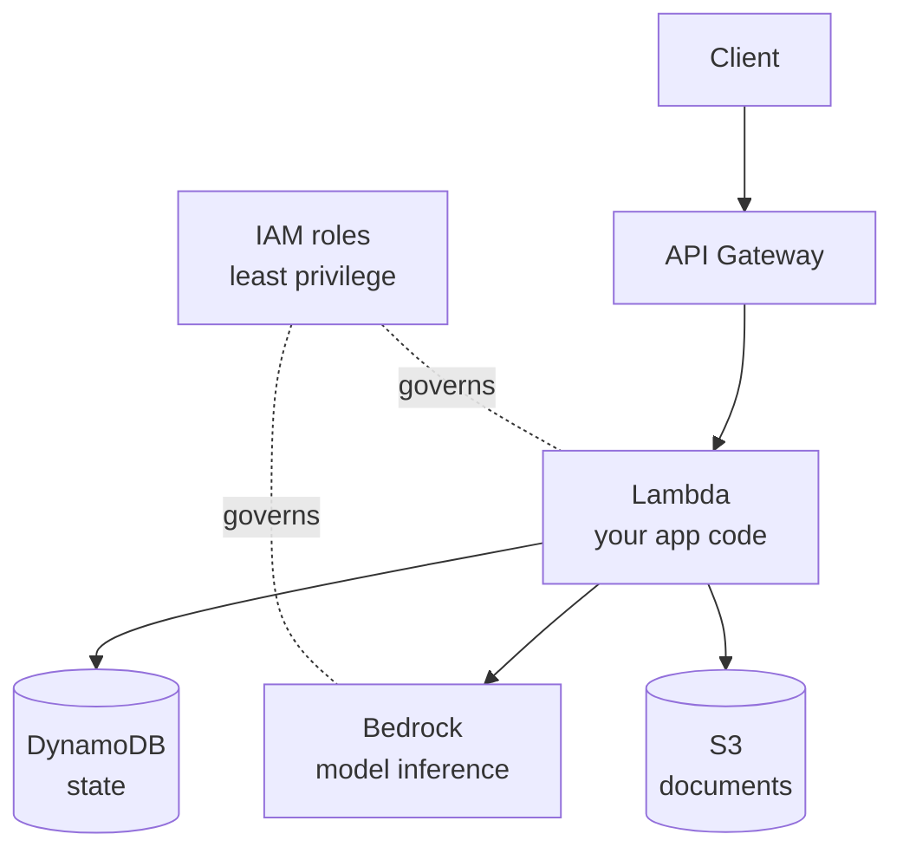

## Identity & Access Management (IAM) — the foundation

IAM decides *who* (principal) can do *what* (action) on *which resource*. Everything
else assumes you got this right.

- **Users / roles / groups** — prefer **roles** for workloads (no long-lived keys);
  attach permissions to roles, add users to groups.
- **Policies** — JSON documents granting/denying actions. Grant the **minimum** needed.
- **Least privilege** — a Lambda that calls Bedrock and one table should have exactly
  those permissions, nothing more.

```json
{
  "Version": "2012-10-17",
  "Statement": [
    {
      "Effect": "Allow",
      "Action": ["bedrock:InvokeModel"],
      "Resource": "arn:aws:bedrock:us-west-2::foundation-model/*"
    },
    {
      "Effect": "Allow",
      "Action": ["dynamodb:GetItem", "dynamodb:PutItem"],
      "Resource": "arn:aws:dynamodb:us-west-2:*:table/conversations"
    }
  ]
}
```

### The IAM vocabulary you must be fluent in

| Term | What it is |
|------|-----------|
| **Principal** | Who is making the request (user, role, service) |
| **Policy** | JSON rules granting/denying actions on resources |
| **Role** | An identity a workload *assumes* to get temporary credentials — no long-lived keys |
| **Trust policy** | Says *who may assume* a role (e.g. "the Lambda service") |
| **Managed vs inline policy** | Reusable/attachable vs embedded in one identity |

### How IAM decides (the evaluation rule)

The mental model that answers most IAM interview questions:

1. **Default deny** — if nothing allows it, it's denied.
2. **An explicit `Allow`** grants the action.
3. **An explicit `Deny` always wins** — it overrides any allow.

So "I gave the role `Allow` but it still can't act" usually means an explicit `Deny`
somewhere (a boundary, an SCP, or another policy) is overriding it.

!!! tip "Roles over keys — say this unprompted"
    *"For any workload — Lambda, EC2, a container — I attach an IAM **role**, not
    access keys. The service assumes the role and gets short-lived, auto-rotated
    credentials. Long-lived keys in env vars or code are the #1 credential leak."*

## The core services for a GenAI app

| Service | Role in a GenAI app |
|---------|---------------------|
| **IAM** | Identity + least-privilege permissions for every component |
| **Lambda** | Run your app code without managing servers; scales to zero |
| **API Gateway** | Public HTTPS endpoint in front of Lambda; auth, throttling |
| **S3** | Store documents, artifacts, model inputs/outputs |
| **DynamoDB** | Low-latency key-value/document store for conversation + app state |
| **RDS** | Relational database when you need SQL/joins/transactions |
| **ECR + Docker** | Package code (and heavy deps) as container images for Lambda/ECS |
| **Bedrock** | Managed foundation-model inference (Chapter 10) |

### A minimal serverless GenAI handler

```python
# Lambda handler: validate input, call a model, persist the turn. Illustrative.
import json, os, boto3

bedrock = boto3.client("bedrock-runtime")
table = boto3.resource("dynamodb").Table(os.environ["TABLE"])

def handler(event, _ctx):
    body = json.loads(event.get("body") or "{}")
    question = (body.get("question") or "").strip()
    if not question:
        return {"statusCode": 400, "body": json.dumps({"error": "question required"})}

    resp = bedrock.invoke_model(
        modelId=os.environ.get("MODEL_ID", "amazon.nova-lite-v1:0"),
        body=json.dumps({"messages": [{"role": "user", "content": question}]}),
    )
    answer = json.loads(resp["body"].read())  # shape depends on the model family

    table.put_item(Item={"id": event["requestContext"]["requestId"], "q": question})
    return {"statusCode": 200, "body": json.dumps({"answer": answer})}
```

### Lambda — the serverless compute model

- **Event-driven, scales to zero** — you pay per invocation + duration, nothing when idle.
- **Stateless** — no local state between invocations; put state in DynamoDB/S3.
- **Cold starts** — first invocation after idle initializes the runtime (slower); keep
  packages lean, or use provisioned concurrency for latency-sensitive paths.
- **Limits to know**: max execution time (15 min), memory-linked CPU, deployment package
  size (use a container image when deps are large, e.g. ML libraries).
- **Concurrency** — Lambda scales out by running many instances; guard downstream
  resources (DBs) with connection limits/pooling.

### API Gateway — the front door

Sits in front of Lambda to expose an HTTPS endpoint. Handles **auth** (JWT/OIDC
authorizers, IAM), **throttling/rate limits**, request validation, and CORS. For a
GenAI app it's where you enforce who may call the model and cap request rate to protect
cost — pairs directly with the identity material in
[AI Security](../AI-Security/identity-api-security.md).

### S3 — object storage

- Stores documents, embeddings dumps, model artifacts, uploads. Effectively unlimited,
  cheap, durable.
- **Keys are flat** but `/`-delimited prefixes act like folders.
- **Storage classes** trade retrieval speed for cost (Standard → Infrequent Access →
  Glacier for archives).
- Common GenAI use: the document corpus for RAG lands in S3, then an ingestion job
  chunks + embeds it.

### DynamoDB — fast NoSQL for app state

- Single-digit-millisecond key-value/document store; scales without you managing servers.
- **Design around access patterns**, not entities — pick a partition key that spreads
  load and matches how you query (e.g. `conversation_id`).
- Great for conversation history, session state, per-user metadata. Not for ad-hoc
  joins or analytics — that's RDS/warehouse territory.

### RDS — when you actually need SQL

Reach for RDS (Postgres/MySQL) when you need **joins, transactions, complex queries, or
strong relational integrity**. Rule of thumb: DynamoDB for high-scale app state with
known access patterns; RDS when the questions are relational and ad-hoc.

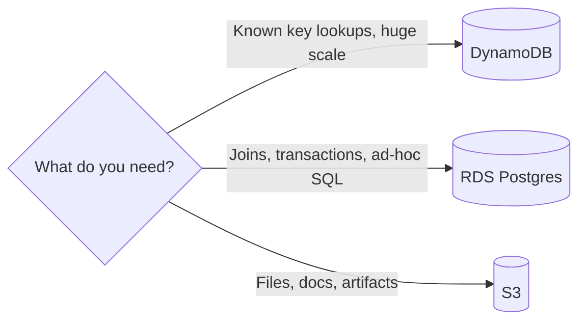

## Containers: Docker + ECR in one breath

When your dependencies are too big for a zipped Lambda (common with ML libs), you ship
a **container image**: write a `Dockerfile`, build it, push to **ECR**, and point
Lambda (or ECS/EKS) at the image.

```dockerfile
FROM public.ecr.aws/lambda/python:3.12
COPY requirements.txt .
RUN pip install -r requirements.txt
COPY app.py ${LAMBDA_TASK_ROOT}
CMD ["app.handler"]
```

## Chapter 2 key takeaways

- IAM least-privilege roles are the backbone — get identity right first.
- A serverless GenAI app is usually API Gateway → Lambda → Bedrock (+ S3/DynamoDB).
- Use containers + ECR when dependencies outgrow a zip.
- Reach for RDS only when you genuinely need relational guarantees; DynamoDB covers most app state.

**Go deeper:** [AWS Interview Q&A](AWS_Interview_QA.md) ·
[Enterprise Security Architecture](../Enterprise/security-architecture/index.md)

---

# Chapter 3 — Python for AI engineering

Python is the lingua franca of AI because of its ecosystem and readability. For
engineering work, focus on the parts that show up in production code.

## The essentials that matter in AI code

- **Data structures** — lists, dicts, sets, tuples; know when each is right.
- **Functions & comprehensions** — small, testable units; comprehensions for transforms.
- **Type hints + `pydantic`** — validate LLM inputs/outputs and API payloads.
- **Error handling & logging** — external calls (models, APIs) fail; handle and log.
- **`async`** — concurrency for I/O-bound work (many model/API calls at once).

### Validate model I/O with pydantic

Structured validation turns "hope the JSON is right" into a guarantee.

```python
from pydantic import BaseModel, Field, ValidationError

class Analysis(BaseModel):
    summary: str
    risk_score: int = Field(ge=0, le=100)
    tags: list[str] = []

def parse_model_output(raw_json: str) -> Analysis | None:
    try:
        return Analysis.model_validate_json(raw_json)
    except ValidationError as e:
        # Log the shape problem, never the raw content if it may hold PII.
        print("model output failed schema:", e.error_count(), "errors")
        return None
```

### Data structures — pick the right one

| Structure | Ordered? | Use for | Note |
|-----------|----------|---------|------|
| `list` | yes | sequences, ordered results | O(n) membership test |
| `dict` | insertion order | key→value lookups, JSON | O(1) lookup — default for mappings |
| `set` | no | uniqueness, fast membership | O(1) `in`; dedupe candidates |
| `tuple` | yes | fixed, immutable records | hashable — usable as dict keys |

A tiny instinct that matters at scale: checking `x in big_list` is O(n); convert to a
`set` first if you test membership repeatedly.

### Resilience: retries, timeouts, backoff

Every model/API call *will* fail sometimes (429 rate limits, timeouts, transient 5xx).
Production code wraps them with a timeout and bounded exponential backoff.

```python
import time, random

def call_with_retry(fn, *, attempts=4, base=0.5, timeout_errors=(TimeoutError,)):
    for i in range(attempts):
        try:
            return fn()
        except timeout_errors:
            if i == attempts - 1:
                raise
            # exponential backoff + jitter avoids thundering-herd retries
            time.sleep(base * (2 ** i) + random.uniform(0, 0.1))
```

- **Timeout every external call** — never wait forever on a model/API.
- **Backoff on 429/5xx**, not on 4xx you caused (fix those instead).
- **Idempotency** — make retries safe (don't double-charge, double-insert).

### Async for parallel model calls

Python's `async` shines for **I/O-bound** fan-out (many model/API calls). It's a single
thread cooperatively switching while waiting on I/O — not CPU parallelism (for CPU work,
use processes).

```python
import asyncio

async def analyze_one(client, text):
    return await client.complete(text)          # placeholder async call

async def analyze_many(client, texts):
    # Fan out I/O-bound calls concurrently instead of one-at-a-time.
    return await asyncio.gather(*(analyze_one(client, t) for t in texts))
```

!!! tip "async vs threads vs processes"
    I/O-bound (API/model/DB calls) → **async** or threads. CPU-bound (heavy local
    compute) → **processes** (the GIL blocks true CPU parallelism in threads). Most
    GenAI app code is I/O-bound, so async is the usual win.

## Object-oriented building blocks

You'll model tools, agents, and clients as classes. Know the four pillars in plain
terms: **encapsulation** (hide internals behind a clean interface), **inheritance**
(share behavior), **polymorphism** (same call, different implementations —
e.g. a common `LLMClient` interface over several providers), **abstraction** (program
to interfaces, not concretions).

```python
from abc import ABC, abstractmethod

class LLMClient(ABC):
    @abstractmethod
    def complete(self, prompt: str) -> str: ...

class OpenAIClient(LLMClient):
    def complete(self, prompt: str) -> str:
        return "..."   # provider-specific call

class BedrockClient(LLMClient):
    def complete(self, prompt: str) -> str:
        return "..."   # different provider, same interface

def summarize(client: LLMClient, text: str) -> str:   # depends on the abstraction
    return client.complete(f"Summarize:\n{text}")
```

## Chapter 3 key takeaways

- Master dicts/lists/sets, comprehensions, functions — the daily tools.
- Use type hints + pydantic to validate LLM and API data at the boundary.
- Handle and log failures on every external call; never log raw sensitive payloads.
- Program to interfaces (an `LLMClient` ABC) so you can swap providers.

**Go deeper:** [Python Interview Q&A](Python_Interview_QA.md)

---

# Chapter 4 — Prompt & context engineering

## Anatomy of a strong prompt

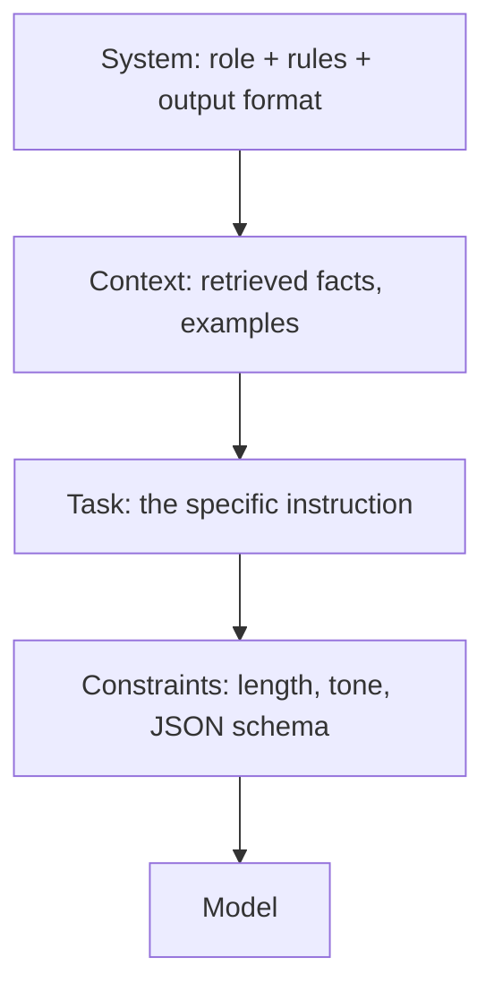

- **Role** — who the model is ("You are a careful data analyst").
- **Task** — the precise instruction, one job at a time.
- **Constraints** — output format (JSON), length, what NOT to do.
- **Examples** — few-shot demonstrations for tricky formats.

## Techniques, with when-and-why

| Technique | What it is | Use when |
|-----------|-----------|----------|
| **Zero-shot** | Just the instruction, no examples | Task is simple and common |
| **Few-shot** | Include 2–5 input→output examples | You need a specific format or edge-case handling |
| **Chain-of-thought** | Ask for reasoning steps (or use a reasoning model) | Multi-step math/logic where a jump to the answer fails |
| **Structured output** | Enforce a JSON schema | Machine-parseable results — the default for pipelines |
| **Role/persona** | Set who the model is | Steer tone and expertise |
| **Decomposition** | Split a big task into smaller prompts | Complex tasks that one prompt does poorly |

### Few-shot in practice

Examples teach format far more reliably than description. Keep them short, diverse, and
representative of the edge cases you care about.

```python
SYSTEM = "Classify each ticket's urgency. Reply with only: low | medium | high."
FEWSHOT = [
    ("Password reset link expired", "low"),
    ("Checkout failing for all users", "high"),
    ("Typo on the pricing page", "low"),
    ("Data export is 3 hours late", "medium"),
]
def build_prompt(ticket):
    shots = "\n".join(f"Ticket: {t}\nUrgency: {u}" for t, u in FEWSHOT)
    return f"{SYSTEM}\n\n{shots}\n\nTicket: {ticket}\nUrgency:"
```

### Structured output — the pipeline default

For anything a program consumes downstream, force a schema instead of parsing prose.

```python
SYSTEM = (
    "You are OfferReady's extraction assistant. Return ONLY valid JSON matching "
    '{"topic": string, "difficulty": "easy"|"medium"|"hard"}. No prose.'
)
```

Set **temperature 0**, give a **sufficient max_tokens** so the JSON isn't truncated, and
**validate** the result (pydantic — Chapter 3) before trusting it.

### Common prompt pitfalls interviewers probe

- **Doing two jobs in one prompt** — split "summarize AND translate AND rate" into steps.
- **Vague constraints** — "be concise" is weak; "≤ 3 bullet points" is enforceable.
- **No format contract** — asking for prose then parsing it. Use a schema.
- **Over-long few-shots** — they cost tokens every call; keep them minimal.
- **Relying on wording to stop injection** — that's an architecture problem (below).

## Context engineering — the part that scales

As apps grow, *what's in the window* beats *how you phrased it*. The window is finite
and every token costs money, so you engineer **what goes in**:

- **Retrieve only relevant chunks** (RAG, Chapter 5) — don't dump whole documents.
- **Summarize long history** — keep a rolling summary instead of the full transcript.
- **Label untrusted content** — put retrieved/tool text in a delimited block the system
  prompt says to treat as data.
- **Trim aggressively** — drop stale turns; keep the system prompt + recent + retrieved.

### Memory strategies for multi-turn apps

| Strategy | How | Trade-off |
|----------|-----|-----------|
| **Full history** | Send every turn | Simple; blows the window + cost fast |
| **Windowed** | Keep the last N turns | Cheap; forgets older context |
| **Summary** | Roll older turns into a running summary | Keeps gist; summary can lose detail |
| **Retrieval (long-term)** | Store turns, retrieve relevant ones on demand | Scales; needs a store + retrieval |

Most production chat apps combine **summary + windowed recent + retrieval** for older
facts.

!!! danger "Security tie-in"
    Treat retrieved/tool text as **data, not instructions**. See
    [AI Security](../AI-Security/index.md) — prompt injection is the flagship risk, and
    no amount of prompt wording fully stops it; you contain it by architecture.

## Chapter 4 key takeaways

- Structure prompts: role → context → task → constraints, with examples when needed.
- Prefer structured (schema-enforced) output over parsing prose.
- Context engineering — retrieval, memory, trimming — is where quality and cost live.

**Go deeper:** [Prompt Engineering](../GenAI-Topics/prompt-engineering/index.md) ·
[Context Engineering](../GenAI-Topics/context-engineering/index.md)

---

# Chapter 5 — Retrieval-Augmented Generation (RAG)

RAG grounds a model in *your* data: retrieve relevant text, put it in the prompt, and
have the model answer from it — reducing hallucination and letting you cite sources.

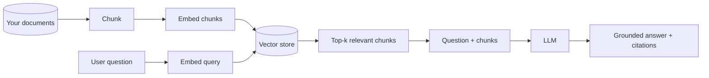

## The pipeline, stage by stage

1. **Ingest & chunk** — split documents into passages (size + overlap matter; too big
   dilutes relevance, too small loses context).
2. **Embed** — turn each chunk into a vector capturing meaning.
3. **Store & index** — put vectors in a vector store for similarity search.
4. **Retrieve** — embed the query, fetch the top-k nearest chunks.
5. **Generate** — give the model the question + chunks; instruct it to answer only from them.

```python
# Minimal RAG loop (pseudocode-ish; swap in your embedder + vector store).
def rag_answer(question, store, llm, k=5):
    q_vec = embed(question)
    chunks = store.search(q_vec, k=k)                 # top-k relevant passages
    context = "\n\n".join(c.text for c in chunks)
    prompt = (
        "Answer ONLY from the context. If it's not there, say you don't know.\n\n"
        f"<context>\n{context}\n</context>\n\nQuestion: {question}"
    )
    return llm.complete(prompt), [c.source for c in chunks]  # answer + citations
```

## Chunking — the decision that quietly decides quality

Retrieval can only return what you chunked well. Get this wrong and no model saves you.

- **Size** — too big dilutes relevance (one chunk covers many topics); too small loses
  context (an answer spans two chunks). A few hundred tokens is a common starting point.
- **Overlap** — repeat ~10–20% of adjacent text so an idea split across a boundary is
  still retrievable in one chunk.
- **Respect structure** — split on headings/paragraphs, not mid-sentence. Structure-aware
  chunking beats fixed-size splits for most docs.
- **Attach metadata** — keep source, section, date, tenant on each chunk for citations
  and filtering.

```python
def chunk(text, size=800, overlap=150):
    step = size - overlap
    return [text[i:i+size] for i in range(0, len(text), step)]
```

## Embeddings + the vector store

- **Embed** each chunk into a vector (Chapter 1). Store vectors + text + metadata.
- **Similarity** is usually cosine distance; the store does approximate nearest-neighbor
  (ANN) search so it's fast at scale.
- **Match dimensions** to the embedding model; re-embed everything if you change models.

## Making retrieval actually good

- **Hybrid search** — combine **vector** similarity (meaning: "cancel plan" ≈ "terminate
  subscription") with **keyword/BM25** (exact terms: error codes, IDs, SKUs). Pure vector
  misses literals; pure keyword misses paraphrases. Fuse both.
- **Re-ranking** — retrieve a wide candidate set (say top-50) cheaply, then a cross-encoder
  reranker reorders the top handful for precision before they hit the prompt.
- **Metadata filtering** — constrain by tenant/date/product so retrieval can't cross
  boundaries (also a security control — a user shouldn't retrieve another tenant's docs).
- **Query rewriting** — expand or rephrase the user's question before retrieval for recall.

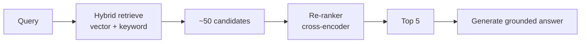

## RAG failure modes (diagnose → fix)

| Symptom | Likely cause | Fix |
|---------|--------------|-----|
| Answer misses info that's in the docs | Bad chunking / low recall | Re-chunk with structure + overlap; hybrid search; raise k |
| Right chunks retrieved, wrong answer | Weak prompt / model ignores context | "Answer only from context"; lower temperature |
| Cites irrelevant sources | No re-ranking / stale index | Add re-ranker; refresh/re-embed |
| Leaks another tenant's data | Missing metadata filter | Enforce per-user/tenant filter at retrieval |
| Confident but unsupported claims | No grounding instruction / no citations | Require citations; validate groundedness |

## Evaluating RAG

Measure the two halves separately so you know *where* it breaks:

- **Retrieval quality** — did the right chunks come back? (recall@k, hit rate)
- **Generation quality** — is the answer correct **and grounded** in those chunks?
  (groundedness/faithfulness, answer correctness via LLM-judge + human checks)

Run a fixed eval set in CI so changing the chunker, embedder, k, or model can't silently
regress quality.

## Chapter 5 key takeaways

- RAG = retrieve relevant chunks → ground the model → answer with citations.
- Quality lives in **chunking + retrieval**, not just the LLM.
- Use hybrid search and re-ranking; instruct the model to answer only from context.
- Evaluate groundedness — don't trust a demo.

**Go deeper:** [RAG](../GenAI-Topics/rag/index.md) ·
[Retrieval Tuning](../GenAI-Topics/retrieval-tuning/index.md) ·
[Vector DB](../GenAI-Topics/vector-db/index.md)

---

# Chapter 6 — LangChain

LangChain is a framework for composing LLM apps: prompts, models, retrievers, tools,
and memory wired into pipelines, with a standard interface across providers.

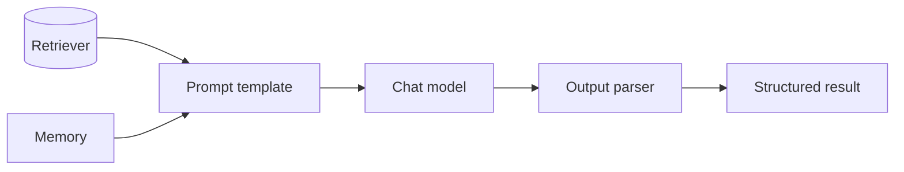

## Core pieces

| Piece | What it does |
|-------|--------------|
| **Prompt templates** | Parameterized prompts (`{variables}` filled at call time) |
| **Chat models** | Uniform interface over OpenAI, Bedrock, Anthropic, etc. |
| **Output parsers** | Coerce responses into typed/structured data (often via pydantic) |
| **Retrievers** | Pluggable RAG sources (vector store, hybrid, etc.) |
| **Tools** | Functions the model can call (search, DB, API) |
| **Memory** | Carry conversation state across turns |
| **Chains / LCEL** | Compose the above into a runnable pipeline |

### LCEL — the pipe composition model

LangChain Expression Language uses `|` to pipe components; each implements a common
Runnable interface (`invoke`, `stream`, `batch`), so composition is uniform.

```python
# prompt -> model -> parser, as one runnable.
chain = prompt_template | chat_model | output_parser
result = chain.invoke({"question": "What is hybrid retrieval?"})

# Same chain streams tokens or runs a batch, no rewrite:
for token in chain.stream({"question": "..."}): ...
results = chain.batch([{"question": "a"}, {"question": "b"}])
```

### A RAG chain, end to end

```python
# Retriever feeds context into the prompt; model answers; parser structures it.
def format_docs(docs): return "\n\n".join(d.page_content for d in docs)

rag_chain = (
    {"context": retriever | format_docs, "question": RunnablePassthrough()}
    | rag_prompt          # "Answer only from {context}. Question: {question}"
    | chat_model
    | StrOutputParser()
)
answer = rag_chain.invoke("How do refunds work?")
```

### Tools and tool-calling

A **tool** is a function plus a schema the model reads to decide when/how to call it.
The model proposes a call; your code executes it and feeds the result back.

```python
from langchain_core.tools import tool

@tool
def get_order(order_id: str) -> dict:
    "Look up one order by id. READ-ONLY."
    return db.fetch_order(order_id)   # your safe, parameterized query
```

Keep tools **narrow and least-privilege** (Chapter 10 / AI Security) — the model
decides *whether* to call; a deterministic layer decides *what actually runs*.

### Observability & callbacks

LangChain's callback system emits events (LLM start/end, tokens, tool calls, errors) so
you can trace latency, token cost, and failures. In production, wire this to your
tracing/eval stack — you can't debug or cost-control what you can't see.

!!! note "When not to reach for a framework"
    For a single model call, plain SDK code is clearer and has fewer moving parts. Adopt
    LangChain when you're genuinely composing retrieval + tools + memory and want the
    shared Runnable interface, streaming, and callbacks for free.

## Chapter 6 key takeaways

- LangChain composes prompt → model → parser, plus retrievers and memory.
- LCEL pipes components into runnable chains with a consistent interface.
- Use it for real composition; skip it for a one-shot call.

**Go deeper:** [LangChain](../GenAI-Topics/langchain/index.md) ·
[LangChain / LangGraph Q&A](LangChain_LangGraph_Interview_QA.md)

---

# Chapter 7 — Graph databases for AI

Some questions are about **relationships** ("which suppliers connect to a flagged
account, two hops out?"). Graph databases store nodes and edges so those traversals
are natural and fast — and they power **GraphRAG**, where retrieval follows
relationships, not just similarity.

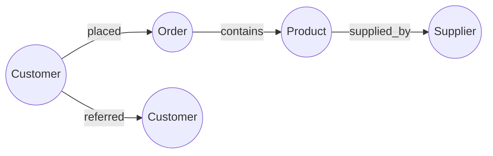

### The graph data model

- **Nodes** = entities (Customer, Order, Product), each with a label and properties.
- **Edges (relationships)** = typed, directed connections (`PLACED`, `CONTAINS`), and
  they can carry properties too (e.g. a `RATED` edge with a `stars` property).
- The power: a relationship is a **first-class, O(1) hop** — no join table, no expensive
  multi-join. Traversing "friends of friends of friends" stays cheap as depth grows,
  which is exactly where relational joins blow up.

### Cypher patterns worth knowing

Cypher reads like ASCII-art of the pattern you want to match: `(node)-[:REL]->(node)`.

```cypher
// 1) Multi-hop traversal: products a customer bought + their suppliers.
MATCH (c:Customer {id: $id})-[:PLACED]->(:Order)-[:CONTAINS]->(p:Product)-[:SUPPLIED_BY]->(s:Supplier)
RETURN p.name, s.name

// 2) Variable-length path: anyone within 3 referral hops of this customer.
MATCH (c:Customer {id: $id})-[:REFERRED*1..3]->(reached:Customer)
RETURN DISTINCT reached.name

// 3) Aggregation: top suppliers by number of products.
MATCH (:Product)-[:SUPPLIED_BY]->(s:Supplier)
RETURN s.name, count(*) AS products ORDER BY products DESC LIMIT 5
```

### Graph vs vector — when to use which

| Question shape | Reach for |
|----------------|-----------|
| "What's similar in meaning to X?" | **Vector** search (embeddings, Chapter 5) |
| "How is X connected to Y?" / multi-hop | **Graph** traversal |
| "Which entities link a flagged account to known fraud, 3 hops out?" | **Graph** |
| "Find passages about refunds" | **Vector** |
| Both meaning *and* relationships | **GraphRAG** (below) |

### GraphRAG — retrieval that follows relationships

Pure vector RAG retrieves *similar chunks* independently; it struggles with questions
whose answer is spread across **connected** facts. GraphRAG instead retrieves a relevant
**subgraph**, serializes it into context, and lets the model reason over the connections.

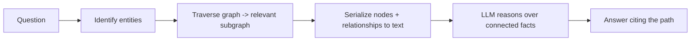

Strong for multi-hop, "how are these related", and root-cause questions. Often combined
with vector search (vector to find entry-point entities, graph to expand the neighborhood).

## Chapter 7 key takeaways

- Graph DBs model entities + relationships; traversals are first-class.
- Cypher expresses multi-hop queries cleanly.
- GraphRAG grounds an LLM in a relevant subgraph for relationship-heavy questions.

**Go deeper:** [Graph DB](../GenAI-Topics/graph-db/index.md)

---

# Chapter 8 — LangGraph: agentic workflows

LangChain composes linear pipelines; **LangGraph** models apps as a **graph of nodes
with state**, so you can branch, loop, and add cycles — exactly what agents need
(plan → act → observe → decide → repeat).


## Why a graph, not a chain

- **State** — a shared, typed object flows through nodes; each node reads and returns
  updates to it (merged via reducers, e.g. "append to the messages list").
- **Cycles** — an agent can loop until done (a linear chain can't).
- **Conditional edges** — route to different next-nodes based on state (branch on
  "needs a tool?" vs "can answer now?").
- **Control** — transitions are explicit, so behavior is inspectable, testable, and
  debuggable — versus an opaque "agent, go" loop.

```python
# State + nodes + edges. Nodes return partial state updates; edges route flow.
from typing import TypedDict, Annotated
import operator

class State(TypedDict):
    messages: Annotated[list, operator.add]   # reducer: new msgs are appended
    steps: int

def plan(state: State) -> dict:
    # decide the next action based on state["messages"]
    return {"messages": [("assistant", "call tool X")]}

def act(state: State) -> dict:
    result = run_tool(...)                     # call a tool
    return {"messages": [("tool", result)], "steps": state["steps"] + 1}

def route(state: State) -> str:
    # conditional edge: stop if done or over the step cap, else loop
    return "END" if done(state) or state["steps"] >= 6 else "plan"

# graph: START -> plan -> act -> route -> (plan | END)
```

## Checkpointing, human-in-the-loop, and durability

Because state is explicit, LangGraph can **checkpoint** it after each node. That unlocks:

- **Human-in-the-loop** — pause before a risky action (a refund, a write), wait for
  approval, then resume from the exact checkpoint.
- **Durability / resume** — a crashed or long-running run can continue from the last
  checkpoint instead of restarting.
- **Time-travel debugging** — inspect or replay state at any step.

!!! warning "Always cap the loop"
    An agent graph can cycle forever (or run up a huge bill) if a stop condition never
    trips. Put a hard **step/iteration cap** on the routing edge (as above) and a cost
    budget around the run.

## Single-agent vs multi-agent

Start **single-agent**. Go multi-agent (a planner/supervisor delegating to specialist
sub-agents) only when one agent's tool set and context become unwieldy — coordination
adds real complexity and new failure modes. In LangGraph, sub-agents are just nodes
(or nested graphs) with a supervisor node routing between them.

## Chapter 8 key takeaways

- LangGraph = stateful graph with branches and loops — the right shape for agents.
- Explicit nodes/edges make agent control flow inspectable and testable.
- Cap iterations to prevent runaway loops.

**Go deeper:** [LangGraph](../GenAI-Topics/langgraph/index.md) ·
[Agent Engineering](../GenAI-Topics/agent-engineering/index.md)

---

# Chapter 9 — Model Context Protocol (MCP)

MCP is an open standard that lets an AI application discover and call **tools** from
external **servers** over a uniform protocol — instead of hand-wiring every
integration. Think "USB-C for tools."

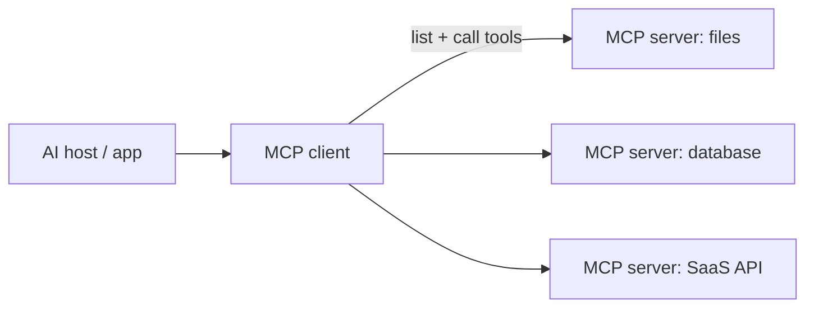

- **Host** — the app the user interacts with (an IDE, a chat app, an agent).
- **Client** — the MCP connector inside the host (one client per server connection).
- **Server** — exposes capabilities (a database, a filesystem, a SaaS API).

### What a server exposes (the three primitives)

| Primitive | What it is | Example |
|-----------|-----------|---------|
| **Tools** | Callable functions the model can invoke with arguments | `search_orders(query)`, `create_ticket(...)` |
| **Resources** | Readable data the host can pull in as context | a file, a DB row, a doc |
| **Prompts** | Reusable prompt templates the server offers | "summarize this ticket" workflow |

### How a session works

The client and server do a **capability handshake** (what protocol version + features
each supports), then the client can **list** tools/resources and **call** them. Messages
use JSON-RPC over a **transport** — stdio for a local server (a subprocess) or HTTP/SSE
for a remote one.

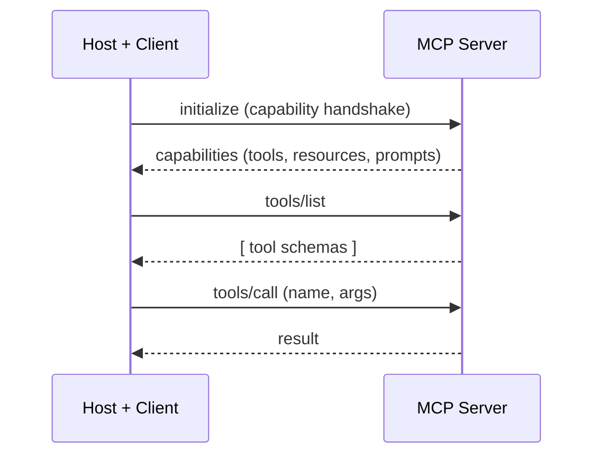

### Why MCP matters

Before MCP, every app↔tool integration was bespoke. MCP makes tools **portable**: write
an MCP server once, and any MCP-capable host (Claude, IDEs, your agent) can use it — the
"USB-C for tools" analogy. It's the interoperability layer under a lot of the agent
tooling you'll build on.

!!! danger "Security tie-in — MCP is a supply-chain surface"
    You load third-party servers whose *tool descriptions* the model reads and whose code
    runs with whatever credentials you give it. Controls: **allowlist** trusted servers,
    **pin/review** tool schemas (guard against tool-poisoning and silent "rug-pull"
    changes), give each server **least-privilege, short-lived** credentials, **sandbox**
    execution with egress limits, and treat all tool output as **untrusted data**, never
    instructions. See [AI Security](../AI-Security/index.md) and
    [AgentCore Identity & Gateway](../AI-Security/agentcore-identity-gateway.md).

## Chapter 9 key takeaways

- MCP standardizes how apps discover and call external tools.
- Host → client → server; the client lists and invokes tools.
- Treat MCP as a security surface: allowlist, pin, least-privilege, validate.

**Go deeper:** [MCP](../GenAI-Topics/mcp/index.md) · [MCP Interview Q&A](MCP_Interview_QA.md)

---

# Chapter 10 — AWS Bedrock & AgentCore

**Bedrock** is AWS's managed foundation-model service: call multiple providers'
models through one API, inside your AWS security perimeter. **AgentCore** adds the
production runtime for agents — runtime, memory, gateway (tools), identity, and
observability.

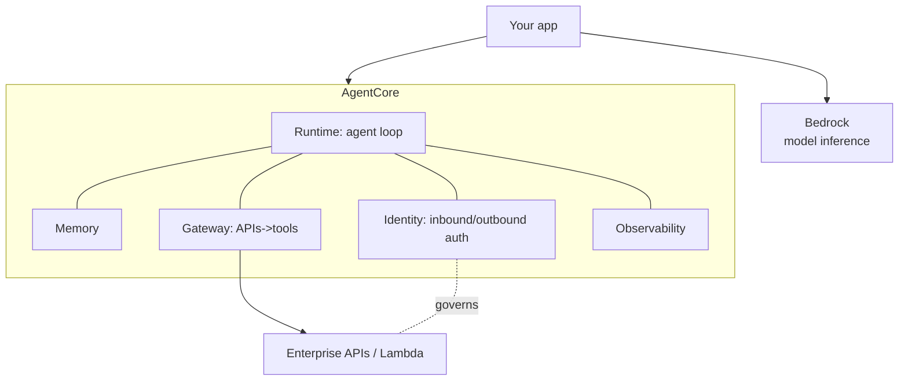

## Bedrock — the managed inference layer

- **Multiple providers, one API** — Anthropic, Meta, Mistral, Amazon (Nova), and others
  behind a single `bedrock-runtime` interface. Swap models by changing a model id.
- **Model access** — you enable specific models for your account/region before use.
- **Invoke vs Converse** — `InvokeModel` takes a provider-specific body; the **Converse
  API** gives a **unified message shape** across providers (prefer it for portability).
- **Guardrails** — configurable filters for denied topics, PII, and harmful content on
  both input and output — an in-account policy layer, not prompt wording.
- **Knowledge Bases** — managed RAG: point at an S3 corpus, Bedrock handles chunking,
  embedding, and retrieval so you don't hand-build the pipeline (Chapter 5).
- **In your perimeter** — inference runs in your AWS account; data doesn't leave to a
  third-party endpoint, so IAM/VPC/logging apply.

```python
# Converse API: same message shape regardless of the underlying model.
import boto3
brt = boto3.client("bedrock-runtime")
resp = brt.converse(
    modelId="amazon.nova-lite-v1:0",
    messages=[{"role": "user", "content": [{"text": "Explain RAG in 2 sentences."}]}],
    inferenceConfig={"temperature": 0.2, "maxTokens": 300},
)
print(resp["output"]["message"]["content"][0]["text"])
```

## AgentCore — production runtime for agents

| Piece | What it does |
|-------|--------------|
| **Runtime** | Runs the plan→act→observe loop reliably at scale; supports long/background runs |
| **Memory** | Short-term conversation + long-term facts, managed |
| **Gateway** | Turns REST/OpenAPI/Lambda into governed **MCP tools** an agent can call |
| **Identity** | Inbound (who may call the agent) + outbound (creds to call tools) auth |
| **Observability** | Trace steps, tool calls, latency, cost, failures |

### Identity is the make-or-break for enterprise agents

An agent is a non-human OAuth client. The two seams:

- **Inbound** — validate an OAuth **JWT** (IdP-agnostic: Okta, Entra, Cognito) before the
  agent runs. "Who is allowed to invoke this agent?"
- **Outbound** — the agent presents credentials to each downstream tool, fetched
  short-lived from the **token vault**, keyed to (workload, user). **2LO** client
  credentials when it acts as itself; **3LO / OBO** to act *on behalf of a user* so the
  downstream API enforces that user's permissions. Secrets never touch the prompt.

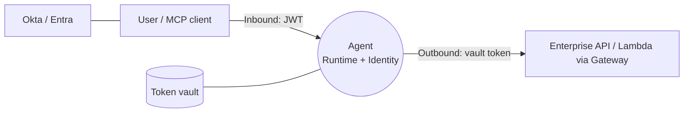

This is exactly the skill set enterprise GenAI roles ask for; the full treatment —
2LO/3LO/OBO, PKCE, JWT validation, Gateway inbound/outbound auth — is on
[AgentCore Identity & Gateway](../AI-Security/agentcore-identity-gateway.md).

## Chapter 10 key takeaways

- Bedrock = managed, multi-provider inference inside your AWS perimeter.
- AgentCore = runtime + memory + gateway + identity + observability for production agents.
- Identity (inbound/outbound auth, token vault) is central to a secure enterprise agent.

**Go deeper:** [Bedrock](../GenAI-Topics/bedrock/index.md) ·
[AgentCore](../GenAI-Topics/agentcore/index.md) ·
[AgentCore Identity & Gateway](../AI-Security/agentcore-identity-gateway.md)

---

# Chapter 11 — Kubernetes & containers for AI

When serverless isn't enough (long-running services, GPU workloads, custom
networking), you run containers on **Kubernetes** (EKS on AWS). Know the mental model,
not every flag.

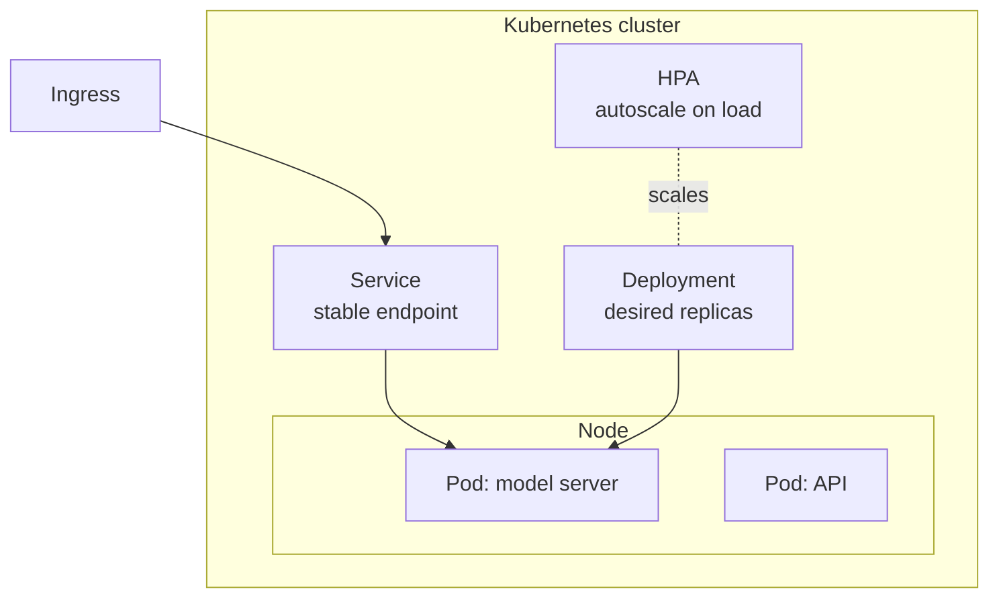

### The core objects

| Object | What it does |
|--------|--------------|
| **Pod** | Smallest unit — one or more containers sharing network/storage |
| **Deployment** | Declares desired replicas; self-heals crashed pods; rolling updates |
| **Service** | Stable virtual IP/DNS in front of changing pods (load-balances) |
| **Ingress** | Routes external HTTP(S) to services (host/path rules, TLS) |
| **ConfigMap / Secret** | Inject config / sensitive values into pods |
| **HPA** | Horizontal Pod Autoscaler — scale replicas on CPU/GPU/custom metrics |

### A minimal Deployment + Service

Kubernetes is **declarative**: you describe the desired state; the control loop makes
reality match it.

```yaml
apiVersion: apps/v1
kind: Deployment
metadata: { name: model-api }
spec:
  replicas: 3
  selector: { matchLabels: { app: model-api } }
  template:
    metadata: { labels: { app: model-api } }
    spec:
      containers:
        - name: api
          image: <account>.dkr.ecr.us-west-2.amazonaws.com/model-api:1.4.0
          ports: [{ containerPort: 8080 }]
          resources:
            requests: { cpu: "500m", memory: "1Gi" }
            limits:   { cpu: "1",    memory: "2Gi" }
          readinessProbe: { httpGet: { path: /health, port: 8080 } }
---
apiVersion: v1
kind: Service
metadata: { name: model-api }
spec:
  selector: { app: model-api }
  ports: [{ port: 80, targetPort: 8080 }]
```

- **requests/limits** — requests schedule the pod; limits cap it. Right-sizing these is
  the main cost/stability lever.
- **readiness/liveness probes** — readiness gates traffic until healthy; liveness
  restarts a hung pod.
- **Rolling update** — a new image version rolls out pod-by-pod with zero downtime; you
  can roll back to the previous ReplicaSet instantly.

### AI-specific concerns

- **GPU scheduling** — request `nvidia.com/gpu` on nodes with GPUs; model-serving pods
  land on GPU nodes. This is a top reason AI workloads leave serverless.
- **Big images / model weights** — bake or mount weights; watch image size and cold pull
  time. Consider an init container or a shared volume for large models.
- **Autoscaling on the right metric** — LLM serving is often GPU/throughput-bound, not
  CPU-bound; scale on the metric that reflects real load (queue depth, GPU util).
- **When to choose K8s over serverless** — long-running/streaming inference, GPUs,
  custom networking, or steady high traffic where always-on beats per-invocation cost.

## Chapter 11 key takeaways

- Pod → Deployment → Service → Ingress is the core chain; HPA autoscales.
- Containers = reproducible env for heavy ML deps.
- Choose Kubernetes over serverless for long-running, GPU, or custom-networking needs.

**Go deeper:** [Kubernetes & Containers](../GenAI-Topics/kubernetes/index.md) ·
[DevOps for AI](../GenAI-Topics/devops-ai/index.md)

---

# Chapter 12 — Capstone: ship one production workflow

Tie it together by taking **one** workflow end to end. Don't build everything — build
one thing that's real, governed, observed, and evaluated.

## A worked example: a governed "ask your docs" assistant

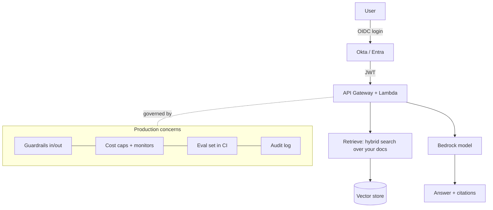

### Request flow, end to end

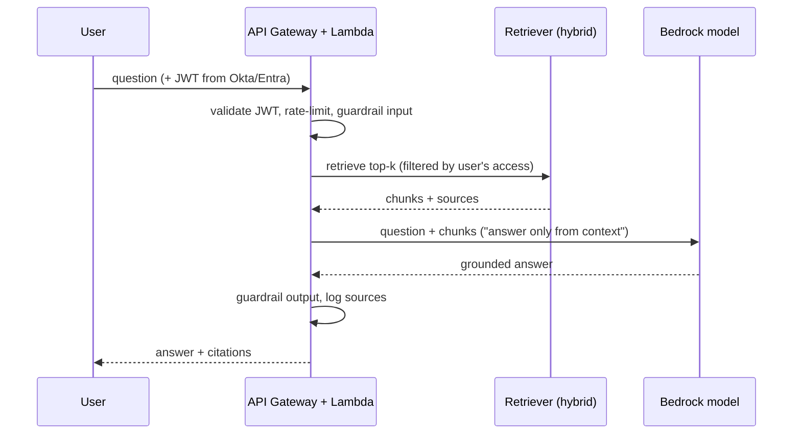

### Build it in phases (don't boil the ocean)

1. **Thin slice** — one endpoint: JWT auth → retrieve → generate → answer with citations.
2. **Ground it well** — hybrid retrieval + re-ranking + "answer only from context".
3. **Harden** — input/output guardrails, per-user access filter at retrieval, secrets in
   a vault, structured-output validation.
4. **Operate** — tracing, cost monitors + caps, an eval set in CI, a rollback plan.
5. *Only then* consider extras (agents, more tools) — and justify each.

### The checklist that separates a demo from production

- **Identity** — authenticate users (OIDC), enforce their access at retrieval so RAG
  can't surface docs they can't see.
- **Grounding** — hybrid retrieval + "answer only from context" + citations.
- **Security** — treat retrieved text as data; validate outputs; secrets in a vault.
- **Cost** — right-size the model, cap output tokens, monitor spend.
- **Observability** — trace retrieval + generation; log sources per answer.
- **Evaluation** — a fixed question set scored on groundedness, run in CI on changes.
- **Rollback** — a plan to revert model/prompt/index changes.

!!! tip "How to present this in an interview"
    Clarify requirements first (users, data, latency, governance, budget). Then map each
    need to a component **with a reason**, and **volunteer** the production concerns —
    security, cost, failure modes, eval — before you're asked. Naming trade-offs
    (managed vs DIY, model tier vs cost, freshness vs spend) is what reads as senior.

## Chapter 12 key takeaways

- Ship one real workflow, fully governed — not a pile of half-features.
- The production checklist: identity, grounding, security, cost, observability, eval, rollback.
- This is exactly what a senior/FDE interview asks you to design.

**Go deeper:** [Requirements → Production](Interview_Requirements_to_Production.md) ·
[Production Incident Interviews](Interview_Production_Incidents.md)

---

!!! success "Where to next"
    - **Do the labs:** [Hands-on Labs](../Labs/index.md) — runnable notebooks
      (RAG, agent loop, Bedrock Converse, Python patterns) + editable diagrams.
    - **Practice:** [Interview Guide Overview](Interview_Guide_Overview.md) and the
      role paths under **Interview Prep**.
    - **Build:** [Setup Guides](../Setup-Guides/index.md) and
      [Projects & POCs](../Projects/genai-poc/index.md).
    - **Defend:** every **Learn** topic page ends with an interview deep dive.

*This study guide is original OfferReady content — our own explanations, diagrams,
and code, written to cover the field end to end.*
