# OfferReady Complete Study Guide

A single, structured path from fundamentals to shipping production GenAI — written
for OfferReady. Every chapter is **original OfferReady content**: our own
explanations, our own diagrams, and fresh code you can run. It pairs with the
deeper topic pages under **Learn** and the practice banks under **Interview Prep**.

!!! abstract "How to use this guide"
    Read top to bottom for a full ramp, or jump to a chapter. Each chapter ends
    with **Key takeaways** and links to the matching deep-dive page and interview
    Q&A so you can go from *learn* → *practice* → *defend*. Diagrams render live
    (Mermaid); code blocks are minimal and runnable.

## Contents

| # | Chapter | Deep dive |
|---|---------|-----------|
| 1 | AI, ML & Generative AI foundations | [LLM Fundamentals](../GenAI-Topics/llm-fundamentals/index.md) |
| 2 | AWS cloud foundations for AI apps | [AWS Q&A](AWS_Interview_QA.md) |
| 3 | Python for AI engineering | [Python Q&A](Python_Interview_QA.md) |
| 4 | Prompt & context engineering | [Prompt Engineering](../GenAI-Topics/prompt-engineering/index.md) |
| 5 | Retrieval-Augmented Generation (RAG) | [RAG](../GenAI-Topics/rag/index.md) |
| 6 | LangChain | [LangChain](../GenAI-Topics/langchain/index.md) |
| 7 | Graph databases for AI | [Graph DB](../GenAI-Topics/graph-db/index.md) |
| 8 | LangGraph — agentic workflows | [LangGraph](../GenAI-Topics/langgraph/index.md) |
| 9 | Model Context Protocol (MCP) | [MCP](../GenAI-Topics/mcp/index.md) |
| 10 | AWS Bedrock & AgentCore | [Bedrock](../GenAI-Topics/bedrock/index.md) · [AgentCore](../GenAI-Topics/agentcore/index.md) |
| 11 | Kubernetes & containers for AI | [Kubernetes](../GenAI-Topics/kubernetes/index.md) |
| 12 | Capstone — ship one production workflow | [Requirements → Production](Interview_Requirements_to_Production.md) |

---

# Chapter 1 — AI, ML & Generative AI foundations

## The hierarchy

Start by placing the terms so nothing is fuzzy later.

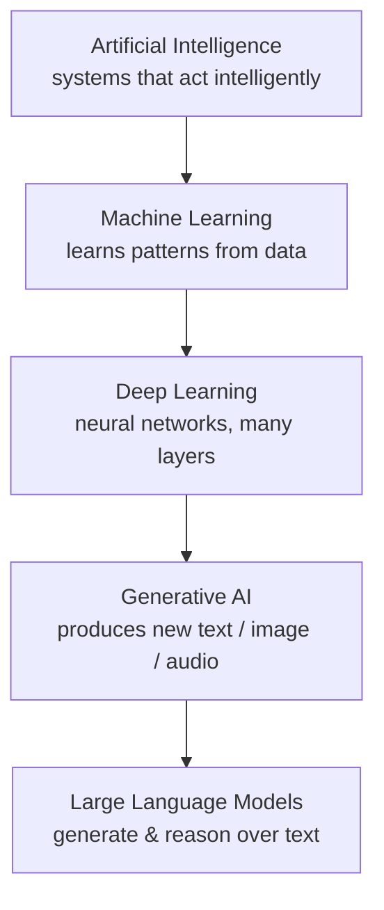

- **AI** — the broad goal: machines doing things that need intelligence.
- **ML** — the dominant method: learn a function from data instead of hand-coding rules.
- **Deep learning** — ML with multi-layer neural networks; powers modern perception and language.
- **Generative AI** — models that *produce* content rather than only classify or predict.
- **LLMs** — the text branch of GenAI; the engine behind most of this guide.

### The three classic ML styles

| Style | Learns from | Everyday example |
|-------|-------------|------------------|
| Supervised | Labeled pairs (input → known answer) | Spam vs not-spam, price prediction |
| Unsupervised | Unlabeled data (find structure) | Customer segments, anomaly detection |
| Reinforcement | Rewards from acting in an environment | Game agents, robotics, RLHF tuning of LLMs |

## What a large language model actually is

An LLM is a next-token predictor trained on huge text corpora. Given the tokens so
far, it outputs a probability distribution over the next token, samples one, appends
it, and repeats. Everything else — answering, summarizing, "reasoning" — emerges from
doing that extremely well at scale.

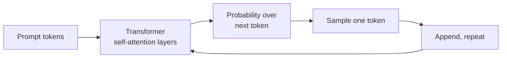

### Why the transformer matters

The transformer replaced sequential recurrence with **self-attention**: every token
can look at every other token in one step, so the model captures long-range
relationships and trains efficiently in parallel. Three shapes to know:

- **Encoder-only** (e.g. BERT-style) — understanding tasks: classification, embeddings.
- **Decoder-only** (e.g. GPT-style) — generation: chat, completion. Most LLMs today.
- **Encoder-decoder** (e.g. T5-style) — translation/summarization where input maps to output.

## Tokens, context window, and cost

- **Token** — a chunk of text (~¾ of a word on average). Models read and bill in tokens.
- **Context window** — the maximum tokens the model can consider at once (prompt +
  output). Exceed it and earlier content is dropped or must be summarized.
- **Cost** — you pay per input token and per output token; larger models cost more per
  token. This is the single biggest lever on a GenAI bill.

```python
# A rough token budget check before you call an API.
# Real tokenizers vary; ~4 characters per token is a workable estimate.
def estimate_tokens(text: str) -> int:
    return max(1, len(text) // 4)

def fits_context(prompt: str, expected_output_tokens: int, window: int) -> bool:
    return estimate_tokens(prompt) + expected_output_tokens <= window

assert fits_context("Summarize this ticket...", 300, window=8192)
```

!!! tip "Cost instinct"
    Cost ≈ (input tokens + output tokens) × price-per-token of the chosen model.
    You control it by **choosing a smaller model where it passes**, **trimming
    context**, and **capping output length** — long before you reach for anything
    fancier.

## Prompt engineering vs context engineering

- **Prompt engineering** — crafting the instruction: role, task, constraints,
  examples, output format.
- **Context engineering** — controlling *what information* is in the window:
  retrieval, memory, tool results, trimming. As systems grow, context engineering
  matters more than clever wording.

## Chapter 1 key takeaways

- AI ⊃ ML ⊃ DL ⊃ GenAI ⊃ LLMs — know where each term sits.
- An LLM predicts the next token; capability emerges from scale + the transformer's attention.
- Tokens drive both the context limit and the bill.
- Prompt engineering shapes the instruction; context engineering shapes the information.

**Go deeper:** [LLM Fundamentals](../GenAI-Topics/llm-fundamentals/index.md) ·
[Prompt Engineering](../GenAI-Topics/prompt-engineering/index.md)

---

# Chapter 2 — AWS cloud foundations for AI apps

You don't need all of AWS to ship GenAI — you need a handful of services and the
identity model that ties them together.

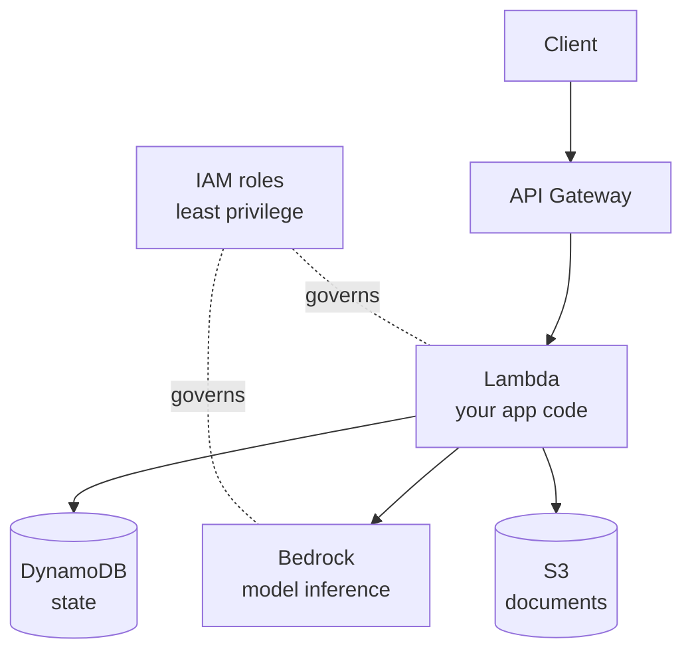

## Identity & Access Management (IAM) — the foundation

IAM decides *who* (principal) can do *what* (action) on *which resource*. Everything
else assumes you got this right.

- **Users / roles / groups** — prefer **roles** for workloads (no long-lived keys);
  attach permissions to roles, add users to groups.
- **Policies** — JSON documents granting/denying actions. Grant the **minimum** needed.
- **Least privilege** — a Lambda that calls Bedrock and one table should have exactly
  those permissions, nothing more.

```json
{
  "Version": "2012-10-17",
  "Statement": [
    {
      "Effect": "Allow",
      "Action": ["bedrock:InvokeModel"],
      "Resource": "arn:aws:bedrock:us-west-2::foundation-model/*"
    },
    {
      "Effect": "Allow",
      "Action": ["dynamodb:GetItem", "dynamodb:PutItem"],
      "Resource": "arn:aws:dynamodb:us-west-2:*:table/conversations"
    }
  ]
}
```

## The core services for a GenAI app

| Service | Role in a GenAI app |
|---------|---------------------|
| **IAM** | Identity + least-privilege permissions for every component |
| **Lambda** | Run your app code without managing servers; scales to zero |
| **API Gateway** | Public HTTPS endpoint in front of Lambda; auth, throttling |
| **S3** | Store documents, artifacts, model inputs/outputs |
| **DynamoDB** | Low-latency key-value/document store for conversation + app state |
| **RDS** | Relational database when you need SQL/joins/transactions |
| **ECR + Docker** | Package code (and heavy deps) as container images for Lambda/ECS |
| **Bedrock** | Managed foundation-model inference (Chapter 10) |

### A minimal serverless GenAI handler

```python
# Lambda handler: validate input, call a model, persist the turn. Illustrative.
import json, os, boto3

bedrock = boto3.client("bedrock-runtime")
table = boto3.resource("dynamodb").Table(os.environ["TABLE"])

def handler(event, _ctx):
    body = json.loads(event.get("body") or "{}")
    question = (body.get("question") or "").strip()
    if not question:
        return {"statusCode": 400, "body": json.dumps({"error": "question required"})}

    resp = bedrock.invoke_model(
        modelId=os.environ.get("MODEL_ID", "amazon.nova-lite-v1:0"),
        body=json.dumps({"messages": [{"role": "user", "content": question}]}),
    )
    answer = json.loads(resp["body"].read())  # shape depends on the model family

    table.put_item(Item={"id": event["requestContext"]["requestId"], "q": question})
    return {"statusCode": 200, "body": json.dumps({"answer": answer})}
```

## Containers: Docker + ECR in one breath

When your dependencies are too big for a zipped Lambda (common with ML libs), you ship
a **container image**: write a `Dockerfile`, build it, push to **ECR**, and point
Lambda (or ECS/EKS) at the image.

```dockerfile
FROM public.ecr.aws/lambda/python:3.12
COPY requirements.txt .
RUN pip install -r requirements.txt
COPY app.py ${LAMBDA_TASK_ROOT}
CMD ["app.handler"]
```

## Chapter 2 key takeaways

- IAM least-privilege roles are the backbone — get identity right first.
- A serverless GenAI app is usually API Gateway → Lambda → Bedrock (+ S3/DynamoDB).
- Use containers + ECR when dependencies outgrow a zip.
- Reach for RDS only when you genuinely need relational guarantees; DynamoDB covers most app state.

**Go deeper:** [AWS Interview Q&A](AWS_Interview_QA.md) ·
[Enterprise Security Architecture](../Enterprise/security-architecture/index.md)

---

# Chapter 3 — Python for AI engineering

Python is the lingua franca of AI because of its ecosystem and readability. For
engineering work, focus on the parts that show up in production code.

## The essentials that matter in AI code

- **Data structures** — lists, dicts, sets, tuples; know when each is right.
- **Functions & comprehensions** — small, testable units; comprehensions for transforms.
- **Type hints + `pydantic`** — validate LLM inputs/outputs and API payloads.
- **Error handling & logging** — external calls (models, APIs) fail; handle and log.
- **`async`** — concurrency for I/O-bound work (many model/API calls at once).

### Validate model I/O with pydantic

Structured validation turns "hope the JSON is right" into a guarantee.

```python
from pydantic import BaseModel, Field, ValidationError

class Analysis(BaseModel):
    summary: str
    risk_score: int = Field(ge=0, le=100)
    tags: list[str] = []

def parse_model_output(raw_json: str) -> Analysis | None:
    try:
        return Analysis.model_validate_json(raw_json)
    except ValidationError as e:
        # Log the shape problem, never the raw content if it may hold PII.
        print("model output failed schema:", e.error_count(), "errors")
        return None
```

### Async for parallel model calls

```python
import asyncio

async def analyze_one(client, text):
    return await client.complete(text)          # placeholder async call

async def analyze_many(client, texts):
    # Fan out I/O-bound calls concurrently instead of one-at-a-time.
    return await asyncio.gather(*(analyze_one(client, t) for t in texts))
```

## Object-oriented building blocks

You'll model tools, agents, and clients as classes. Know the four pillars in plain
terms: **encapsulation** (hide internals behind a clean interface), **inheritance**
(share behavior), **polymorphism** (same call, different implementations —
e.g. a common `LLMClient` interface over several providers), **abstraction** (program
to interfaces, not concretions).

```python
from abc import ABC, abstractmethod

class LLMClient(ABC):
    @abstractmethod
    def complete(self, prompt: str) -> str: ...

class OpenAIClient(LLMClient):
    def complete(self, prompt: str) -> str:
        return "..."   # provider-specific call

class BedrockClient(LLMClient):
    def complete(self, prompt: str) -> str:
        return "..."   # different provider, same interface

def summarize(client: LLMClient, text: str) -> str:   # depends on the abstraction
    return client.complete(f"Summarize:\n{text}")
```

## Chapter 3 key takeaways

- Master dicts/lists/sets, comprehensions, functions — the daily tools.
- Use type hints + pydantic to validate LLM and API data at the boundary.
- Handle and log failures on every external call; never log raw sensitive payloads.
- Program to interfaces (an `LLMClient` ABC) so you can swap providers.

**Go deeper:** [Python Interview Q&A](Python_Interview_QA.md)

---

# Chapter 4 — Prompt & context engineering

## Anatomy of a strong prompt

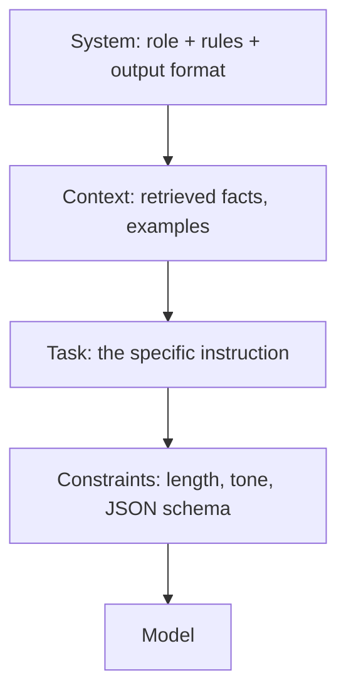

- **Role** — who the model is ("You are a careful data analyst").
- **Task** — the precise instruction, one job at a time.
- **Constraints** — output format (JSON), length, what NOT to do.
- **Examples** — few-shot demonstrations for tricky formats.

## Techniques, shortest useful version

| Technique | Use when |
|-----------|----------|
| Zero-shot | Task is simple and well-known |
| Few-shot | You need a specific format or edge-case handling |
| Chain-of-thought | Multi-step reasoning helps (ask for steps, or use a reasoning model) |
| Structured output | You need machine-parseable results — enforce a JSON schema |

```python
SYSTEM = (
    "You are OfferReady's extraction assistant. Return ONLY valid JSON matching "
    '{"topic": string, "difficulty": "easy"|"medium"|"hard"}. No prose.'
)
```

## Context engineering — the part that scales

As apps grow, *what's in the window* beats *how you phrased it*. Retrieve only
relevant chunks, keep a rolling summary of long conversations, put untrusted content
in a clearly labeled block, and trim aggressively to control cost and stay in-window.

!!! danger "Security tie-in"
    Treat retrieved/tool text as **data, not instructions**. See
    [AI Security](../AI-Security/index.md) — prompt injection is the flagship risk.

## Chapter 4 key takeaways

- Structure prompts: role → context → task → constraints, with examples when needed.
- Prefer structured (schema-enforced) output over parsing prose.
- Context engineering — retrieval, memory, trimming — is where quality and cost live.

**Go deeper:** [Prompt Engineering](../GenAI-Topics/prompt-engineering/index.md) ·
[Context Engineering](../GenAI-Topics/context-engineering/index.md)

---

# Chapter 5 — Retrieval-Augmented Generation (RAG)

RAG grounds a model in *your* data: retrieve relevant text, put it in the prompt, and
have the model answer from it — reducing hallucination and letting you cite sources.

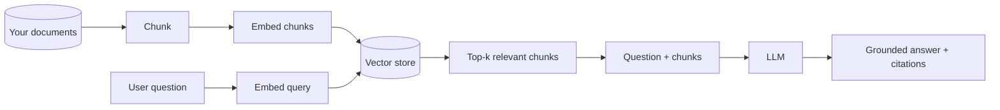

## The pipeline, stage by stage

1. **Ingest & chunk** — split documents into passages (size + overlap matter; too big
   dilutes relevance, too small loses context).
2. **Embed** — turn each chunk into a vector capturing meaning.
3. **Store & index** — put vectors in a vector store for similarity search.
4. **Retrieve** — embed the query, fetch the top-k nearest chunks.
5. **Generate** — give the model the question + chunks; instruct it to answer only from them.

```python
# Minimal RAG loop (pseudocode-ish; swap in your embedder + vector store).
def rag_answer(question, store, llm, k=5):
    q_vec = embed(question)
    chunks = store.search(q_vec, k=k)                 # top-k relevant passages
    context = "\n\n".join(c.text for c in chunks)
    prompt = (
        "Answer ONLY from the context. If it's not there, say you don't know.\n\n"
        f"<context>\n{context}\n</context>\n\nQuestion: {question}"
    )
    return llm.complete(prompt), [c.source for c in chunks]  # answer + citations
```

## Making retrieval actually good

- **Hybrid search** — combine vector similarity (meaning) with keyword (exact terms
  like error codes/IDs). Pure vector misses literals.
- **Re-ranking** — a second pass reorders candidates for precision.
- **Chunking strategy** — respect structure (headings, paragraphs); add overlap.
- **Evaluation** — measure groundedness and answer quality on a fixed question set.

## Chapter 5 key takeaways

- RAG = retrieve relevant chunks → ground the model → answer with citations.
- Quality lives in **chunking + retrieval**, not just the LLM.
- Use hybrid search and re-ranking; instruct the model to answer only from context.
- Evaluate groundedness — don't trust a demo.

**Go deeper:** [RAG](../GenAI-Topics/rag/index.md) ·
[Retrieval Tuning](../GenAI-Topics/retrieval-tuning/index.md) ·
[Vector DB](../GenAI-Topics/vector-db/index.md)

---

# Chapter 6 — LangChain

LangChain is a framework for composing LLM apps: prompts, models, retrievers, tools,
and memory wired into pipelines, with a standard interface across providers.

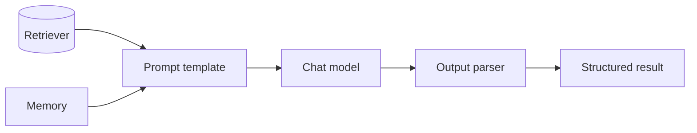

## Core pieces

- **Prompt templates** — parameterized prompts.
- **Models** — a uniform interface over OpenAI, Bedrock, etc.
- **Output parsers** — coerce responses into typed/structured data.
- **Retrievers** — pluggable RAG sources.
- **Chains / LCEL** — compose steps into a runnable pipeline.
- **Memory** — carry conversation state across turns.

```python
# LCEL-style composition (illustrative): prompt | model | parser.
chain = prompt_template | chat_model | output_parser
result = chain.invoke({"question": "What is hybrid retrieval?"})
```

!!! note "When not to reach for a framework"
    For a single model call, plain SDK code is clearer. Adopt LangChain when you're
    genuinely composing retrieval + tools + memory and want the abstractions.

## Chapter 6 key takeaways

- LangChain composes prompt → model → parser, plus retrievers and memory.
- LCEL pipes components into runnable chains with a consistent interface.
- Use it for real composition; skip it for a one-shot call.

**Go deeper:** [LangChain](../GenAI-Topics/langchain/index.md) ·
[LangChain / LangGraph Q&A](LangChain_LangGraph_Interview_QA.md)

---

# Chapter 7 — Graph databases for AI

Some questions are about **relationships** ("which suppliers connect to a flagged
account, two hops out?"). Graph databases store nodes and edges so those traversals
are natural and fast — and they power **GraphRAG**, where retrieval follows
relationships, not just similarity.

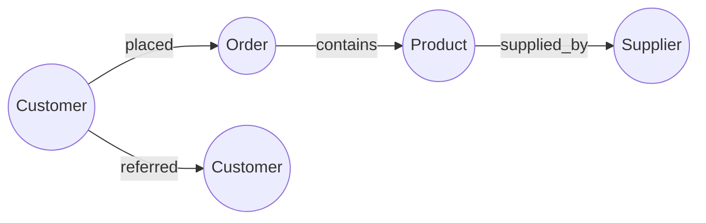

- **Nodes** = entities (Customer, Order, Product). **Edges** = relationships (PLACED, CONTAINS).
- **Cypher** (Neo4j's query language) expresses traversals declaratively:

```cypher
// Products a customer bought, and who supplies them.
MATCH (c:Customer {id: $id})-[:PLACED]->(:Order)-[:CONTAINS]->(p:Product)-[:SUPPLIED_BY]->(s:Supplier)
RETURN p.name, s.name
```

**GraphRAG** combines this with LLMs: retrieve a relevant subgraph, serialize it into
context, and let the model reason over connected facts — strong for multi-hop
questions where pure vector RAG struggles.

## Chapter 7 key takeaways

- Graph DBs model entities + relationships; traversals are first-class.
- Cypher expresses multi-hop queries cleanly.
- GraphRAG grounds an LLM in a relevant subgraph for relationship-heavy questions.

**Go deeper:** [Graph DB](../GenAI-Topics/graph-db/index.md)

---

# Chapter 8 — LangGraph: agentic workflows

LangChain composes linear pipelines; **LangGraph** models apps as a **graph of nodes
with state**, so you can branch, loop, and add cycles — exactly what agents need
(plan → act → observe → decide → repeat).

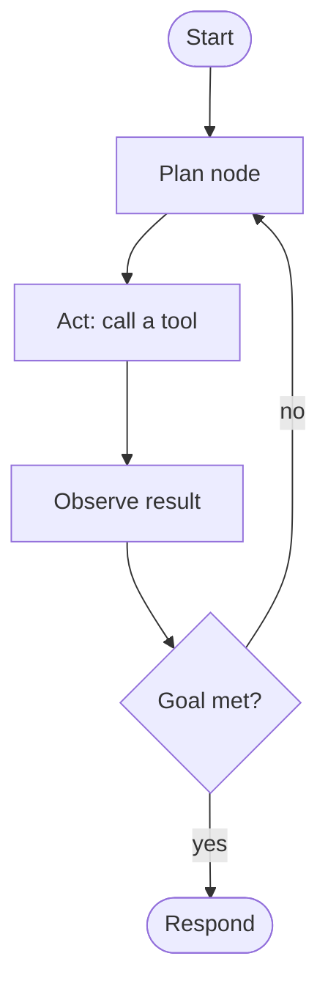

## Why a graph, not a chain

- **State** — a shared object flows through nodes; each node reads/updates it.
- **Cycles** — an agent can loop until done (a chain can't).
- **Control** — you decide transitions explicitly, so behavior is inspectable and
  testable (vs an opaque "agent, go" loop).

```python
# Shape of a LangGraph app: nodes mutate a shared state; edges route the flow.
def plan(state):   ...   # decide next action
def act(state):    ...   # call a tool
def observe(state): ...  # record result, set state["done"]

# graph: START -> plan -> act -> observe -> (loop to plan | END)
```

## Chapter 8 key takeaways

- LangGraph = stateful graph with branches and loops — the right shape for agents.
- Explicit nodes/edges make agent control flow inspectable and testable.
- Cap iterations to prevent runaway loops.

**Go deeper:** [LangGraph](../GenAI-Topics/langgraph/index.md) ·
[Agent Engineering](../GenAI-Topics/agent-engineering/index.md)

---

# Chapter 9 — Model Context Protocol (MCP)

MCP is an open standard that lets an AI application discover and call **tools** from
external **servers** over a uniform protocol — instead of hand-wiring every
integration. Think "USB-C for tools."

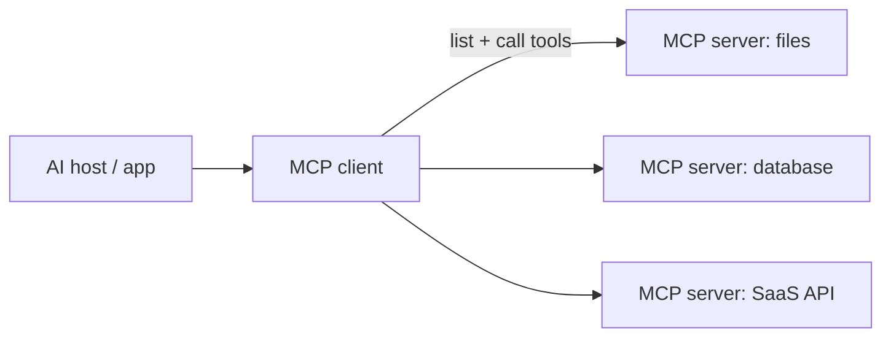

- **Host** — the app the user interacts with.
- **Client** — the MCP connector inside the host.
- **Server** — exposes tools/resources (a database, a filesystem, an API).
- The client can **discover** available tools and **invoke** them with arguments.

!!! danger "Security tie-in"
    MCP adds a supply-chain surface: you load third-party servers whose *tool
    descriptions* the model reads. Allowlist servers, pin/review tools, give each
    least-privilege short-lived credentials, and treat tool output as untrusted data.
    See [AI Security](../AI-Security/index.md) and
    [AgentCore Identity & Gateway](../AI-Security/agentcore-identity-gateway.md).

## Chapter 9 key takeaways

- MCP standardizes how apps discover and call external tools.
- Host → client → server; the client lists and invokes tools.
- Treat MCP as a security surface: allowlist, pin, least-privilege, validate.

**Go deeper:** [MCP](../GenAI-Topics/mcp/index.md) · [MCP Interview Q&A](MCP_Interview_QA.md)

---

# Chapter 10 — AWS Bedrock & AgentCore

**Bedrock** is AWS's managed foundation-model service: call multiple providers'
models through one API, inside your AWS security perimeter. **AgentCore** adds the
production runtime for agents — runtime, memory, gateway (tools), identity, and
observability.

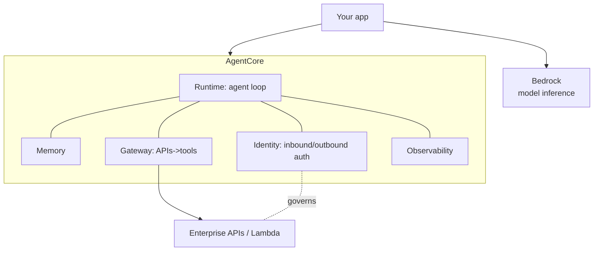

## What each piece buys you

| Piece | What it does |
|-------|--------------|
| **Bedrock** | Managed inference across model providers; guardrails; stays in-account |
| **AgentCore Runtime** | Runs the plan→act→observe loop reliably at scale |
| **AgentCore Memory** | Short-term conversation + long-term facts, managed |
| **AgentCore Gateway** | Turns REST/OpenAPI/Lambda into governed MCP tools |
| **AgentCore Identity** | Inbound (who calls the agent) + outbound (creds to call tools) auth |
| **Observability** | Trace steps, tool calls, cost, failures |

Identity is the make-or-break for enterprise agents: inbound JWT auth (Okta/Entra),
outbound tokens from a vault (2LO for workload, 3LO/OBO for a user), secrets never in
the prompt. The full treatment is on the dedicated page.

## Chapter 10 key takeaways

- Bedrock = managed, multi-provider inference inside your AWS perimeter.
- AgentCore = runtime + memory + gateway + identity + observability for production agents.
- Identity (inbound/outbound auth, token vault) is central to a secure enterprise agent.

**Go deeper:** [Bedrock](../GenAI-Topics/bedrock/index.md) ·
[AgentCore](../GenAI-Topics/agentcore/index.md) ·
[AgentCore Identity & Gateway](../AI-Security/agentcore-identity-gateway.md)

---

# Chapter 11 — Kubernetes & containers for AI

When serverless isn't enough (long-running services, GPU workloads, custom
networking), you run containers on **Kubernetes** (EKS on AWS). Know the mental model,
not every flag.

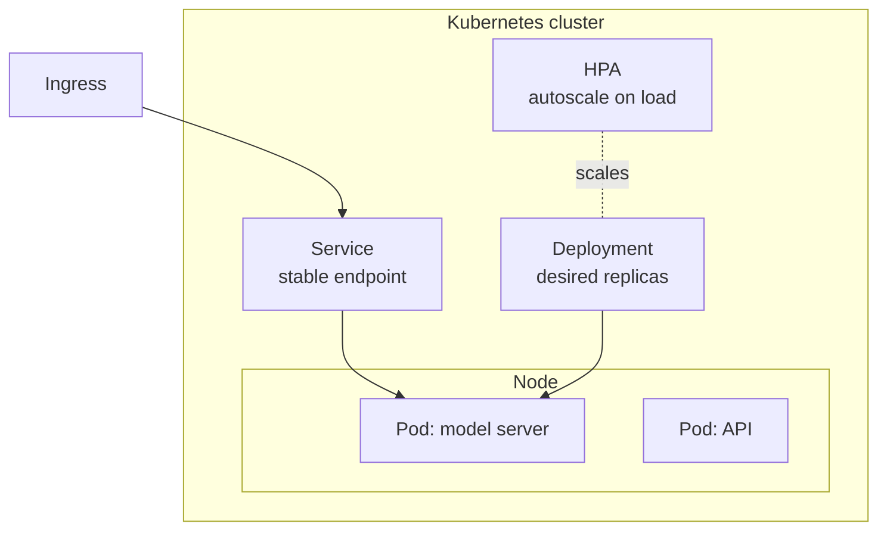

- **Pod** — one or more containers running together (smallest unit).
- **Deployment** — declares desired replicas; self-heals and rolls out updates.
- **Service** — stable network endpoint in front of changing pods.
- **Ingress** — routes external HTTP(S) to services.
- **HPA** — Horizontal Pod Autoscaler scales replicas with load.

For AI: containers give you reproducible environments for heavy ML deps; Kubernetes
gives scaling, rollouts, and GPU scheduling. Use it when Lambda's limits (duration,
package size, no GPU) get in the way.

## Chapter 11 key takeaways

- Pod → Deployment → Service → Ingress is the core chain; HPA autoscales.
- Containers = reproducible env for heavy ML deps.
- Choose Kubernetes over serverless for long-running, GPU, or custom-networking needs.

**Go deeper:** [Kubernetes & Containers](../GenAI-Topics/kubernetes/index.md) ·
[DevOps for AI](../GenAI-Topics/devops-ai/index.md)

---

# Chapter 12 — Capstone: ship one production workflow

Tie it together by taking **one** workflow end to end. Don't build everything — build
one thing that's real, governed, observed, and evaluated.

## A worked example: a governed "ask your docs" assistant

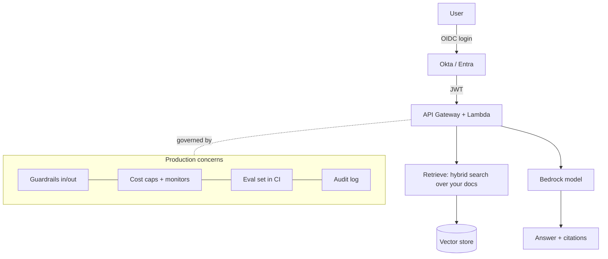

### The checklist that separates a demo from production

- **Identity** — authenticate users (OIDC), enforce their access at retrieval so RAG
  can't surface docs they can't see.
- **Grounding** — hybrid retrieval + "answer only from context" + citations.
- **Security** — treat retrieved text as data; validate outputs; secrets in a vault.
- **Cost** — right-size the model, cap output tokens, monitor spend.
- **Observability** — trace retrieval + generation; log sources per answer.
- **Evaluation** — a fixed question set scored on groundedness, run in CI on changes.
- **Rollback** — a plan to revert model/prompt/index changes.

## Chapter 12 key takeaways

- Ship one real workflow, fully governed — not a pile of half-features.
- The production checklist: identity, grounding, security, cost, observability, eval, rollback.
- This is exactly what a senior/FDE interview asks you to design.

**Go deeper:** [Requirements → Production](Interview_Requirements_to_Production.md) ·
[Production Incident Interviews](Interview_Production_Incidents.md)

---

!!! success "Where to next"
    - **Practice:** [Interview Guide Overview](Interview_Guide_Overview.md) and the
      role paths under **Interview Prep**.
    - **Build:** [Setup Guides](../Setup-Guides/index.md) and
      [Projects & POCs](../Projects/genai-poc/index.md).
    - **Defend:** every **Learn** topic page ends with an interview deep dive.

*This study guide is original OfferReady content — our own explanations, diagrams,
and code, written to cover the field end to end.*
