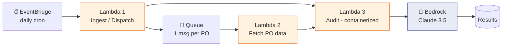
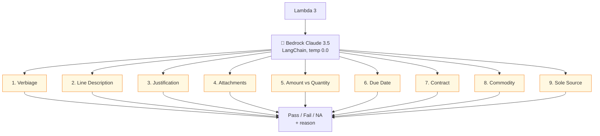
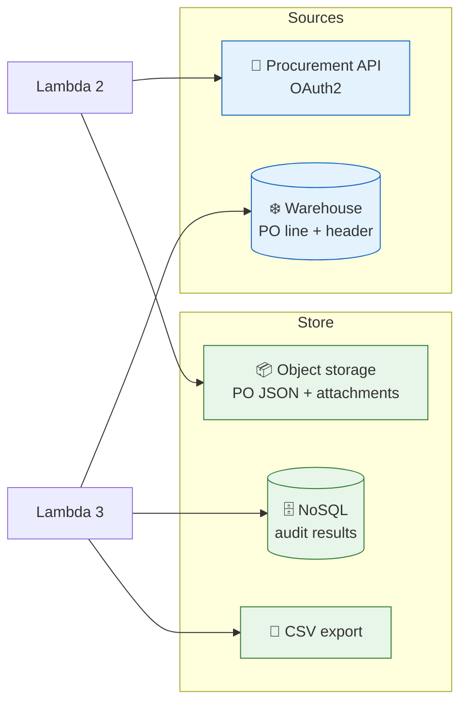
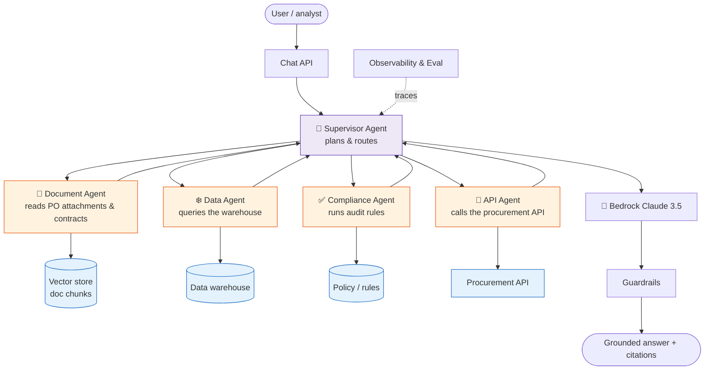
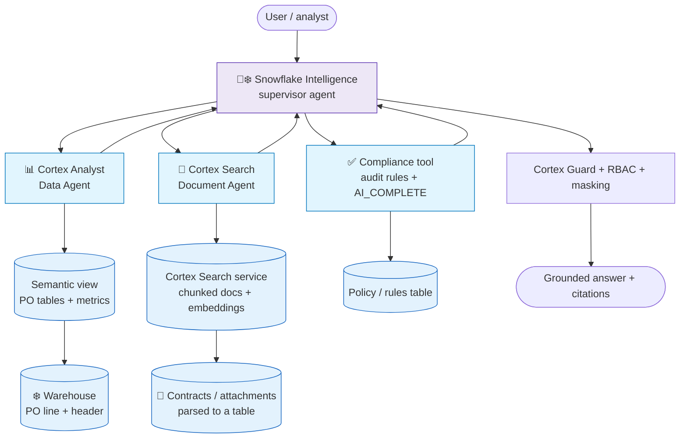

# GenAI Procurement Audit Bot — Architecture

*Last reviewed: October 2026*

!!! note "Model and API versions"
    The bot was built on Claude 3.5 Sonnet with LangChain's `LLMChain`. That model was
    retired on the Anthropic API in October 2025 and `LLMChain` is legacy (now in
    `langchain-classic`). A 2026 rebuild would pin a current Claude model through a
    Bedrock inference profile, use the Converse API or LangChain 1.x with structured
    output, and re-run the labeled eval set before switching.

A serverless, event-driven pipeline that audits purchase orders with an LLM. This
is a **generalized reference architecture** — internal names, endpoints, and
identifiers are omitted.

*The architecture is shown in three readable parts below: the pipeline, the LLM
audit, and the data/storage layout.*

## Part 1 — The pipeline (trigger → fetch → audit)



## Part 2 — The 9-point LLM audit



## Part 3 — Data & storage



## Key design details

| Component | Value |
|-----------|-------|
| LLM Model | Claude 3.5 Sonnet (via Amazon Bedrock) |
| Bedrock Access | Private VPC endpoint (config in Parameter Store) |
| Region | us-west-2 |
| LLM Framework | LangChain (`ChatBedrock`, `LLMChain`, `PromptTemplate`) |
| Temperature | 0.0 (repeatable auditing; not a guarantee of identical output) |
| Parallelism | ThreadPoolExecutor, ~40 workers, chunked |
| Results store | NoSQL table + CSV export |
| Packaging | Container image on a serverless runtime |
| Schedule | Daily (EventBridge) |

## Data flow

```
EventBridge (daily)
  → Lambda 1 → Warehouse (get new PO list) → Queue
  → Lambda 2 → Procurement API (fetch PO data) → Object storage
  → Lambda 3 → Object storage (read PO JSON) + Warehouse (PO details)
             → Bedrock Claude 3.5 Sonnet (9 audit checks via LangChain)
             → NoSQL + CSV (save audit results)
```

## 9-Point AI Audit Checklist
1. **Verbiage** — Is requisition header verbiage adequate?
2. **Line Description** — Does each line have a proper description?
3. **Justification** — Is business justification provided?
4. **Attachments** — Are required attachments present?
5. **Amount vs Quantity** — Is a service PO submitted correctly (Amount vs Qty)?
6. **Due Date** — Is the need-by date after the PO create date?
7. **Contract** — Is a contract referenced where required?
8. **Commodity** — Is the commodity code appropriate?
9. **Sole Source** — Is the sole-source memo justified?

Each check returns **Pass / Fail / NA** with a reason.

## Why this design

- **Fan-out with a queue** — one message per PO keeps the audit Lambda simple,
  parallel, and retry-safe (idempotent per PO).
- **Repeatable auditing** — temperature 0.0 so the same PO almost always yields the
  same verdict; the checklist is a structured prompt returning Pass/Fail/NA +
  reason. (Track verdict flips across re-runs as a signal of ambiguous checks.)
- **Grounded** — the LLM audits against real PO data pulled from the warehouse and
  API, not from memory.
- **Private inference** — Bedrock via a VPC endpoint keeps data in-boundary.

## GenAI design deep dive

The GenAI decisions that make this reliable — useful as a study/interview example:

### Structured, deterministic prompting

Each audit check is a **structured prompt** that must return a fixed shape, so
downstream code can parse it and store Pass/Fail/NA:

```text
System: You are a procurement compliance auditor. Answer ONLY from the PO data
provided. If information is missing, return NA — never guess.

Given this PO line data:
{po_json}

Check: Is a business justification provided and adequate?
Return JSON only: {"result": "Pass|Fail|NA", "reason": "<one sentence>"}
```

- **Temperature 0.0** → same PO, same verdict in practice (auditable, repeatable).
- **JSON-only output** → parsed and validated; a bad parse triggers a retry. Today,
  prefer the provider's structured-output / tool-schema mode so the shape is
  enforced rather than requested.
- **"NA, never guess"** → prevents hallucinated compliance verdicts.

### Grounding, not memory

The model never audits from its own knowledge — it's given the **actual PO
line/header data** (from the warehouse) plus attachments/comments (from the API).
This is retrieval-style grounding: the facts come from your systems, the model
only *reasons* over them. See [RAG](../GenAI-Topics/rag/index.md).

### Batching & parallelism

- POs are independent → audited **in parallel** (thread pool, chunked) for
  throughput.
- Each PO's 9 checks can be one call (all checks in a single structured prompt)
  or split — a **cost/latency vs granularity** trade-off (see
  [Cost Optimization](../GenAI-Topics/cost-optimization/index.md)).

### Evaluation & guardrails

- **Eval set** of hand-labeled POs measures audit accuracy per check before
  changing the model or prompt (see
  [Observability & Eval](../GenAI-Topics/observability/index.md)).
- **Output guardrails** ensure only valid Pass/Fail/NA leaves the pipeline.
- **Human-in-the-loop** for Fails — a person reviews before action; the bot
  flags, it doesn't auto-reject.

### What could go wrong (and the fix)

| Risk | Mitigation |
|------|------------|
| Hallucinated "Pass" on missing data | "Return NA if missing; never guess" + eval |
| Inconsistent verdicts | Temperature 0.0 + structured output |
| Prompt injection via PO free-text | Treat PO text as data, not instructions |
| Cost spikes on volume | Batch checks per call, prompt-cache the fixed instructions, Bedrock batch inference for the nightly run, right-size model |
| Silent quality drift on model upgrade | Pin version, re-run eval set before switching |

---

## Astra — Multi-Agent Procurement Assistant

**Astra** is a conversational, **multi-agent** evolution of the batch auditor
above. Instead of one Lambda running a fixed 9-point checklist, a **supervisor
agent** routes a user's request to specialist agents that each own a domain, then
composes the answer.



## How Astra differs from the batch bot

| | Procurement Audit Bot | Astra (multi-agent) |
|-|----------------------|---------------------|
| Interaction | Batch, scheduled | Conversational, on-demand |
| Structure | One Lambda, fixed checklist | Supervisor + specialist agents |
| Flexibility | Fixed 9 checks | Handles open-ended questions |
| Retrieval | Direct queries | RAG + tools per agent |
| Pattern | Pipeline | Agent orchestration (A2A) |

## The agents

| Agent | Responsibility | Tools |
|-------|----------------|-------|
| **Supervisor** | Understand intent, plan, route, compose | (delegates) |
| **Document Agent** | Read PO attachments, contracts | Vector search (RAG) |
| **Data Agent** | Answer numeric/status questions | Warehouse SQL (read-only) |
| **Compliance Agent** | Apply audit rules to a PO | Rules + LLM reasoning |
| **API Agent** | Fetch live PO/vendor data | Procurement REST API |

## Design principles (Astra)

- **Supervisor + specialists** — each agent has a narrow, well-described tool set;
  the supervisor decides who to call (see
  [Agent Engineering](../GenAI-Topics/agent-engineering/index.md) and
  [A2A Communication](../GenAI-Topics/a2a/index.md)).
- **Least privilege** — read-only data/API tools; any write action is gated.
- **Grounded + cited** — answers cite the PO lines / documents used.
- **Guardrails + tracing** — every request is traced and passes output guardrails
  (see [Observability & Eval](../GenAI-Topics/observability/index.md)).

> Astra is illustrative — a generalized multi-agent design, not tied to any
> specific internal system.

---

## Snowflake-native version — Cortex + Snowflake Intelligence

The same multi-agent idea as **Astra**, but built entirely on Snowflake so the
data never leaves the platform. **Snowflake Intelligence** is the supervisor,
**Cortex Analyst** is the Data Agent (structured PO data → SQL), and **Cortex
Search** is the Document Agent (contracts, attachments, memos → retrieval). The
LLM reasoning runs inside Snowflake via **Cortex AI functions** (`AI_COMPLETE`;
older code uses `SNOWFLAKE.CORTEX.COMPLETE`), and access is enforced by the same
RBAC you already use on the tables.



## Astra agent → Snowflake feature

| Astra (generic multi-agent) | Snowflake-native equivalent | What it does |
|-----------------------------|-----------------------------|--------------|
| **Supervisor Agent** | **Snowflake Intelligence** (Cortex Agents) | Plans, routes to tools, composes the cited answer |
| **Data Agent** (warehouse SQL) | **Cortex Analyst** | Natural language → SQL over a **semantic view** (or legacy YAML semantic model) of the PO tables |
| **Document Agent** (vector RAG) | **Cortex Search** | Hybrid (vector + keyword) retrieval over chunked contracts/attachments |
| **Compliance Agent** (rules + LLM) | **Cortex AI functions** (`AI_COMPLETE`) + rules table | Runs the 9 audit checks as structured prompts, in-database |
| **API Agent** (live REST) | **External Access Integration** / stored proc | Optional: pull live PO/vendor data when the warehouse is stale |
| Vector store | **Cortex Search service** | Managed embeddings + index — no separate vector DB to run |
| Guardrails | **Cortex Guard** + **RBAC** + **masking policies** | Safety on output; row/column access enforced by the platform |
| Tracing / eval | **AI Observability** (traces + evaluations) | Trace every agent run; score answers against an eval set |

## What each piece looks like

**Cortex Analyst (Data Agent)** answers numeric/status questions from a
**semantic view** (new builds) or a legacy YAML **semantic model** — either
describes the PO tables, the joins, and the business metrics, so analysts ask in
plain English and get verified SQL back. The YAML form looks like this:

```yaml
# po_semantic_model.yaml (excerpt)
tables:
  - name: purchase_orders
    base_table: {database: PROCUREMENT, schema: CURATED, table: PO_HEADER}
    dimensions:
      - name: po_status
        expr: status
      - name: sole_source_flag
        expr: is_sole_source
    facts:
      - name: po_amount
        expr: total_amount
    time_dimensions:
      - name: created_date
        expr: created_ts
verified_queries:
  - name: open sole-source POs
    question: "Which sole-source POs are still open?"
    sql: >
      SELECT po_number, total_amount FROM PROCUREMENT.CURATED.PO_HEADER
      WHERE is_sole_source = TRUE AND status = 'OPEN'
```

**Cortex Search (Document Agent)** indexes the parsed attachments/contracts so
the supervisor can retrieve grounding text with citations:

```sql
CREATE OR REPLACE CORTEX SEARCH SERVICE po_docs_search
  ON chunk_text
  ATTRIBUTES po_number, doc_type
  WAREHOUSE = search_wh
  TARGET_LAG = '1 hour'
  AS (
    SELECT chunk_text, po_number, doc_type
    FROM PROCUREMENT.CURATED.PO_DOC_CHUNKS
  );
```

**Compliance check (in-database LLM)** runs each of the 9 audit checks with the
same "structured, deterministic, never-guess" prompt from the batch bot — but as
a SQL function call instead of a Lambda + Bedrock round trip:

```sql
SELECT
  po_number,
  AI_COMPLETE(
    model => 'claude-sonnet-4-5',          -- pick a current model enabled in your region
    prompt => 'You are a procurement compliance auditor. Answer ONLY from the data. '
    || 'If information is missing, return NA — never guess. '
    || 'Check: is a business justification provided and adequate? '
    || 'PO data: ' || TO_VARCHAR(OBJECT_CONSTRUCT(*)),
    response_format => {'type': 'json', 'schema': {'type': 'object',
      'properties': {'result': {'type': 'string', 'enum': ['Pass', 'Fail', 'NA']},
                     'reason': {'type': 'string'}},
      'required': ['result', 'reason']}}
  ) AS justification_verdict
FROM PROCUREMENT.CURATED.PO_LINE
WHERE created_date >= DATEADD('day', -1, CURRENT_DATE());   -- only new lines: AI calls bill per token
```

## Why the Snowflake-native version

- **Data stays inside Snowflake's perimeter** — Analyst, Search, and the LLM calls
  all run inside Snowflake; no egress to an external inference endpoint you manage
  (check cross-region inference settings if residency matters).
- **One security model** — the agent inherits **RBAC, row-access, and masking
  policies** already on the PO tables. Least privilege comes for free instead of
  being re-implemented per tool.
- **Less to operate** — no queue, no Lambda packaging, no separate vector DB.
  Cortex Search manages the embeddings + index; Analyst manages the SQL
  generation from the semantic model.
- **Grounded + verifiable** — Analyst returns the **SQL it ran** and Search
  returns **source chunks**, so every answer is auditable — the same grounding
  discipline as the batch bot, enforced by the platform.
- **Governed reasoning** — Cortex Guard plus a deterministic, JSON-only,
  "return NA if missing" prompt keeps compliance verdicts safe and parseable.

## Batch bot vs Astra vs Snowflake-native

| | Procurement Audit Bot | Astra (multi-agent) | Snowflake-native |
|-|----------------------|---------------------|------------------|
| Supervisor | None (fixed pipeline) | Custom supervisor agent | **Snowflake Intelligence** (Cortex Agents) |
| Structured data | Warehouse query in Lambda | Data Agent + SQL tool | **Cortex Analyst** (semantic view) |
| Documents | Object storage read | Vector store + RAG | **Cortex Search** service |
| LLM reasoning | Bedrock (external VPC endpoint) | Bedrock | **Cortex AI functions** (inside Snowflake) |
| Infra to run | EventBridge, SQS, 3 Lambdas, NoSQL | Agents + vector DB + API | Mostly SQL objects + a semantic model |
| Data movement | Leaves account for inference | Leaves account for inference | **Stays in Snowflake** |
| Governance | IAM + VPC | IAM + app-level | **Snowflake RBAC + masking + Guard** |

> Illustrative and generalized — feature names follow Snowflake Cortex /
> Snowflake Intelligence; no internal system or account specifics implied.
